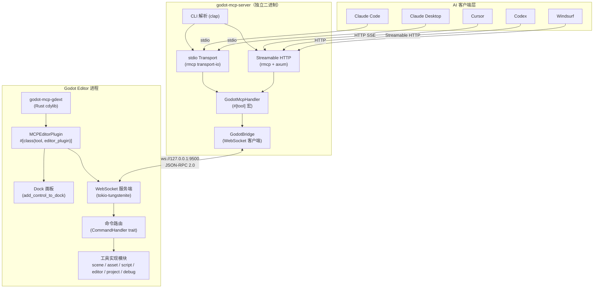

# 架构概览

## 整体拓扑



## 数据流

### stdio 模式（由 AI 客户端直接启动）

```
AI Client (e.g. Claude Code)
    |
    | MCP Protocol (stdio JSON-RPC 2.0)
    ↓
godot-mcp-server (子进程)
    |
    | WebSocket (JSON-RPC 2.0)
    ↓
GDExtension WebSocket Server
    |
    | EditorInterface / ClassDB API
    ↓
Godot Editor
```

### Streamable HTTP 模式（独立守护进程）

```
AI Client (e.g. Cursor / Codex)
    |
    | MCP Protocol (HTTP POST /mcp)
    ↓
godot-mcp-server (HTTP 守护进程, axum :8900)
    |
    | WebSocket (JSON-RPC 2.0)
    ↓
GDExtension WebSocket Server
    |
    | EditorInterface / ClassDB API
    ↓
Godot Editor
```

### 三协议并行（all 模式）

```
stdio (子进程) ──┐
                 ├──→ godot-mcp-server ──→ GDExtension
HTTP (:8900)  ──┘
```

## 核心设计原则

1. **单语言全栈**：Rust 贯穿引擎端（GDExtension）和服务端（MCP Server），无 Python/Node.js 运行时依赖
2. **共享类型**：`core` crate 定义 IPC 协议和工具清单，`gdext` 和 `server` 共享同一套类型系统
3. **解耦传输**：MCP Server 不直接操作 Godot API，所有操作通过 WebSocket 委托给 GDExtension
4. **热加载**：GDExtension 支持 `reloadable = true`，修改 Rust 代码后无需重启 Godot 编辑器

## 与相关页面的关系

| 页面 | 关系 |
|------|------|
| [Cargo Workspace 结构](../specification/workspace.md) | 代码组织方式 |
| [IPC 与 MCP 协议](../specification/protocol.md) | 通信协议细节 |
| [Dock UI 面板](../design/dock-ui.md) | 编辑器插件 UI |
| [IPC 桥接细节](../design/ipc-bridge.md) | 桥接实现 |

## 现有方案对比

| 维度 | hi-godot/godot-ai | CoplayDev/unity-mcp | **本方案** |
|------|-------------------|---------------------|------------|
| 引擎端 | GDScript EditorPlugin | C# EditorPlugin | **Rust GDExtension** |
| 服务端 | Python FastMCP | Python uvx | **Rust rmcp** |
| 运行时依赖 | Python 3.10+, uv | Python 3.10+, uv | **无（静态编译）** |
| 传输协议 | Streamable HTTP | HTTP + stdio | **stdio + Streamable HTTP** |
| 配置启动 | `uvx godot-ai` | `uvx mcp-for-unity` | **`godot-mcp-server`** |
| UI 面板 | 底部面板 + 配置页 | 完整管理窗口 | **独立 Dock 面板** |
| 工具热切换 | 不支持 | 支持 (manage_tools) | **面板 CheckBox → IPC 实时同步** |