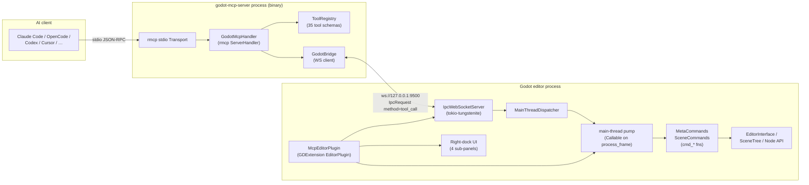

# Architecture Overview

> Two processes, three crates, one WebSocket. Verified against the codebase as of 2026-05-22.

## Process topology

## Crates

| Crate | Kind | Role |
|-------|------|------|
| `godot-mcp-core` | `lib` | Wire types: `IpcRequest`, `IpcResponse`, `IpcResult`, `IpcNotification`, `ToolCallParams`, `ToolManifest`, `ToolListUpdate` |
| `godot-mcp-server` | `bin` | MCP server using `rmcp`. Owns `ToolRegistry` (schemas), `GodotMcpHandler` (rmcp glue), `GodotBridge` (WS client) |
| `godot-mcp-gdext` | `cdylib` | GDExtension. Owns `McpEditorPlugin`, `IpcWebSocketServer`, command handlers, dispatcher, logging pump, dock UI |

See [`specification/workspace.md`](../specification/workspace.md) for full `Cargo.toml` per crate.

## Request flow (worked example)

`call_tool { name: "create_node", arguments: { parent_path: ".", node_type: "Node2D", name: "Player" } }`:

1. AI client writes JSON-RPC to the server's stdin.
2. `rmcp` parses it, invokes `GodotMcpHandler::call_tool` (`crates/server/src/handler.rs:142`).
3. Handler verifies the tool is registered & enabled in `ToolRegistry`, then calls `forward_tool_call` for non-meta tools.
4. `forward_tool_call` invokes `bridge.call("tool_call", {tool, args})`. The wire frame is `{id, method: "tool_call", params: {tool, args}}`.
5. `IpcWebSocketServer::handle_request` (`crates/gdext/src/ipc/ws_server.rs:170`) reads the frame, deserialises `ToolCallParams`, calls `route_tool_call`.
6. `route_tool_call` chooses `MetaCommands::handle_meta_tool` (4 tools) or `SceneCommands::handle_scene_tool` (31 tools). Logs every call via the cross-thread `logging` channel.
7. For scene tools: `handle_scene_tool` is async; it calls `dispatcher.submit(move || cmd_create_node(&args))` and awaits the oneshot reply. The closure runs on the **Godot main thread** when the pump fires.
8. The pump (`Callable::from_fn` connected to `SceneTree::process_frame` in `editor_plugin.rs:install_main_thread_pump`) drains the dispatcher queue and the log channel each frame.
9. `cmd_create_node` calls Godot APIs synchronously, returns a `serde_json::Value`. Dispatcher sends it through the oneshot.
10. `route_tool_call` wraps it in `IpcResponse { status: ok, data }`, the WS server sends it back.
11. `GodotBridge` matches the response id to its pending oneshot, server returns the JSON-stringified result as MCP `CallToolResult`.

## Threading

There are **two** worlds and one ferry between them:

- **tokio multi-thread runtime** (2 worker threads, owned by `McpEditorPlugin`). Runs the WS server, all routing, all `await`s. Calling Godot APIs from here panics.
- **Godot editor main thread**. The only place where `EditorInterface`, `Node`, `godot_print!` and other engine APIs are safe to touch.
- The ferry: `MainThreadDispatcher` (closures) + `logging` mpsc (log records), both drained every frame by a Callable connected to `SceneTree::process_frame`.

Read [`overview/threading-model.md`](threading-model.md) before writing any new code in `crates/gdext/`.

## What lives where

| Concern | File |
|---------|------|
| Wire types shared by both processes | `crates/core/src/protocol.rs`, `crates/core/src/tool_manifest.rs` |
| MCP entry point (stdio) | `crates/server/src/main.rs` |
| MCP handler (`get_info`, `list_tools`, `call_tool`) | `crates/server/src/handler.rs` |
| Tool schemas (35 entries) | `crates/server/src/tool_registry.rs:register_defaults` |
| WS client (id↔oneshot, notification listener) | `crates/server/src/bridge.rs` |
| GDExtension entry, init level | `crates/gdext/src/lib.rs` |
| Plugin lifecycle, pump install | `crates/gdext/src/editor_plugin.rs` |
| WS server, request dispatch | `crates/gdext/src/ipc/ws_server.rs` |
| Routing trait + meta tools | `crates/gdext/src/commands/{mod,meta}.rs` |
| 31 scene tools + J↔V helpers | `crates/gdext/src/commands/scene.rs` |
| Closure queue (worker → main) | `crates/gdext/src/dispatcher.rs` |
| Log channel + main-thread drain | `crates/gdext/src/logging.rs` |
| Right-dock UI | `crates/gdext/src/dock/*.rs` |

## Boundaries

- **The server never imports `godot`**. It only knows how to forward `tool_call` frames. Adding a tool only on the server side will surface as `Tool '...' handler not yet implemented` from the gdext side.
- **The gdext never imports `rmcp`**. Symmetric: adding a `cmd_*` without registering a schema in `tool_registry.rs` means MCP clients never see the tool.
- **`core` never imports `godot` or `rmcp`**. It is the only place both sides may share types.
- **stdio is the only working MCP transport**. `transport-streamable-http-server` is in the server's deps but no `transports/` module exists; the planned HTTP `:8900/mcp` mode is unimplemented.
