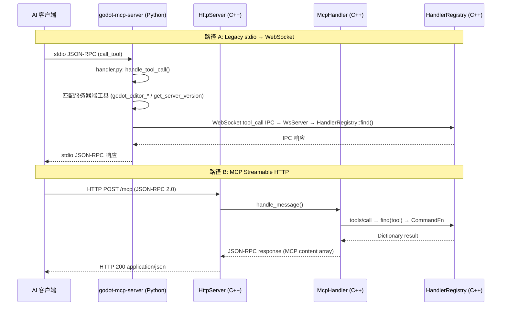

# 架构总览

项目包含一个 C++ GDExtension 实现和一个 Python MCP 服务器，双进程架构，同时支持 MCP Streamable HTTP 直连。

## 双进程 + HTTP 直连设计

```
路径 A (Legacy stdio):
AI 客户端 ── stdio ──► godot-mcp-server.exe ── WebSocket :9500 ──► godot_mcp_gdext.dll
                         (Python/Cython)                              (extensions/gdext/, C++)

路径 B (MCP Streamable HTTP):
AI 客户端 ── HTTP POST/GET /mcp ──► godot_mcp_gdext.dll 内置 HttpServer :9600
                                    (JSON-RPC 2.0 over HTTP + SSE)

server/ ── Python 服务器，通过 Cython --embed 编译为独立 exe
           registry.py 是工具 schema 的唯一权威来源
extensions/gdext/ ── C++ GDExtension（唯一实现）
```

## 架构图

```
┌─────────────────────────────────────────────────────────────────────┐
│ AI 客户端 (Claude Code / OpenCode / Cursor / Copilot / Codex / …)   │
└───────┬──────────────────────────────────┬──────────────────────────┘
        │ stdio                            │ HTTP /mcp (JSON-RPC 2.0)
        ▼                                  ▼
┌──────────────────────────────┐  ┌──────────────────────────────────────┐
│ godot-mcp-server.exe         │  │ godot_mcp_gdext.dll                  │
│ (server/, Python/Cython)     │  │ (extensions/gdext/, C++)             │
│                              │  │                                      │
│ ┌──────────┐ ┌────────────┐ │  │ ┌──────────────┐  ┌──────────────┐  │
│ │entry.py   │→│handler.py  │ │  │ │HttpServer    │  │McpHandler    │  │
│ │(asyncio) │ │(dispatch)  │ │  │ │(:9600, SSE)  │→ │(sessions,    │  │
│ └──────────┘ └─────┬──────┘ │  │ └──────────────┘  │ JSON-RPC 2.0)│  │
│   ┌────────────┐   │        │  │                    └──────┬───────┘  │
│   │bridge.py   │←──┘        │  │ ┌──────────────┐          │          │
│   │(WebSocket) │            │  │ │WsServer      │          │          │
│   └──────┬─────┘            │  │ │(:9500, legacy)│          │          │
│          │                  │  │ └──────┬───────┘          │          │
│          │  registry.py     │  │        │                  │          │
│          │  (125 schemas)   │  │        └────────┬─────────┘          │
│          │  editor_ctl.py   │  │                 │                    │
└──────────┼──────────────────┘  │    ┌────────────▼──────────┐        │
           │                     │    │ HandlerRegistry        │        │
           │ WebSocket :9500     │    │ CommandFn 函数指针表    │        │
           │ tool_call IPC       │    │ 16 组活跃 (115 工具)    │        │
           ▼                     │    └────────────────────────┘        │
┌──────────────────────────────┐│                                      │
│       (shared gdext)         ││  ┌───────────────────────────────┐   │
│                              ││  │ 所有代码在 Godot 主线程上运行    │   │
│                              ││  │ process_frame hook 驱动 poll()  │   │
│                              ││  └───────────────────────────────┘   │
│                              ││                                      │
│                              ││  Godot EditorInterface / Node API    │
└──────────────────────────────┘└──────────────────────────────────────┘
```

## 数据流



## 关键属性

- **双传输**: stdio (legacy, 通过 Python 服务器中转) 和 MCP Streamable HTTP (直接连接 gdext)
- **IPC 线路格式**: 路径 A 使用 JSON-RPC 风格的 `IpcRequest`/`IpcResponse`；路径 B 使用标准 MCP JSON-RPC 2.0
- **125 个工具**: 121 个在 C++ 中定义（16 组活跃注册 115 个，`register_script_cs` 已声明但未调用），4 个服务器端在 `handler.py` 中拦截
- **工具 Schema**: Python 侧 `registry.py` 是权威来源；C++ 侧通过 `tool_schemas.json` 加载元数据
- **两个端口**: WebSocket `:9500`（legacy），HTTP `:9600`（MCP Streamable HTTP）

## 当前目录布局

```
extensions/gdext/              # C++ GDExtension（唯一实现）
└── src/
    ├── register_types.cpp     # GDExtension 入口 (gdext_rust_init)
    ├── editor_plugin.cpp/.hpp # McpEditorPlugin 生命周期
    ├── commands/              # 17 个命令处理器文件，16 组活跃注册
    │   ├── handler_registry.cpp/.hpp  # 注册表 + register_all_tools()
    │   ├── cmd_utils.cpp/.hpp/.json   # 共享工具函数
    │   └── *.cpp              # 各命令组
    ├── ipc/
    │   ├── ws_server.cpp/.hpp        # 同步 WebSocket 服务器 (legacy)
    │   └── http_server.cpp/.hpp      # MCP Streamable HTTP 服务器
    ├── mcp/
    │   └── mcp_handler.cpp/.hpp      # JSON-RPC 2.0 会话管理
    ├── protocol/
    │   └── ipc_types.hpp      # IPC 协议构造辅助
    ├── lsp/
    │   └── client.cpp/.hpp    # GDScript LSP 验证
    └── logging.hpp            # 日志（直接 print/push_warning）

server/                        # Python/Cython MCP 服务器
├── entry.py                   # Cython --embed 入口
├── src/godot_mcp_server/
│   ├── handler.py             # GodotMcpHandler 分发器
│   ├── bridge.py              # GodotBridge WebSocket 客户端
│   ├── registry.py            # ToolRegistry (125 tools)
│   ├── editor_ctl.py          # 编辑器进程管理
│   └── protocol.py            # Pydantic IPC 协议模型
└── tools/
    └── patch_entry_c.py       # PYTHONHOME 补丁工具
```

## 双进程启动顺序（Legacy stdio 路径）

```
1. AI 客户端启动 → godot-mcp-server.exe（stdio 子进程）
2. server 注册 125 个工具的 Schema，监听 stdio
3. AI 客户端调用 godot_editor_open → server 启动 Godot 编辑器
4. 编辑器加载插件 → C++ GDExtension 初始化 → 启动 WsServer :9500 + HttpServer :9600
5. server 的 bridge.py 连接到 WebSocket :9500
6. 连接建立 → gdext 发送 godot_ready 通知
7. 后续工具调用的完整链路开始工作
```
