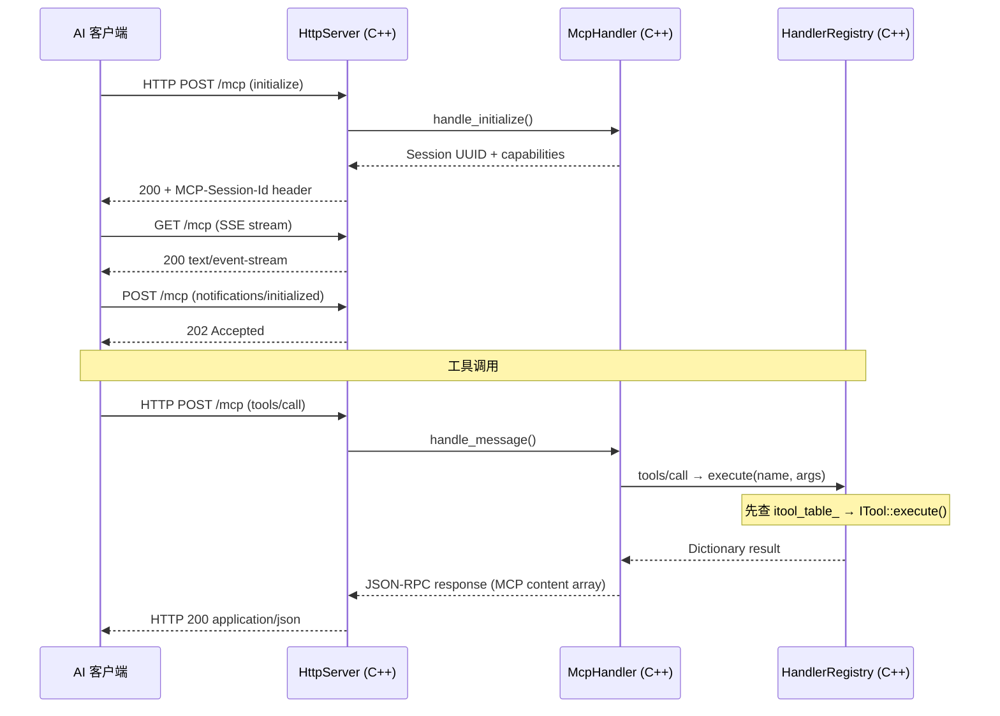

# 架构总览

项目是一个 C++ GDExtension 单进程架构，通过 MCP Streamable HTTP 直接暴露给 AI 客户端。

## 单进程设计

```
AI 客户端 ── Streamable HTTP :9600 ──► godot_mcp_gdext.dll（C++ GDExtension）
                                           │
                                           ├── MCP Session 管理
                                           ├── JSON-RPC 2.0 处理
                                           └── HandlerRegistry（ITool 统一调度）

extensions/src/ ── C++ GDExtension（唯一的代码库）
```

## 架构图

```
┌─────────────────────────────────────────────────────────────────────┐
│ AI 客户端 (Claude Code / OpenCode / Cursor / Copilot / Codex / …)   │
└──────────────────────────────┬──────────────────────────────────────┘
                               │ HTTP POST/GET /mcp (JSON-RPC 2.0)
                               ▼
┌──────────────────────────────────────────────────────────────────────┐
│ godot_mcp_gdext.dll (extensions/src/, C++)                          │
│                                                                      │
│ ┌──────────────┐  ┌──────────────────┐                               │
│ │HttpServer    │  │McpHandler        │                               │
│ │(:9600, SSE)  │→ │(sessions,        │                               │
│ └──────────────┘  │ JSON-RPC 2.0)    │                               │
│                    └────────┬─────────┘                               │
│                             │                                         │
│                 ┌────────────▼──────────┐                             │
│                 │ HandlerRegistry        │                             │
│                 │ ITool 统一调度          │                             │
│                 │ 124 ITool (codegen)    │                             │
│                 │ └ CommandFn 后备(空)   │                             │
│                 └────────────────────────┘                             │
│                                                                      │
│  ┌───────────────────────────────┐                                    │
│  │ 所有代码在 Godot 主线程上运行    │                                    │
│  │ process_frame hook 驱动 poll()  │                                    │
│  └───────────────────────────────┘                                    │
│                                                                      │
│  Godot EditorInterface / Node API                                    │
└──────────────────────────────────────────────────────────────────────┘
```

## 数据流



## 关键属性

- **单进程**: C++ GDExtension 加载到 Godot 编辑器内，无额外进程
- **MCP Streamable HTTP**: 唯一传输方式，AI 客户端直连 gdext（端口 9600）
- **124 个 ITool 子类**，通过 `// @tool register` 注释 + `tools/codegen.py` 自动注册
- **端口**: HTTP `:9600`（MCP Streamable HTTP）

## 当前目录布局

```
extensions/src/              # C++ GDExtension（唯一代码库）
├── register_types.cpp       # GDExtension 入口 (gdext_rust_init)
├── editor_plugin.cpp/.hpp   # McpEditorPlugin 生命周期
├── built_in/
│   ├── tool_base.hpp/.cpp   # ITool 接口 + ToolResult/ToolContext
│   ├── cmd_utils.hpp/.cpp   # 共享工具函数
│   ├── cmd_utils_json.cpp   # JSON↔Variant 转换
│   └── tools/               # 124 个 ITool .hpp 文件，按分类组织
│       ├── meta/ (5)
│       ├── node/ (21)
│       ├── property/ (21)
│       ├── property_3d/ (6)
│       ├── collision/ (2)
│       ├── find/ (4)
│       ├── scene/ (16)
│       ├── editor_control/ (7)
│       ├── search/ (3)
│       ├── script_gd/ (5)
│       ├── script_cs/ (6)
│       ├── script_helpers/ (3)
│       ├── project_settings/ (7)
│       ├── project_settings_ext/ (10)
│       ├── input_map/ (4)
│       ├── plugin_management/ (2)
│       └── undo/ (2)
├── server/
│   ├── registry/
│   │   └── handler_registry.cpp/.hpp  # 注册表 + category remap
│   ├── ipc/
│   │   └── http_server.cpp/.hpp       # MCP Streamable HTTP 服务器
│   └── mcp/
│       └── mcp_handler.cpp/.hpp       # JSON-RPC 2.0 会话管理
├── sdk/
│   ├── mcp_tool_definition.hpp/.cpp   # 可继承的 RefCounted 基类
│   ├── mcp_tool_registry.hpp/.cpp     # 单例注册表
│   └── mcp_tool_adapter.hpp           # ITool 适配器桥接
├── lsp/
│   └── client.cpp/.hpp                # GDScript LSP 验证
├── testing/
│   ├── test_engine.hpp/.cpp           # C++ YAML 测试引擎
│   ├── yaml_parser.hpp               # ryml 解析器
│   ├── test_assertions.hpp           # 断言引擎
│   └── godot_file_verifier.hpp       # 磁盘文件校验
├── plugin/
│   └── test_runner_dock.hpp/.cpp     # 编辑器底部面板
└── logging.hpp                        # 日志（直接 print/push_warning）
```
