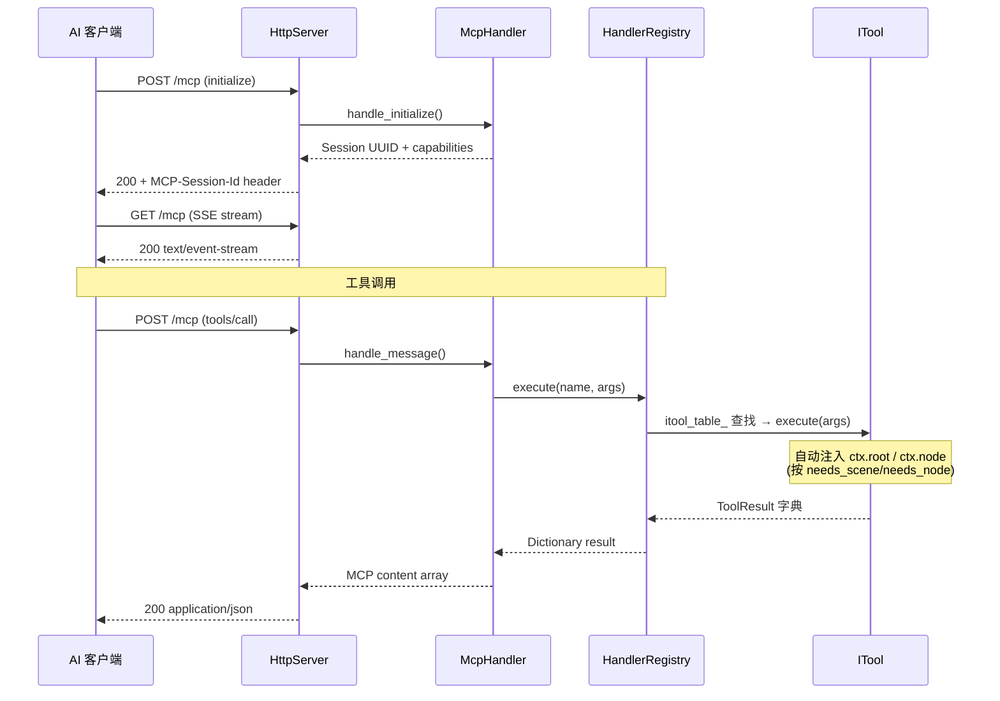
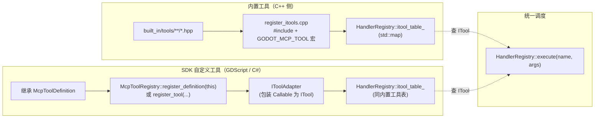

# 架构总览

项目是 C++ GDExtension 单进程架构，通过 MCP Streamable HTTP 直接暴露给 AI 客户端。

## 单进程设计


## 关键属性

| 维度 | 状态 |
|------|------|
| 进程数 | **1**（C++ GDExtension 加载到 Godot 编辑器内） |
| 传输 | MCP Streamable HTTP，端口 `:9600` |
| 工具注册 | **X-macro 分文件注册**（`register_itools.cpp` + `register/*.hpp`） |
| 工具总数 | **~171**（无 codegen，无 YAML 数据库生成） |
| 线程模型 | **纯主线程**（`McpEditorPlugin::_process()` 驱动） |
| 入口符号 | `gdext_mcp_init`（`register_types.cpp:60`） |
| 编码规范 | 根 `CMakeLists.txt:43` 已加 `/utf-8 /bigobj`（MSVC） |
| 构建优化 | sccache/ccache（自动检测）、Unity(jumbo)、lld-link |
| 持久化 | C++ 侧无独立状态；Godot 编辑器持有数据 |

## 数据流（一次工具调用）



## 目录布局

```
extensions/src/                  # C++ GDExtension 唯一源码根
├── register_types.cpp           # GDExtension 入口 (gdext_mcp_init)
├── editor_plugin.cpp/.hpp       # McpEditorPlugin 生命周期 + _process 泵
├── logging.hpp                  # 日志 inline 函数
├── built_in/
│   ├── register_itools.cpp      # X-macro 注册主文件（#include + GODOT_MCP_TOOL 宏）
│   ├── tool_base.hpp/.cpp       # ITool + ToolResult + ToolContext
│   ├── tool_adapter.hpp/.cpp    # IToolAdapter（SDK → ITool 适配器）
│   ├── cmd_utils.hpp/.cpp       # 共享工具（resolve_node / undoable_set / notify_file_changed）
│   ├── cmd_utils_json.cpp       # JSON↔Variant 递归转换
│   ├── screenshot_utils.hpp     # 截图捕获
│   └── tools/
│       ├── register/            # X-macro 注册文件（4 个）
│       │   ├── register_meta.hpp
│       │   ├── register_existing.hpp
│       │   ├── register_fallback.hpp
│       │   └── register_docs.hpp
│       ├── meta/                # 7 个元工具
│       ├── signal/              # 4 个信号工具
│       ├── group/               # 4 个分组工具
│       ├── node_tools/general/  # 6 个资源管理工具
│       ├── node_properties/     # 2 个通用兜底工具（Layer 0）
│       ├── editor_tools/
│       │   ├── scene_tree/      # 24 个场景树 CRUD 工具
│       │   ├── animation/       # 10 个动画工具（Player + Tree）
│       │   ├── control/         # 4 个 UI/Control 工具
│       │   ├── collision/       # 1 个碰撞形状工具
│       │   ├── docs/            # 8 个文档查询工具（Layer 3）
│       │   ├── export/          # 4 个导出工具
│       │   ├── filesystem/      # 12 个文件系统工具
│       │   ├── inputmap/        # 4 个输入映射工具
│       │   ├── plugin/          # 3 个插件管理工具
│       │   ├── scaffold/        # 1 个脚手架工具
│       │   ├── scripts/         # 12 个脚本工具
│       │   ├── settings/        # 4 个设置工具
│       │   ├── shader/          # 5 个 shader 工具
│       │   ├── audio/           # 3 个音频工具
│       │   ├── navigation/      # 3 个导航工具
│       │   ├── 3d_scene/        # 3 个 3D 场景工具
│       │   ├── tilemap/         # 3 个 TileMap 工具
│       │   ├── visualizer/      # 1 个可视化工具
│       │   └── workspace/       # 31 个工作区/调试器工具
│       └── runtime_tools/
│           ├── bridge/          # 6 个运行时桥接工具
│           └── lifecycle/       # 6 个游戏生命周期工具
├── server/
│   ├── ipc/http_server.cpp/.hpp # MCP Streamable HTTP 服务器
│   ├── mcp/mcp_handler.cpp/.hpp # JSON-RPC 2.0 会话管理
│   └── registry/
│       └── handler_registry.cpp/.hpp  # ITool 调度 + 分类自动发现
├── sdk/
│   ├── mcp_tool_definition.hpp/.cpp   # GDScript/C# 可继承基类
│   └── mcp_tool_registry.hpp/.cpp     # 单例 SDK 注册表
├── lsp/
│   └── client.cpp/.hpp          # GDScript LSP 验证（StreamPeerTCP）
└── testing/
    ├── test_engine.cpp/.hpp     # C++ 进程内测试引擎
    ├── yaml_parser.hpp          # ryml → Godot Variant
    ├── test_assertions.hpp      # 断言运行器
    ├── godot_file_verifier.hpp  # 磁盘文件校验
    └── type_utils.hpp           # 类型辅助
```

## 运行时桥接

编辑器 ↔ 游戏进程的 TCP JSON 通道，端口 9601：

- **GameBridgeNode**（游戏进程）：`register_types.cpp` 在 `LEVEL_SCENE` 创建，`call_deferred` 加入场景树，7 个命令 handler
- **RuntimeBridge**（编辑器进程）：`McpEditorPlugin` 持有，`_process()` 每帧 `poll()` 驱动
- **生命周期**：`_try_bridge_connect()` 通过 `ei->is_playing_scene()` 感知游戏启停

详见 [modules/runtime-bridge.md](../modules/runtime-bridge.md)。

## 双重注册路径



详细命令路由与分类系统见 [modules/command-routing.md](../modules/command-routing.md)。
