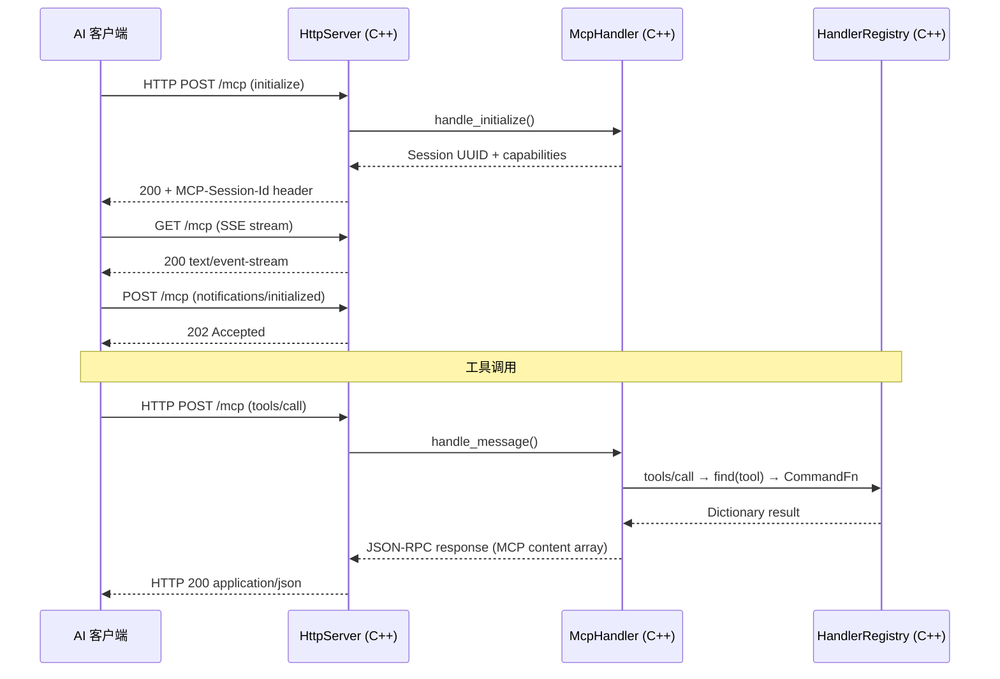

# 架构总览

项目是一个 C++ GDExtension 单进程架构，通过 MCP Streamable HTTP 直接暴露给 AI 客户端。

## 单进程设计

```
AI 客户端 ── Streamable HTTP :9600 ──► godot_mcp_gdext.dll（C++ GDExtension）
                                           │
                                           ├── MCP Session 管理
                                           ├── JSON-RPC 2.0 处理
                                           └── HandlerRegistry（CommandFn）

extensions/gdext/ ── C++ GDExtension（唯一的代码库）
```

## 架构图

```
┌─────────────────────────────────────────────────────────────────────┐
│ AI 客户端 (Claude Code / OpenCode / Cursor / Copilot / Codex / …)   │
└──────────────────────────────┬──────────────────────────────────────┘
                               │ HTTP POST/GET /mcp (JSON-RPC 2.0)
                               ▼
┌──────────────────────────────────────────────────────────────────────┐
│ godot_mcp_gdext.dll (extensions/gdext/, C++)                        │
│                                                                      │
│ ┌──────────────┐  ┌──────────────────┐                               │
│ │HttpServer    │  │McpHandler        │                               │
│ │(:9600, SSE)  │→ │(sessions,        │                               │
│ └──────────────┘  │ JSON-RPC 2.0)    │                               │
│                    └────────┬─────────┘                               │
│                             │                                         │
│                 ┌────────────▼──────────┐                             │
│                 │ HandlerRegistry        │                             │
│                 │ CommandFn 函数指针表    │                             │
│                 │ 16 组活跃 (115 工具)    │                             │
│                 └────────────────────────┘                             │
│                                                                      │
│  ┌───────────────────────────────┐                                    │
│  │ 所有代码在 Godot 主线程上运行    │                                    │
│  │ process_frame hook 驱动 poll()  │                                    │
│  └───────────────────────────────┘                                    │
│                                                                      │
│  Godot EditorInterface / Node API                                    │
└──────────────────────────────────────────────────────────────────────┘
```

## 数据流



## 关键属性

- **单进程**: C++ GDExtension 加载到 Godot 编辑器内，无额外进程
- **MCP Streamable HTTP**: 唯一传输方式，AI 客户端直连 gdext（端口 9600）
- **121 个工具**: 17 个处理器文件定义，16 组活跃注册（115 个），`register_script_cs` 已声明但未调用
- **端口**: HTTP `:9600`（MCP Streamable HTTP）

## 当前目录布局

```
extensions/gdext/              # C++ GDExtension（唯一代码库）
└── src/
    ├── register_types.cpp     # GDExtension 入口 (gdext_rust_init)
    ├── editor_plugin.cpp/.hpp # McpEditorPlugin 生命周期
    ├── commands/              # 17 个命令处理器文件，16 组活跃注册
    │   ├── handler_registry.cpp/.hpp  # 注册表 + register_all_tools()
    │   ├── cmd_utils.cpp/.hpp/.json   # 共享工具函数
    │   └── *.cpp              # 各命令组
    ├── ipc/
    │   └── http_server.cpp/.hpp      # MCP Streamable HTTP 服务器
    ├── mcp/
    │   └── mcp_handler.cpp/.hpp      # JSON-RPC 2.0 会话管理
    ├── lsp/
    │   └── client.cpp/.hpp    # GDScript LSP 验证
    └── logging.hpp            # 日志（直接 print/push_warning）
```
