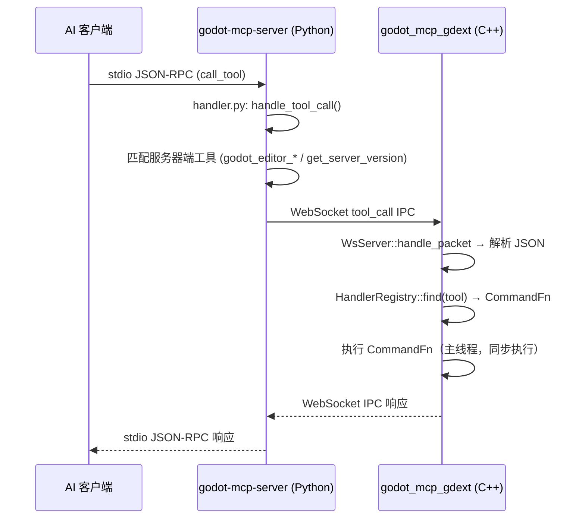

# 架构总览

项目包含一个 C++ GDExtension 实现和一个 Python MCP 服务器，双进程架构。

## 双进程设计

```
AI 客户端 ── stdio ──► godot-mcp-server.exe ── WebSocket :9500 ──► godot_mcp_gdext.dll
                        (Python/Cython)                              (extensions/gdext/, C++)

server/ ── Python 服务器，通过 Cython --embed 编译为独立 exe
          registry.py 是工具 schema 的唯一权威来源
extensions/gdext/ ── C++ GDExtension（唯一实现）
```

## 架构图

```
┌─────────────────────────────────────────────────────────────────────┐
│ AI 客户端 (Claude Code / OpenCode / Cursor / Copilot / Codex / …)   │
│ 标准输入输出 (stdio) JSON-RPC (MCP 协议)                              │
└───────────────┬─────────────────────────────────────────────────────┘
                │ stdio
                ▼
┌──────────────────────────────────────────────────────────────────────┐
│ godot-mcp-server.exe               (server/, Python/Cython)          │
│                                                                      │
│ ┌──────────┐  ┌────────────┐  ┌────────────┐  ┌─────────────────┐   │
 │ │entry.py   │→│handler.py  │→│bridge.py   │  │registry.py      │   │
│ │(asyncio) │  │(dispatch)  │  │(WebSocket)  │  │125 tools schema │   │
│ └──────────┘  └─────┬──────┘  └──────┬──────┘  └─────────────────┘   │
│                     │editor_ctl.py   │editor_ctl.py                   │
│                     │(open/close/    │(restart)                       │
│                     │ get_version)   │                                │
└─────────────────────┼────────────────┼────────────────────────────────┘
                      │ WebSocket ws://127.0.0.1:9500
                      │ tool_call IPC 请求
                      ▼
┌──────────────────────────────────────────────────────────────────────┐
│ godot_mcp_gdext.dll            (extensions/gdext/, C++)              │
│                                                                      │
│ ┌──────────────┐  ┌──────────────┐  ┌────────────────────────┐      │
│ │register_type │→│editor_plugin │→│WsServer                │      │
│ │.cpp (入口)   │  │.cpp          │  │(TCPServer + WebSocket  │      │
│ │gdext_rust_init│  │McpEditorPlugin│ │ Peer, 同步 poll)      │      │
│ └──────────────┘  └──────┬───────┘  └────────────┬───────────┘      │
│                          │                       │                    │
│                          │    ┌──────────────────▼────────────┐      │
│                          │    │ HandlerRegistry               │      │
│                          └───►│ CommandFn 函数指针表          │      │
│                               │ register_all_tools() 注册 16 组│     │
│                               └───────────────────────────────┘      │
│                                                                      │
│  ┌─────────────────────────────────────────────────────────────┐     │
│  │ 所有代码在 Godot 主线程上运行（process_frame hook 驱动）       │     │
│  │ 无 tokio、无工作线程、无线程间通信                              │     │
│  └─────────────────────────────────────────────────────────────┘     │
│                                                                      │
│  Godot EditorInterface / Node / Scene API (godot-cpp)                │
└──────────────────────────────────────────────────────────────────────┘
```

## 数据流



## 关键属性

- **stdio 是唯一**启用的 MCP 传输
- **IPC 线路格式**: JSON-RPC 风格的 `IpcRequest`（`method`+`params`）/`IpcResponse`（`status` tag），Python 端 `protocol.py` 有 Pydantic 模型，C++ 端 `ipc_types.hpp` 有构造辅助
- **125 个工具**: 121 个通过 gdext 执行，4 个服务器端（`get_server_version` + 3 个 `godot_editor_*`）在 `handler.py` 中拦截
- **工具注册表**: Python 侧 `registry.py` 是权威来源；C++ 侧 `handler_registry.cpp` 中的 `register_all_tools()` 注册 17 组 CommandFn
- **服务器端断言**: Python 侧 `total == 125`；C++ 侧 `registry_.size()` 用于诊断

## 当前目录布局

```
extensions/gdext/              # C++ GDExtension（唯一实现）
└── src/
    ├── register_types.cpp     # GDExtension 入口 (gdext_rust_init)
    ├── editor_plugin.cpp/.hpp # McpEditorPlugin 生命周期
    ├── commands/              # 17 组命令处理器
    │   ├── handler_registry.cpp/.hpp  # 注册表
    │   ├── cmd_utils.cpp/.hpp/.json   # 共享工具函数
    │   └── *.cpp              # 各命令组
    ├── ipc/
    │   └── ws_server.cpp/.hpp # 同步 WebSocket 服务器
    ├── protocol/
    │   └── ipc_types.hpp      # IPC 协议构造辅助
    ├── lsp/
    │   └── client.cpp         # GDScript LSP 验证
    └── logging.hpp            # 日志（直接 print/push_warning）

server/                        # Python/Cython MCP 服务器
├── entry.py                   # Cython --embed 入口
├── src/godot_mcp_server/
│   ├── handler.py             # GodotMcpHandler 分发器
│   ├── bridge.py              # GodotBridge WebSocket 客户端
│   ├── registry.py            # ToolRegistry (125 tools)
│   ├── editor_ctl.py          # 编辑器进程管理
│   └── protocol.py            # Pydantic IPC 协议模型
```

## 双进程启动顺序

```
1. AI 客户端启动 → godot-mcp-server.exe（stdio 子进程）
2. server 注册 125 个工具的 Schema，监听 stdio
3. AI 客户端调用 godot_editor_open → server 启动 Godot 编辑器
4. 编辑器加载插件 → C++ GDExtension 初始化 → 启动 WebSocket 服务器 :9500
5. server 的 bridge.py 连接到 WebSocket
6. 连接建立 → gdext 发送 godot_ready 通知
7. 后续工具调用的完整链路开始工作
```
