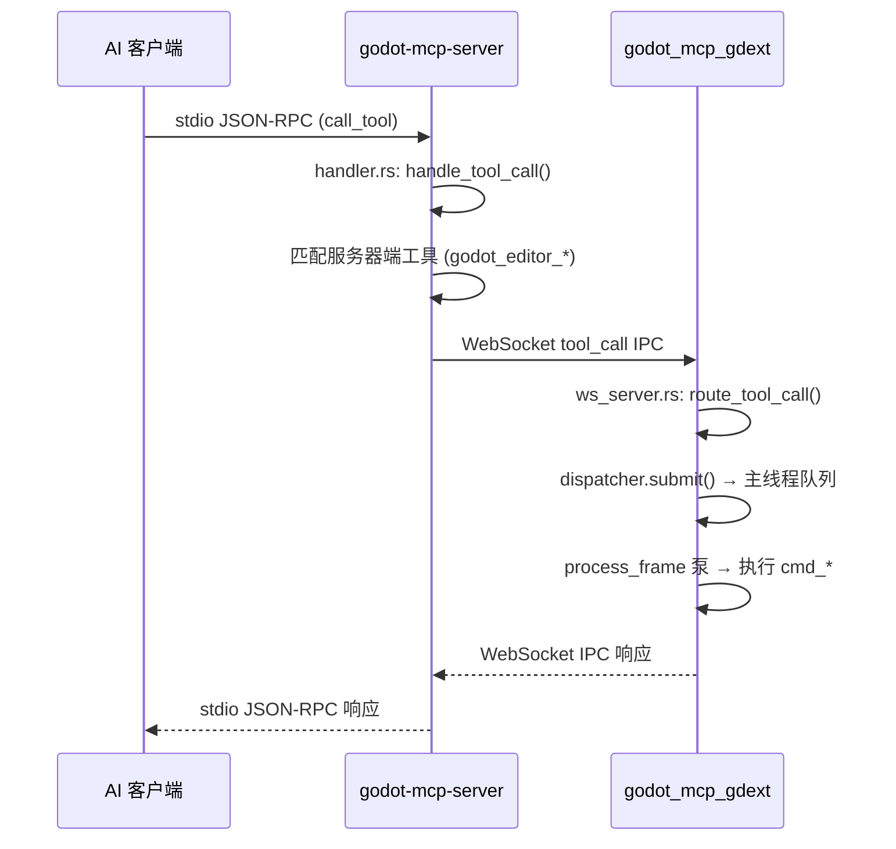

# 架构总览

## 双进程、三 crate 设计

```
┌─────────────────────────────────────────────────────────────────────┐
│ AI 客户端 (Claude Code / OpenCode / Cursor / Copilot / Codex / …)   │
│ 标准输入输出 (stdio) JSON-RPC (MCP 协议)                              │
└───────────────┬─────────────────────────────────────────────────────┘
                │ stdio
                ▼
┌──────────────────────────────────────────────────────────────────────┐
│ godot-mcp-server.exe              ┌─────────────────────────────┐   │
│ (crates/server, 二进制)            │ ToolRegistry                │   │
│                                    │ 125 个工具的 JSON Schema     │   │
│ ┌────────┐  ┌─────────┐  ┌──────┐ │                             │   │
│ │ main.rs│→│handler.rs│→│bridge│ └─────────────────────────────┘   │
│ │(clap)  │  │(rmcp)   │  │(WS)  │                                  │
│ └────────┘  └─────────┘  └──┬───┘                                  │
└──────────────────────────────┼──────────────────────────────────────┘
                               │ WebSocket ws://127.0.0.1:9500
                               │ tool_call IPC 请求
                               ▼
┌──────────────────────────────────────────────────────────────────────┐
│ godot_mcp_gdext.dll            (crates/gdext, cdylib)               │
│                                                                     │
│ ┌──────────┐  ┌────────────┐  ┌───────────────────────────────┐    │
│ │lib.rs    │→│editor_plugin│→│IpcWebSocketServer              │    │
│ │(#![gdext])│  │McpEditorPlugin│  (crates/gdext/src/ipc/)      │    │
│ └──────────┘  └────────────┘  └───────────────┬───────────────┘    │
│                                               │                     │
│                        ┌──────────────────────▼──────────────┐      │
│                        │ route_tool_call (ws_server.rs)       │      │
│                        │ 17 个 handler 组链式调用              │      │
│                        └──────────┬───────────┬──────────────┘      │
│                                   │           │                     │
│                          ┌────────▼───┐ ┌─────▼─────────┐          │
│                          │dispatcher  │ │logging (mpsc) │          │
│                          │submit()    │ │log_info/warn  │          │
│                          │process_pend│ │drain_to_consol│          │
│                          └───────┬────┘ └───────┬────────┘          │
│                                  │               │                  │
│                          ┌───────▼───────────────▼────────┐         │
│                          │ process_frame (SceneTree 信号)   │         │
│                          │ 主线程泵（非 plugin .process()） │         │
│                          └────────────────────────────────┘         │
│                                                                     │
│                          Godot EditorInterface / Node / Scene API   │
└──────────────────────────────────────────────────────────────────────┘
```

## 数据流



## 关键属性

- **stdio 是唯一**启用的 MCP 传输。`transport-streamable-http-server` 在依赖中但未接线
- **IPC 线路格式**: JSON-RPC 风格的 `IpcRequest`/`IpcResponse`/`IpcNotification`，类型定义在 `crates/core/src/protocol.rs`
- **125 个工具**: 122 个通过 gdext 执行，3 个服务器端（editor_control）在 `handler.rs` 中拦截，永不抵达 WebSocket
- **工具注册表**: 同时维护在 `crates/server/src/tool_registry.rs`（MCP 服务端侧）和 `crates/gdext/src/commands/mod.rs`（通过 `CommandHandler` trait）
- **测试断言**: `tool_registry.rs` 和 `handler.rs` 都有 `assert_eq!(total, 125)`

## 目录布局

```
crates/
├── core/          # 共享类型: protocol.rs, tool_manifest.rs
├── server/        # MCP 服务端二进制
│   └── src/
│       ├── main.rs          # clap CLI → GodotMcpHandler
│       ├── handler.rs       # rmcp ServerHandler 实现
│       ├── bridge.rs        # WebSocket 客户端 (GodotBridge)
│       └── tool_registry.rs # 工具注册与 Schema
└── gdext/         # GDExtension cdylib
    └── src/
        ├── lib.rs           # gdextension 入口
        ├── editor_plugin.rs # McpEditorPlugin 生命周期
        ├── dispatcher.rs    # MainThreadDispatcher
        ├── logging.rs       # 跨线程日志
        ├── commands/        # 18 个命令处理模块
        │   ├── mod.rs       # CommandHandler trait + 共享工具函数
        │   ├── meta.rs      # ping, get_engine_version, get_plugin_version
        │   ├── node.rs      # 节点 CRUD + 场景树遍历
        │   ├── property.rs  # 2D 属性 get/set
        │   ├── property_3d.rs # 3D 属性 get/set
        │   ├── scene.rs     # 场景文件 + 编辑器标签操作
        │   ├── collision.rs # 碰撞体添加
        │   ├── find.rs      # 节点搜索
        │   ├── script_helpers.rs # call_method, get/set_variable
        │   ├── project_settings.rs # 项目设置读写
        │   ├── script_gd.rs # GDScript 文件操作 + LSP 验证
        │   ├── script_cs.rs # C# 文件操作 + Solution 生成
        │   ├── search.rs    # find_in_file, search_project, find_and_replace
        │   └── undo.rs      # 撤销/重做
        ├── ipc/             # WebSocket 服务器
        │   ├── ws_server.rs # IpcWebSocketServer + route_tool_call
        │   └── plugin_state.rs
        ├── lsp/             # GDScript LSP 客户端
        │   ├── client.rs    # validate_via_lsp
        │   └── protocol.rs  # LSP 协议类型
        └── dock/            # 编辑器右侧 Dock UI
            ├── main_dock.rs
            ├── status_bar.rs
            ├── integration.rs
            ├── settings.rs
            └── tool_manager.rs
```
