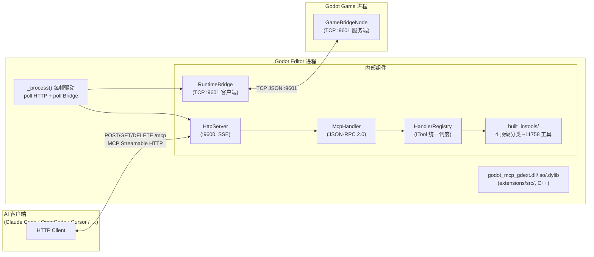
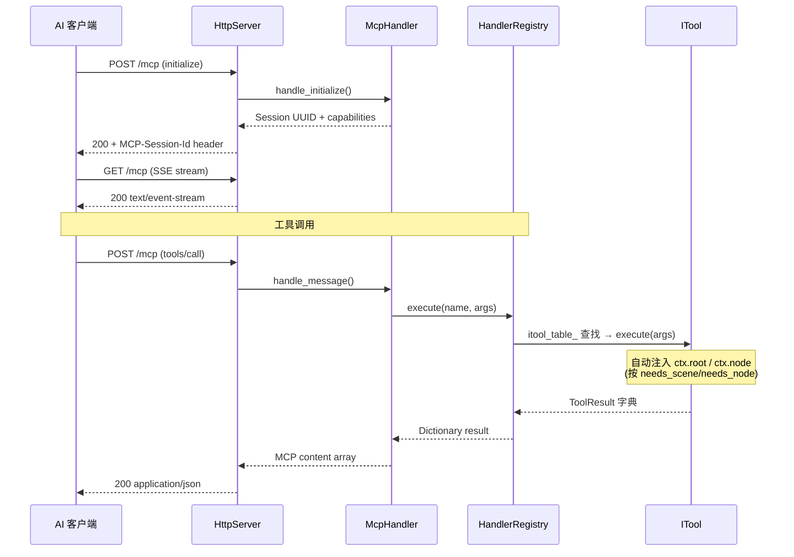
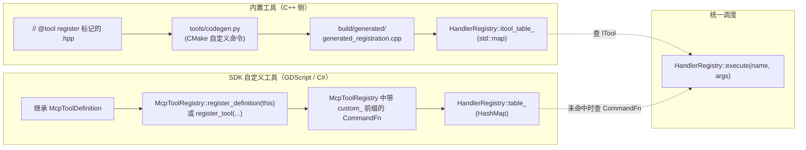

# 架构总览

项目是 C++ GDExtension 单进程架构，通过 MCP Streamable HTTP 直接暴露给 AI 客户端。

## 单进程设计



## 关键属性

| 维度 | 状态 |
|------|------|
| 进程数 | **1**（C++ GDExtension 加载到 Godot 编辑器内） |
| 传输 | MCP Streamable HTTP，端口 `:9600` |
| 工具注册 | `// @tool register` + `tools/codegen.py` 编译期自动注册 |
| 线程模型 | **纯主线程**（`McpEditorPlugin::_process()` 驱动） |
| 入口符号 | `gdext_mcp_init`（`register_types.cpp:45`） |
| 编码规范 | 根 `CMakeLists.txt:43` 已加 `/utf-8 /bigobj`（MSVC） |
| 构建优化 | sccache/ccache（自动检测）、Unity(jumbo)、lld-link |
| 持久化 | C++ 侧无独立状态；Godot 编辑器持有数据 |

## 数据流（一次工具调用）



## 当前目录布局

```
extensions/src/                  # C++ GDExtension 唯一源码根
├── register_types.cpp           # GDExtension 入口 (gdext_mcp_init)
├── editor_plugin.cpp/.hpp       # McpEditorPlugin 生命周期 + process_frame 泵
├── logging.hpp                  # 日志 inline 函数
├── built_in/
│   ├── tool_base.hpp/.cpp       # ITool + ToolResult + ToolContext
│   ├── cmd_utils.hpp/.cpp       # 共享工具（resolve_node / undoable_set / notify_file_changed）
│   ├── cmd_utils_json.cpp       # JSON↔Variant 递归转换
│   └── tools/                   # 所有 ITool 子类 (CMake GLOB 自动编译)
│       ├── meta/                #   5 个元工具
│       ├── node_tools/          #   资源工具模板
│       │   └── general/         #     6 个（load/clear/new/duplicate/save/get_resource_info）
│       ├── node_resource/       #   资源属性 YAML 数据库（419 文件）
│       │   └── db/
│       ├── group/               #   4 个分组工具
│       ├── signal/              #   4 个信号工具
│       ├── node_props/          #   节点属性 YAML 数据库（283 文件）+ 模板
│       │   ├── node_property_tool.hpp
│       │   └── db/
│       ├── editor_tools/
│       │   ├── scene_tree/      #   25+ 场景树 CRUD 工具 + scene_tree_utils
│       │   ├── workspace/       #   24 个工作区工具
│       │   ├── filesystem/      #   14 个文件系统工具
│       │   ├── scripts/         #   12 个脚本读写验证工具
│       │   └── settings/        #   4 个兜底工具 + 24 个 YAML 数据库
│       │       ├── settings_tool.hpp
│       │       ├── get_setting.hpp / set_setting.hpp / reset_setting.hpp / list_settings.hpp
│       │       └── db/          #     24 个分类 YAML（844 设置项）
│       └── runtime_tools/
│           ├── bridge/          #   6 个运行时桥接工具
│           └── lifecycle/       #   5 个游戏生命周期工具
├── server/
│   ├── ipc/
│   │   └── http_server.cpp/.hpp # MCP Streamable HTTP 服务器
│   ├── mcp/
│   │   └── mcp_handler.cpp/.hpp # JSON-RPC 2.0 会话管理
│   └── registry/
│       └── handler_registry.cpp/.hpp  # ITool 调度 + top_level_meta（4 个顶级分类）
├── sdk/
│   ├── mcp_tool_definition.hpp/.cpp   # GDScript/C# 可继承基类
│   └── mcp_tool_registry.hpp/.cpp     # 单例 SDK 注册表
├── lsp/
│   └── client.cpp/.hpp          # GDScript LSP 验证（StreamPeerTCP）
└── testing/
    ├── test_engine.cpp/.hpp     # C++ 进程内测试引擎
    ├── yaml_parser.hpp          # ryml → Godot Variant
    ├── test_assertions.hpp      # 断言运行器
    ├── godot_file_verifier.hpp  # 磁盘文件校验
    └── type_utils.hpp           # 类型辅助

extensions/CMakeLists.txt        # FetchContent + codegen + add_library + 编译优化
tools/
├── codegen.py                   # // @tool register 扫描 + YAML 数据库 → 注册代码
├── collect_node_props.py        # Godot 运行时收集节点/资源属性 → YAML
└── collect_settings.py          # Godot 运行时收集项目设置 → YAML

example/addons/godot_mcp/        # 构建产物（CMake 生成 + copy-gdext target）
├── plugin.cfg                   # 由根 CMakeLists.txt 从 PROJECT_VERSION 生成
├── godot_mcp.gdextension        # entry_symbol = gdext_mcp_init
└── bin/                         # godot_mcp_gdext.{dll,so,dylib}（gitignored）
```

## 运行时桥接

编辑器 ↔ 游戏进程的 TCP JSON 通道，端口 9601：

- **GameBridgeNode**（游戏进程）：`register_types.cpp:23` 在 `LEVEL_SCENE` 创建，`call_deferred` 加入场景树，7 个命令 handler
- **RuntimeBridge**（编辑器进程）：`McpEditorPlugin` 持有，`_process()` 每帧 `poll()` 驱动
- **生命周期**：`_try_bridge_connect()` 通过 `ei->is_playing_scene()` 感知游戏启停

详见 [modules/runtime-bridge.md](../modules/runtime-bridge.md)。

## 双重注册路径



详细命令路由与分类系统见 [modules/command-routing.md](../modules/command-routing.md)。
