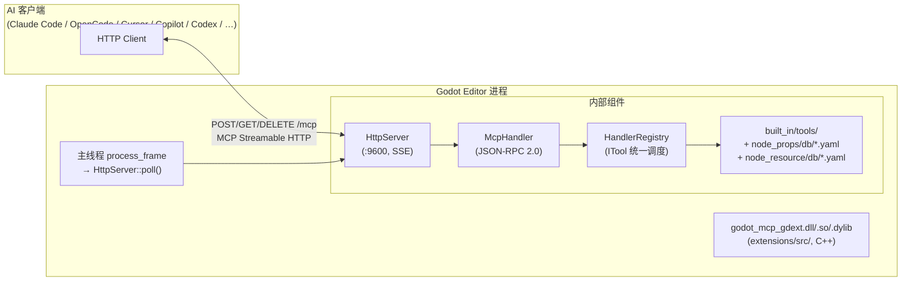
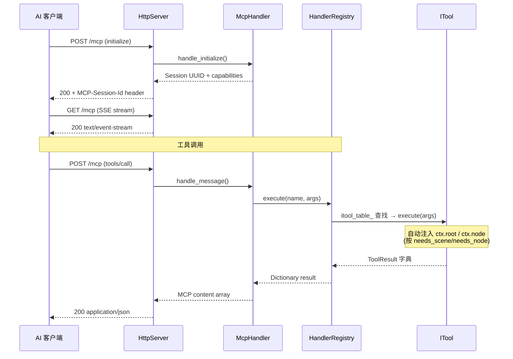
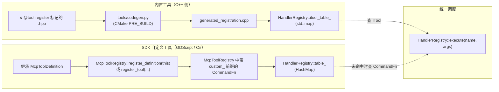

# 架构总览

项目是 C++ GDExtension 单进程架构，通过 MCP Streamable HTTP 直接暴露给 AI 客户端。

## 单进程设计



## 关键属性

| 维度 | 状态 |
|------|------|
| 进程数 | **1**（C++ GDExtension 加载到 Godot 编辑器内） |
| 传输 | MCP Streamable HTTP，端口 `:9600` |
| 工具注册 | `// @tool register` + `tools/codegen.py` 编译期自动注册 |
| 线程模型 | **纯主线程**（`EditorPlugin::_on_process_frame` 驱动） |
| 入口符号 | `gdext_rust_init`（`register_types.cpp:45`，遗留名） |
| 编码规范 | MSVC `/utf-8 /bigobj`（`extensions/CMakeLists.txt:152`） |
| 持久化 | C++ 侧无独立状态；Godot 编辑器持有数据 |

## 数据流（一次工具调用）



## 当前目录布局

```
extensions/src/                  # C++ GDExtension 唯一源码根
├── register_types.cpp           # GDExtension 入口 (gdext_rust_init)
├── editor_plugin.cpp/.hpp       # McpEditorPlugin 生命周期 + process_frame 泵
├── logging.hpp                  # 日志 inline 函数
├── built_in/
│   ├── tool_base.hpp/.cpp       # ITool + ToolResult + ToolContext
│   ├── cmd_utils.hpp/.cpp       # 共享工具（resolve_node / undoable_set / notify_file_changed）
│   ├── cmd_utils_json.cpp       # JSON↔Variant 递归转换
│   └── tools/                   # 19 个 .hpp 标 // @tool register
│       ├── meta/                #   5 个（get_info / get_categories / get_tools / get_tool_detail / call_tool）
│       ├── node_tools/          #   1 个（node_resource_tool，6 个资源子工具的 wrapper）
│       │   └── general/         #     6 个（load/clear/new/duplicate/save/get_resource_info）
│       ├── node_resource/       #   YAML 数据库（资源类型属性）
│       │   └── db/
│       ├── group/               #   4 个（add/remove/get_nodes_in_group/get_node_groups）
│       ├── signal/              #   4 个（connect/disconnect/list_signals/get_signal_connections）
│       └── node_props/          #   YAML 数据库（283 节点类型属性）+ 模板
│           ├── node_property_tool.hpp  # NodePropertyGetTool / NodePropertySetTool
│           └── db/                     # Node.yaml / CanvasItem.yaml / Label.yaml / ... (283 文件)
│           └── node_resource/          #   YAML 数据库（419 资源类型属性）
│               └── db/                 # Resource.yaml / Material.yaml / Texture2D.yaml / ... (419 文件)
├── server/
│   ├── ipc/
│   │   └── http_server.cpp/.hpp # MCP Streamable HTTP 服务器
│   ├── mcp/
│   │   └── mcp_handler.cpp/.hpp # JSON-RPC 2.0 会话管理
│   └── registry/
│       └── handler_registry.cpp/.hpp  # ITool 调度 + top_level_meta
├── sdk/
│   ├── mcp_tool_definition.hpp/.cpp   # GDScript/C# 可继承基类
│   └── mcp_tool_registry.hpp/.cpp     # 单例 SDK 注册表
├── lsp/
│   └── client.cpp/.hpp          # GDScript LSP 验证（StreamPeerTCP）
├── testing/
│   └── test_engine.cpp/.hpp     # C++ 进程内测试引擎
└── plugin/
    └── test_runner_dock.cpp/.hpp  # 编辑器底部面板（TestRunnerDock）

extensions/CMakeLists.txt        # FetchContent + codegen + add_library
tools/
├── codegen.py                   # // @tool register 扫描 + 两种 YAML 数据库 → 注册代码
└── collect_node_props.py        # Godot 运行时收集节点/资源属性 → YAML 数据库

example/addons/godot_mcp/        # 构建产物（GLOB 收集 + CMake 生成）
├── plugin.cfg                   # 由 CMake 从 PROJECT_VERSION 生成
├── godot_mcp.gdextension        # entry_symbol = gdext_rust_init
└── bin/                         # godot_mcp_gdext.{dll,so,dylib}（gitignored）
```

## 双重注册路径



详细命令路由与分类 remap 见 [modules/command-routing.md](../modules/command-routing.md)。
