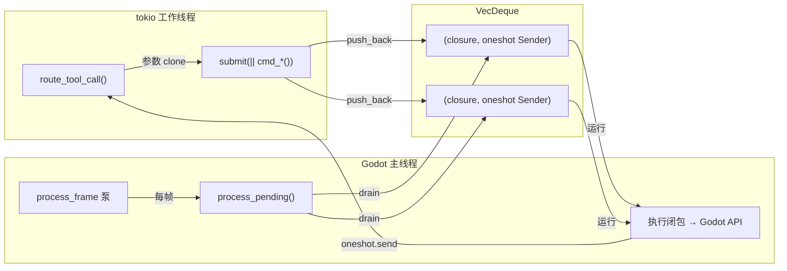
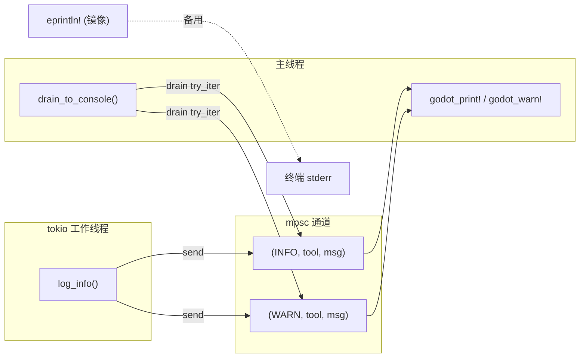

# 线程模型

> **接触 gdext 前必读。** 这是项目中最容易出问题的部分。

## 核心问题

工具路由运行在 tokio 工作线程上。**几乎所有 Godot API 如果在非主线程调用都会 panic**（崩溃）。

项目有两个机制来处理这个问题——以及为什么不能直接用 `EditorPlugin::process()`。

## 机制 1: MainThreadDispatcher



- 工作线程调用 `dispatcher.submit(move || { /* Godot API */ })`，返回一个 `oneshot` future
- 提交的内容是一个 `Box<dyn FnOnce() -> Value + Send>` 闭包，被推送到 `VecDeque`
- 主线程通过 `process_pending()` 取出并执行所有排队的闭包
- 所有 `cmd_*` 函数都通过此机制调用，无一例外（MetaCommands 也不除外——`handle_meta_tool` 不调用 Godot API 所以可以直接在主线程上下文调用，但它仍然是**从主线程**运行的）

## 机制 2: 跨线程日志



- 工作线程调用 `log_info/log_warn/log_error` → 消息进入 mpsc 通道 + `eprintln!` 镜像
- 主线程调用 `drain_to_console()` → 转发到 `godot_print!`/`godot_warn!`/`godot_error!`
- **绝不要在 tokio 工作线程上调用 `godot_print!`**

## 为什么不用 `EditorPlugin::process()`（bind_mut 陷阱）

```
EditorPlugin::process(&mut self)  ← 持有 self 的独占借用 (bind_mut)
  └─ 调用某个 Godot API
      └─ 该 API 同步触发信号
          └─ 信号回调试图访问编辑器插件
              └─ Gd<T>::bind_mut() 崩溃: "already bound"
```

两个队列都通过 `Callable::from_fn` 挂载在 `SceneTree::process_frame` 信号上：

```rust
// editor_plugin.rs (简化)
let callable = Callable::from_fn("godot_mcp_pump", move |_args| {
    dispatcher.process_pending();
    logging::drain_to_console();
    Variant::nil()
});
tree.connect("process_frame", &callable);
```

这样调用栈上**不持有** `McpEditorPlugin` 的任何绑定，Godot API 可安全重入。

## 新增工具的规则

1. 在 `commands/xx.rs` 中实现 `cmd_your_tool()` 函数
2. 在组内添加 `TOOL_NAMES` 和 `can_handle()` 匹配
3. 在 `commands/mod.rs::create_registry()` 中注册新组（或现有组的 handler）
4. 每个工具在 `handler.handle()` 中调用 `d.submit(move || cmd_*()).await`
5. 用 `pipe()` 包裹返回值：`pipe(d.submit(...).await)` 将 `json!({"error": "..."})` 转为 `Err`
6. `ws_server.rs` 的 `dispatch()` 自动遍历所有已注册的 handler——无需修改
