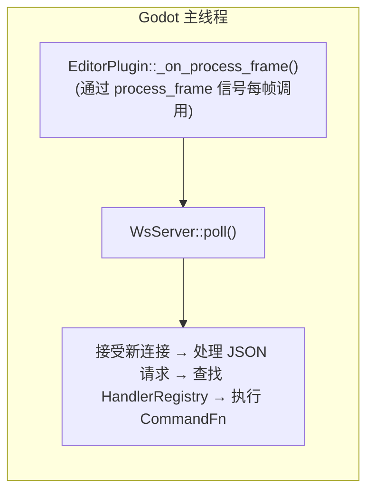

# 线程模型

> C++ 版本极其简单：**一切都在 Godot 主线程上运行**。Rust 遗留版本需要复杂的 tokio↔主线程分离。

## C++（当前）—— 纯主线程



C++ 版本**没有任何工作线程**。所有操作（WebSocket 接受、JSON 解析、命令执行、Godot API 调用）都在 `EditorPlugin::_on_process_frame()` 中同步完成，该函数通过 `SceneTree::process_frame` 信号每帧调用。

这意味着：
- **无需** `MainThreadDispatcher`
- **无需** 跨线程日志（直接调用 `UtilityFunctions::print`）
- **无需** tokio 运行时
- 无 `bind_mut` 死锁风险
- 所有 `cmd_*` 函数可以直接调用 Godot API

## Rust（遗留）—— tokio + 主线程 dispatcher

```
┌──────────────────────────────┐     ┌──────────────────────────────┐
│ tokio 工作线程 (2核)          │     │ Godot 主线程                 │
│                              │     │                              │
│ route_tool_call()            │     │ process_frame 泵             │
│   └─ dispatcher.submit() ───►│     │   ├─ process_pending()       │
│                              │ ──► │   └─ drain_to_console()      │
│ log_info/log_warn/log_error ─┤     │                              │
│   (mpsc 通道 + eprintln!)    │     │ godot_print!/godot_warn!     │
└──────────────────────────────┘     └──────────────────────────────┘
```

**核心问题**：`godot` Rust crate 要求所有 Godot API 调用必须从主线程进行。从 tokio 工作线程调用 `godot_print!` 会触发未定义行为（通常崩溃）。

**两个跨线程机制**：
1. **MainThreadDispatcher**：工作线程提交闭包 → `VecDeque` → 主线程每帧排空并执行
2. **mpsc 日志通道**：工作线程调用 `log_info` → mpsc 通道（+ `eprintln!` 镜像到 stderr）→ 主线程每帧排空到 `godot_print!`

两个队列都通过 `Callable::from_fn` 挂载在 `SceneTree::process_frame` 信号上——**不在** `EditorPlugin::_process()` 中，以避免 `bind_mut` 死锁。

## 为什么 C++ 如此简单？

Rust 的 `godot` crate 使用独特的 `Gd<T>::bind_mut()` 借用机制，该机制在运行时检查绑定是否已被借用——从非主线程调用时会 panic。godot-cpp （C++ 版本使用的）没有这种机制：它是一个普通的 C++ 类库，所有 API 调用仅是正常函数调用，没有线程借用检查。GDExtension API 本身确实要求在主线程调用，但`extensions/gdext/`中的所有代码都保证在主线程上运行（由 `_on_process_frame` 保证），因此无需额外基础设施。

## 实现细节（C++）

```cpp
// editor_plugin.cpp
void McpEditorPlugin::_enter_tree() {
    registry_.set_engine_version(Engine::get_singleton()->get_version_info().get("string", ""));
    registry_.set_plugin_version(String(GODOT_MCP_PLUGIN_VERSION));
    register_all_tools(registry_);
    
    ws_server_.start(port, &registry_);
    
    // connect to SceneTree::process_frame
    SceneTree *tree = Object::cast_to<SceneTree>(get_tree());
    tree->connect("process_frame", callable_mp(this, &McpEditorPlugin::_on_process_frame));
}

void McpEditorPlugin::_on_process_frame() {
    if (!started_) return;
    ws_server_.poll();  // 接受连接 + 处理消息 + 执行命令, 全部同步
}
```

## 处理 Rust 遗留代码时应避免的问题

当修改或审查 `crates/gdext/`（Rust）中的代码时：

1. 绝不在 tokio 工作线程上调用 `godot_print!`、`godot_warn!`、`godot_error!`
2. 所有 `cmd_*` 函数必须通过 `dispatcher.submit()` 调用
3. 使用 `pipe()` 包装 dispatcher 结果以正确传播 JSON 级的错误
4. 闭包必须 `move` 捕获值，而非引用
