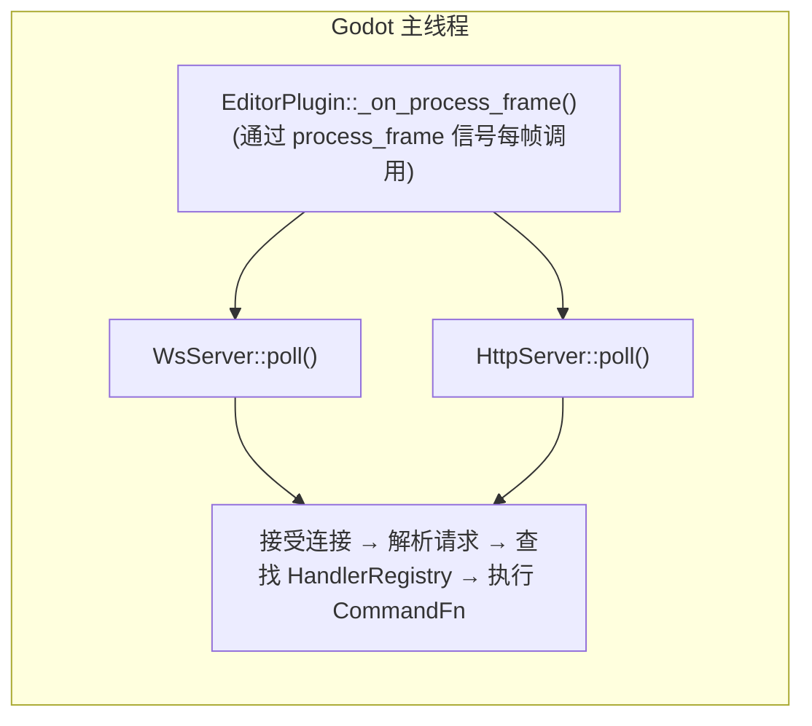

# 线程模型

> **一切都在 Godot 主线程上运行**——是项目最简单可靠的架构决策。

## 纯主线程



C++ 版本**没有任何工作线程**。所有操作（WebSocket 接受、HTTP 解析、JSON 处理、命令执行、Godot API 调用）都在 `EditorPlugin::_on_process_frame()` 中同步完成，该函数通过 `SceneTree::process_frame` 信号每帧调用。

这意味着：
- **无需** `MainThreadDispatcher`
- **无需** 跨线程日志（直接调用 `UtilityFunctions::print`）
- **无需** tokio 运行时
- 无 `bind_mut` 死锁风险
- 所有 `cmd_*` 函数可以直接调用 Godot API

## 为何选择纯主线程

Godot GDExtension API 要求所有 API 调用发生在主线程。C++ godot-cpp 绑定没有额外的线程借用检查机制，因此只要保证所有代码跑在主线程即可。`extensions/gdext/` 通过 `_on_process_frame` 确保这一点。

相比之下，Rust 的 `gdext` crate 的 `Gd<T>::bind_mut()` 借用机制增加了线程复杂性，是项目从 Rust 迁移到 C++ 的关键动因之一。

## 实现细节（C++）

```cpp
// editor_plugin.cpp
void McpEditorPlugin::_enter_tree() {
    registry_.set_engine_version(Engine::get_singleton()->get_version_info().get("string", ""));
    registry_.set_plugin_version(String(GODOT_MCP_PLUGIN_VERSION));
    register_all_tools(registry_);
    
    ws_server_.start(ws_port, &registry_);
    http_server_.start(http_port, &registry_, &mcp_handler_);
    mcp_handler_.set_registry(&registry_);
    
    SceneTree *tree = Object::cast_to<SceneTree>(get_tree());
    tree->connect("process_frame", callable_mp(this, &McpEditorPlugin::_on_process_frame));
}

void McpEditorPlugin::_on_process_frame() {
    if (!started_) return;
    ws_server_.poll();    // WebSocket legacy: 接受连接 + 处理消息 + 执行命令
    http_server_.poll();  // HTTP: 解析请求 + MCP 会话 + SSE 刷新
}
```

两个服务器共享同一个 `HandlerRegistry`，但路径不同：
- `WsServer` 直接通过 `HandlerRegistry::find()` 分发（扁平 IPC 协议）
- `HttpServer` 通过 `McpHandler` 分发（标准 MCP JSON-RPC 2.0 会话管理）
