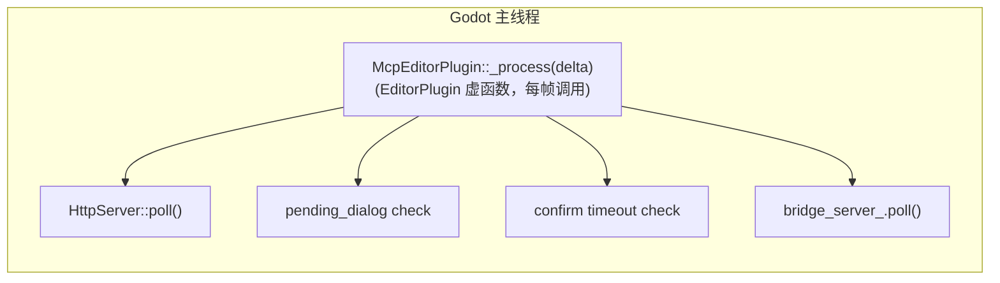

# 线程模型

> **一切都在 Godot 主线程上运行**——是项目最简单可靠的架构决策。

## 纯主线程



C++ 版本**没有任何工作线程**。所有操作（HTTP 解析、JSON 处理、命令执行、Godot API 调用）都在 `McpEditorPlugin::_process(delta)` 中同步完成。该函数是 `EditorPlugin` 的虚函数，由 Godot 引擎每帧自动调用。

这意味着：
- **无需** `MainThreadDispatcher`
- **无需** 跨线程日志（直接调用 `UtilityFunctions::print`）
- **无需** tokio 运行时
- 无 `bind_mut` 死锁风险
- 所有 `cmd_*` 函数可以直接调用 Godot API

## 为何选择纯主线程

Godot GDExtension API 要求所有 API 调用发生在主线程。C++ godot-cpp 绑定没有额外的线程边界检查机制，因此只要保证所有代码跑在主线程即可。`extensions/src/` 通过重写 `_process()` 确保这一点。

## 实现细节（C++）

```cpp
// editor_plugin.cpp:353-369
void McpEditorPlugin::_process(double /*delta*/) {
    if (!started_) return;

    http_server_.poll();
    if (pending_dialog_op_.has_value()) {
        // 处理确认对话框状态
    }
    mcp_handler_.check_pending_timeouts(kConfirmTimeoutMs);
    bridge_server_.poll();
}
```

`HttpServer::poll()` 非阻塞地处理 TCP 连接（accept、read、parse、dispatch），`RuntimeBridgeServer::poll()` 推进多实例 TCP 服务器状态机。所有操作在单帧内同步完成。`http_server_` 内部有 `polling_` 标志防止 `EditorProgress` → `Main::iteration()` 导致的递归重入。

`HttpServer::start()` 签名（`http_server.hpp:42`）：

```cpp
Error start(uint16_t port, McpHandler *mcp_handler, const String &bind_address = "127.0.0.1");
```

返回 `Error`，调用方检查返回值（`editor_plugin.cpp`）。
