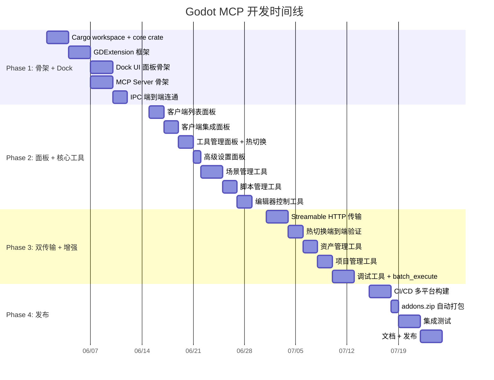

# 分阶段实施计划

## 相关页面

- [架构概览](../overview/architecture.md) — 要实现的架构
- [Cargo Workspace 结构](../specification/workspace.md) — 代码组织
- [Dock UI 面板](../design/dock-ui.md) — 面板实现
- [工具清单与热切换](../design/tools.md) — 工具实现

---

## 总览



## Phase 1：骨架搭建（预计 2 周）

**目标**：端到端连通，Dock 面板可见

| # | 任务 | 产出 | 验收标准 |
|---|------|------|----------|
| 1.1 | Cargo workspace 初始化 | `cargo build` 编译通过 | 三层 crate 均可正常编译 |
| 1.2 | core crate: 协议类型 | `IpcRequest`, `IpcResponse`, `IpcResult` | 单元测试覆盖序列化/反序列化 |
| 1.3 | GDExtension: `#[gdextension]` 入口 | `godot_mcp_gdext.{dll,so,dylib}` | Godot 启动时加载不报错 |
| 1.4 | GDExtension: EditorPlugin 注册 | McpEditorPlugin | 插件出现在 Project Settings > Plugins 列表 |
| 1.5 | Dock UI: 主容器 | VBoxContainer 在右侧 Dock 可见 | 启用插件后右侧面板自动出现 |
| 1.6 | Dock UI: 状态栏 | ColorRect + Label + Button | 显示绿色指示灯和 "Running" |
| 1.7 | GDExtension: WebSocket 服务端 | `IpcWebSocketServer` | `telnet 127.0.0.1 9500` 可连接 |
| 1.8 | MCP Server: CLI 框架 | `godot-mcp-server --help` | clap 参数正确解析 |
| 1.9 | MCP Server: stdio + `ping` | stdio transport 可运行 | 无错误退出 |
| 1.10 | IPC 连通验证 | Server → WebSocket → GDExtension → pong | 单元测试覆盖端到端消息往返 |

### Phase 1 关键风险

| 风险 | 说明 | 缓解 |
|------|------|------|
| tokio runtime 在 GDExtension 中启动失败 | Godot 主线程与 tokio 线程冲突 | 独立线程池 + EditorPlugin._process() |
| godot-rust/gdext API 不兼容 | 0.5 版本刚发布 | 锁定 `=0.5` 版本 |

## Phase 2：面板完善 + 核心工具（预计 2 周）

**目标**：完整 Dock 面板 + 30 个基础工具

| # | 任务 | 工具数 |
|---|------|--------|
| 2.1 | 客户端列表面板 | — |
| 2.2 | 客户端集成面板 + 一键配置 | — |
| 2.3 | 工具管理面板 + Tree CheckBox + hot-switch | — |
| 2.4 | 高级设置面板 | — |
| 2.5 | 场景管理工具组 (GDExtension + Server 双向) | 10 |
| 2.6 | 脚本管理工具组 | 8 |
| 2.7 | 编辑器控制工具组 | 7 |
| 2.8 | Resources 端点 | 4 |

### Phase 2 关键工具示例

```rust
impl CommandHandler for SceneCommands {
    fn can_handle(&self, method: &str) -> bool {
        matches!(method, "get_scene_tree" | "create_node" | ...)
    }
    
    fn execute(&self, params: &Value) -> Result<Value, String> {
        let method = params["tool"].as_str().unwrap();
        match method {
            "get_scene_tree" => self.get_scene_tree(),
            "create_node" => self.create_node(
                params["args"]["parent_path"].as_str().unwrap(),
                params["args"]["node_type"].as_str().unwrap(),
                params["args"]["name"].as_str().unwrap(),
            ),
            _ => Err(format!("Unknown tool: {}", method)),
        }
    }
}

impl SceneCommands {
    fn get_scene_tree(&self) -> Result<Value, String> {
        let editor = EditorInterface::singleton();
        let root = editor.get_edited_scene_root();
        Ok(serialize_node_tree(&root, 0, 10))
    }
}
```

## Phase 3：双传输 + 增强（预计 2 周）

**目标**：完整传输支持 + 剩余工具

| # | 任务 | 说明 |
|---|------|------|
| 3.1 | Streamable HTTP transport | axum 挂载 `/mcp` 端点 |
| 3.2 | `--transport all` 模式 | stdio + HTTP 并行 |
| 3.3 | 工具热切换端到端验证 | Dock → IPC → Server 完整链路 |
| 3.4 | 资产管理工具组 (6) | search_assets, import_asset, create_asset... |
| 3.5 | 项目管理工具组 (6) | get_project_settings, get_input_map... |
| 3.6 | 调试工具组 (6) | game_screenshot, get_debug_output... |
| 3.7 | batch_execute | 批量命令减少 IPC 往返 |

### Phase 3 网络配置

```
默认端口：
  WebSocket  : 9500 (GDExtension 服务端)
  HTTP       : 8900 (MCP Server HTTP 端点)
```

## Phase 4：发布（预计 2 周）

**目标**：CI/CD + 多平台分发

| # | 任务 | 说明 |
|---|------|------|
| 4.1 | GitHub Actions CI | cargo build + clippy + test 三平台 |
| 4.2 | 多平台 GDExtension 构建 | Windows (msvc), Linux (gnu), macOS |
| 4.3 | addons.zip 自动打包 | CI 制品中自动产出插件包 |
| 4.4 | 集成测试 | 端到端测试 |
| 4.5 | README 文档 | 安装说明、使用示例、客户端配置 |
| 4.6 | Godot Asset Library 发布 | 提交到 asset-library 仓库 |
| 4.7 | crates.io 发布 | 发布 `godot-mcp-server` crate |

### CI/CD 关键配置

```yaml
# .github/workflows/release.yml
name: Release
on:
  push:
    tags: 'v*'

jobs:
  build:
    strategy:
      matrix:
        include:
          - os: windows-latest
            target: x86_64-pc-windows-msvc
            ext: dll
            suffix: .exe
          - os: ubuntu-latest
            target: x86_64-unknown-linux-gnu
            ext: so
            suffix: ""
          - os: macos-latest
            target: x86_64-apple-darwin
            ext: dylib
            suffix: ""
    runs-on: ${{ matrix.os }}
    steps:
      - uses: actions/checkout@v4
      - run: cargo build --release --target ${{ matrix.target }} -p godot-mcp-gdext
      - run: cargo build --release --target ${{ matrix.target }} -p godot-mcp-server
      - run: |
          mkdir -p release/addons/godot_mcp/bin/
          cp target/${{ matrix.target }}/release/godot_mcp_gdext.${{ matrix.ext }} release/addons/godot_mcp/bin/
          cp target/${{ matrix.target }}/release/godot-mcp-server${{ matrix.suffix }} release/
      - uses: actions/upload-artifact@v4
        with:
          name: godot-mcp-${{ matrix.os }}
          path: release/
```

## 总计

| Phase | 周期 | 交付物 |
|-------|------|--------|
| Phase 1 | 2 周 | 骨架 + Dock 面板 + IPC 连通 |
| Phase 2 | 2 周 | 完整 Dock + 30+ 工具 |
| Phase 3 | 2 周 | 双传输 + 48 工具全部 |
| Phase 4 | 2 周 | CI/CD + 多平台发布 |
| **总计** | **8 周** | **初始发布版本 v0.1.0** |