# DAG 设计 — 节点定义与依赖关系

## 节点总览

57 个节点分为 8 个类别：

| 类别前缀 | 类别名 | 节点数 | 说明 |
|----------|--------|--------|------|
| B | Build System | 10 | CMake / build.py 修复 |
| X | Critical Bugs (P0) | 5 | 严重 bug 修复 |
| I | Infrastructure Primitives | 4 | 共享模板/工具函数 |
| T | Tool Migration | 7 | 将基础设施应用到工具 |
| A | Architecture | 7 | 核心架构重构 |
| P | Performance | 8 | 性能优化 |
| U | UI / Testing | 5 | UI 和测试基础设施 |
| M | Misc / Cleanup | 11 | 代码质量 + 死代码清理 |

---

## 完整节点列表

### B — Build System（10 节点）

| ID | 标题 | 文件域 | 依赖 | 优先级 |
|----|------|--------|------|--------|
| B1 | 移除 RELEASE option，统一 CMAKE_BUILD_TYPE | `CMakeLists.txt` L7; `ext/CMakeLists.txt` L191,195 | 无 | P1 |
| B2 | `add_compile_options` → `target_compile_options` | `ext/CMakeLists.txt` L207 | 无 | P1 |
| B3 | `CMAKE_POSITION_INDEPENDENT_CODE` 限定到 ryml | `ext/CMakeLists.txt` L44 | 无 | P1 |
| B4 | rapidyaml GIT → URL+SHA256 | `ext/CMakeLists.txt` L34-41 | 无 | P1 |
| B5 | 删除冗余 PREFIX 设置 | `ext/CMakeLists.txt` L157,160-162 | 无 | P1 |
| B6 | `file(WRITE)` → `configure_file` | `CMakeLists.txt` L68-92 | 无 | P2 |
| B7 | 清理死配置 | `ext/CMakeLists.txt` L110-121,127-128 | 无 | P3 |
| B8 | 提升警告级别 | `ext/CMakeLists.txt` L177,179 | B2 | P2 |
| B9 | build.py 修复 | `build.py` | 无 | P2 |
| B10 | register_itools.cpp SKIP_UNITY_BUILD | `ext/CMakeLists.txt` (新增行) | 无 | P3 |

### X — Critical Bugs P0（5 节点）

| ID | 标题 | 文件域 | 依赖 | 优先级 |
|----|------|--------|------|--------|
| X1 | McpConsole TreeItem 未删除 | `ui/mcp_console.cpp` L314-326 | 无 | P0 |
| X2 | read_response() 阻塞主线程 | `runtime/bridge.cpp` L197 | 无 | P0 |
| X3 | UTF-8 TCP 分片死锁 | `runtime/game_bridge.cpp` L181-191 | 无 | P0 |
| X4 | Auth token 长度泄漏 | `server/ipc/http_server.cpp` L254 | 无 | P0 |
| X5 | add_child 后 memdelete 所有权违规 | `tools/**/*.hpp` (~20 文件) | 无 | P0 |

### I — Infrastructure Primitives（4 节点）

| ID | 标题 | 文件域 | 依赖 | 优先级 |
|----|------|--------|------|--------|
| I1 | MemdeleteGuard\<T\> RAII 模板 | `cmd_utils/memdelete_guard.hpp` (新建) | 无 | P1 |
| I2 | SchemaBuilder 辅助函数 | `cmd_utils/schema_builder.hpp` (新建) | 无 | P1 |
| I3 | 空 schema 默认实现 | `tool_base.hpp` | 无 | P1 |
| I4 | 统一错误码常量 | `cmd_utils/error_codes.hpp` (新建) | 无 | P1 |

### T — Tool Migration（7 节点）

| ID | 标题 | 文件域 | 依赖 | 优先级 |
|----|------|--------|------|--------|
| T1 | 应用 MemdeleteGuard 到所有工具 | `tools/**/*.hpp` (~20 文件) | I1, X5 | P1 |
| T2 | 应用 SchemaBuilder 到 171 工具 | `tools/**/*.hpp` (171 文件) | I2, I3 | P2 |
| T3 | 合并 GDScript/C# 工具对 (10→5) | `tools/**/scripts/*_gd_*.hpp`, `*_csharp_*.hpp` | I2 | P1 |
| T4 | 删除冗余 debugger 快捷工具 (5→0) | `tools/**/workspace/debugger_*.hpp`, `register/*.hpp` | 无 | P1 |
| T5 | 删除冗余 workspace 快捷工具 (4→0) | `tools/**/workspace/set_workspace_*.hpp`, `register/*.hpp` | 无 | P1 |
| T6 | 合并 args_get / args_get_typed | `cmd_utils.hpp`, `cmd_utils/args_get_typed.hpp` | 无 | P2 |
| T7 | 修正 is_destructive 标记 | `register/register_existing.hpp` | 无 | P1 |

### A — Architecture（7 节点）

| ID | 标题 | 文件域 | 依赖 | 优先级 |
|----|------|--------|------|--------|
| A1 | ToolInfo 去重 | `server/registry/handler_registry.hpp/cpp` | 无 | P1 |
| A2 | pending_requests_ 修复 | `server/mcp/mcp_handler.hpp/cpp` | 无 | P1 |
| A3 | 场景树递归深度限制 | `server/mcp/mcp_handler.cpp` L524-540 | 无 | P1 |
| A4 | 死代码清理 | `tool_executor.hpp/cpp`, `handler_registry.cpp`, `tool_base.hpp` | 无 | P2 |
| A5 | auth_token/permission_policy 清理 | `server/mcp/tool_executor.hpp/cpp` | 无 | P2 |
| A6 | 错误码类型统一 | `runtime/bridge.cpp` | I4 | P2 |
| A7 | PromptProvider 简化 | `server/mcp/prompt_provider.cpp` | 无 | P3 |

### P — Performance（8 节点）

| ID | 标题 | 文件域 | 依赖 | 优先级 |
|----|------|--------|------|--------|
| P1 | search_tools 预构建索引 | `server/registry/handler_registry.cpp` | A1 | P2 |
| P2 | HTTP 响应字符串优化 | `server/ipc/http_connection.cpp` | 无 | P2 |
| P3 | 日志格式化优化 | `server/mcp/tool_executor.cpp` | A5 | P2 |
| P4 | Vector reserve() | 多文件（~10 处） | 无 | P2 |
| P5 | McpLogger 持久化文件句柄 | `ui/mcp_logger.cpp` | 无 | P2 |
| P6 | GameBridge 字节跟踪 | `runtime/game_bridge.cpp` | X3 | P2 |
| P7 | Performance monitors DispatchMap | `tools/**/get_performance_monitors.hpp` | 无 | P2 |
| P8 | Console 缓存复用 | `tools/**/get_console_errors.hpp`, `get_console_warnings.hpp` | 无 | P2 |

### U — UI / Testing（5 节点）

| ID | 标题 | 文件域 | 依赖 | 优先级 |
|----|------|--------|------|--------|
| U1 | Logger 轮转路径修复 | `ui/mcp_logger.cpp` | 无 | P1 |
| U2 | McpDock 状态更新优化 | `ui/mcp_dock.cpp` | 无 | P2 |
| U3 | 测试编排器进程泄漏修复 | `tests/test_orchestrator.py` | 无 | P1 |
| U4 | httpx client 复用 | `tests/godot_manager.py` | 无 | P1 |
| U5 | yaml_parser 优化 | `testing/yaml_parser.hpp` | 无 | P2 |

### M — Misc / Cleanup（11 节点）

| ID | 标题 | 文件域 | 依赖 | 优先级 |
|----|------|--------|------|--------|
| M1 | debugger_step_out 行为修正 | `tools/**/debugger_step_out.hpp` | 无 | P3 |
| M2 | get_info error_count 修复 | `tools/**/get_info.hpp` | 无 | P3 |
| M3 | #pragma 顺序修正 | 3 个文件 | 无 | P3 |
| M4 | set_shader_uniform undo 支持 | `tools/**/set_shader_uniform.hpp` | 无 | P1 |
| M5 | 移除未使用 ToolResult 方法 | `tool_base.hpp` | A4 | P3 |
| M6 | Performance 监控子集工具合并 | `tools/**/workspace/get_fps.hpp` 等 5 文件 | 无 | P2 |
| M7 | Console 查询工具合并 | `tools/**/get_console_errors.hpp`, `get_console_warnings.hpp` | 无 | P2 |
| M8 | Debugger 状态查询工具合并 | `tools/**/get_debugger_*.hpp` 3 文件 | 无 | P2 |
| M9 | Resource 工具基类提取 | `tools/**/resource/*.hpp` 6 文件 | 无 | P2 |
| M10 | Toggle 工具模板化 | `tools/**/toggle_*.hpp` 3 文件 | 无 | P2 |
| M11 | Misc P3 小项 | 多文件（单行改动） | B7 | P3 |

---

## 依赖关系图（Mermaid）

```mermaid
graph TD
    subgraph "Batch 0 — Foundation (19 nodes, all parallel)"
        B1
        B2
        B3
        B4
        B5
        B6
        B7
        B9
        X1
        X2
        X3
        X4
        I1
        I2
        I3
        I4
        T4
        T5
        T7
    end

    subgraph "Batch 1 — Infrastructure (5 nodes)"
        B8
        B10
        T6
        U3
        U4
    end

    subgraph "Batch 2 — Tool Migration (5 nodes)"
        X5
        T1
        T3
        A4
        U1
    end

    subgraph "Batch 3 — Architecture & Performance (12 nodes)"
        A1
        A2
        A3
        A5
        A6
        A7
        P2
        P4
        P5
        P7
        P8
        M4
    end

    subgraph "Batch 4 — Performance Continued (7 nodes)"
        P1
        P3
        P6
        U2
        U5
        M6
        M7
    end

    subgraph "Batch 5 — Remaining Migration (3 nodes)"
        T2
        M9
        M10
    end

    subgraph "Batch 6 — Consolidation (4 nodes)"
        M8
        M1
        M2
        M3
    end

    subgraph "Batch 7 — Final Cleanup (6 nodes)"
        M5
        M11
    end

    %% Dependencies
    B2 --> B8
    I1 --> T1
    X5 --> T1
    I2 --> T2
    I3 --> T2
    I2 --> T3
    A4 --> M5
    A4 --> T2
    A1 --> P1
    A5 --> P3
    X3 --> P6
    B7 --> M11
    I4 --> A6

    %% Gate markers
    GATE1["🔒 GATE 1<br/>编译 + 测试"]
    GATE2["🔒 GATE 2<br/>编译 + 测试"]
    GATE3["🔒 GATE 3<br/>编译 + 测试"]

    B9 -.-> GATE1
    I4 -.-> GATE1
    T7 -.-> GATE1

    T1 -.-> GATE2
    A5 -.-> GATE2
    M4 -.-> GATE2

    T2 -.-> GATE3
    M10 -.-> GATE3
    M3 -.-> GATE3
```



---

## 依赖关系矩阵

下表列出所有非平凡依赖（"无"依赖表示可在 Batch 0 执行）：

| 节点 | 前置依赖 | 原因 |
|------|----------|------|
| B8 | B2 | B2 将 `add_compile_options` 改为 `target_compile_options`，B8 在新基础上加警告标志 |
| T1 | I1, X5 | 需要 MemdeleteGuard 模板存在；X5 先修复所有权问题，T1 再用 guard 替换手动清理 |
| T2 | I2, I3, A4 | 需要 SchemaBuilder 和空 schema 默认实现；A4 清理死代码后避免冲突 |
| T3 | I2 | 合并后的模板工具使用 SchemaBuilder |
| P1 | A1 | A1 重构 HandlerRegistry 后，P1 在新结构上建索引 |
| P3 | A5 | A5 清理 tool_executor 后，P3 优化同一文件的日志格式化 |
| P6 | X3 | X3 修复 UTF-8 分片后，P6 在同一文件优化字节跟踪 |
| A6 | I4 | A6 使用 I4 定义的错误码常量 |
| M5 | A4 | A4 清理 tool_executor 死代码后，M5 移除 tool_base 中未使用方法 |
| M11 | B7 | B7 清理 CMake 死配置后，M11 清理代码中的对应残留 |

---

## 文件域冲突矩阵

以下文件被多个节点触碰，**不可**分配到同一批次的不同 subagent：

| 文件 | 涉及节点 | 解决方案 |
|------|----------|----------|
| `ext/CMakeLists.txt` | B1,B2,B3,B4,B5,B7,B8,B10 | 同一 subagent 处理所有 B 类 CMake 改动 |
| `tool_executor.hpp/cpp` | A4,A5,P3 | A4+A5 同批次，P3 延后 |
| `mcp_handler.hpp/cpp` | A2,A3 | 同一 subagent |
| `handler_registry.hpp/cpp` | A1,P1 | A1 先，P1 延后 |
| `mcp_logger.cpp` | U1,P5 | 同一 subagent |
| `game_bridge.cpp` | X3,P6 | X3 先，P6 延后 |
| `tool_base.hpp` | I3,A4,M5 | I3 先，A4+M5 同批次 |
| `tools/**/*.hpp` (20 文件) | X5,T1 | X5+T1 同一 subagent |
| `tools/**/*.hpp` (171 文件) | T2 | 独立大批次 |
| `register/register_existing.hpp` | T4,T5,T7 | T7 先（小改动），T4+T5 同批次 |

---

## 关键路径

最长依赖链（决定最短总工期）：

```
B2 → B8                                    (2 批次)
I1 → X5 → T1                               (3 批次)
I2 → T3                                    (2 批次)
I2 → T2 ← A4                               (3 批次)
A1 → P1                                    (2 批次)
X3 → P6                                    (2 批次)
```

**关键路径长度 = 3 批次**（I1→X5→T1 和 I2→T2←A4）。加上 8 个批次的串行约束，总批次 = 8。
