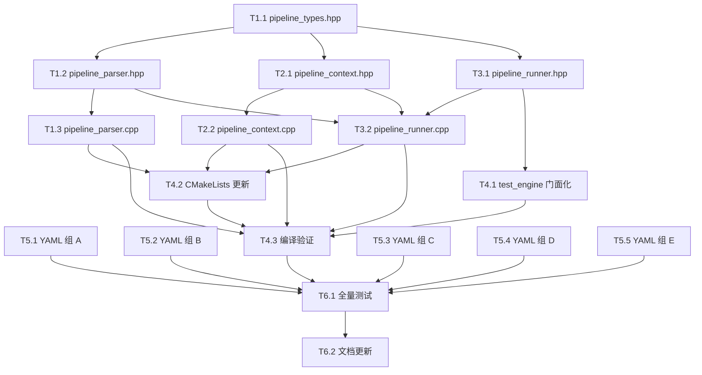

# DAG 执行规划 — 测试引擎流水线重构

> **配套文档**：[pipeline-refactor-plan.md](pipeline-refactor-plan.md)（完整重构方案）
> **执行模式**：多 subagent 高并发，串行/并行交替批次执行
> **DAG 节点总数**：18 个
> **批次总数**：7 批
> **最大并行度**：5（批次 1、2 达到上限）

---

## 1. DAG 全景图



---

## 2. 批次执行计划

### 拓扑排序结果

| 批次 | 节点数 | 并行度 | 节点列表 | 预计耗时 |
|------|--------|--------|----------|----------|
| **批次 0** | 1 | 1 | T1.1 | ~3 min |
| **批次 1** | 5 | **5** | T1.2, T2.1, T3.1, T5.1, T5.2 | ~3 min |
| **批次 2** | 5 | **5** | T1.3, T2.2, T3.2, T4.1, T5.3 | ~5 min |
| **批次 3** | 3 | 3 | T4.2, T5.4, T5.5 | ~3 min |
| **批次 4** | 1 | 1 | T4.3 | ~2 min |
| **批次 5** | 1 | 1 | T6.1 | ~5 min |
| **批次 6** | 1 | 1 | T6.2 | ~3 min |
| **总计** | 18 | — | — | ~24 min（理论） |

### 并行度分析

```
并行度
  5 │      █████       █████
  4 │      █████       █████
  3 │      █████       █████   ███
  2 │      █████       █████   ███
  1 │  ███ █████       █████   ███   ███   ███   ███
    └──┬──────┬──────────┬──────┬─────┬─────┬─────┬──→ 批次
       0      1          2      3     4     5     6
```

**关键路径**：T1.1 → T1.2 → T1.3 → T4.2 → T4.3 → T6.1 → T6.2（7 步串行）

**并行优化要点**：
- YAML 迁移（T5.1~T5.5）与 C++ 实现完全解耦，从批次 1 起即并行
- T4.1（门面化）在批次 2 与 T1.3/T2.2/T3.2 并行（文件域不冲突）
- T3.2（runner.cpp）仅依赖头文件接口（T1.2/T2.1/T3.1），不依赖 T1.3/T2.2 实现完成

---

## 3. 文件域隔离矩阵

确保同批次并行节点操作不同文件：

| 批次 | 节点 | 操作文件 | 冲突检查 |
|------|------|----------|----------|
| 0 | T1.1 | `pipeline_types.hpp`（新建） | 无冲突 |
| 1 | T1.2 | `pipeline_parser.hpp`（新建） | 无冲突 |
| 1 | T2.1 | `pipeline_context.hpp`（新建） | 无冲突 |
| 1 | T3.1 | `pipeline_runner.hpp`（新建） | 无冲突 |
| 1 | T5.1 | `tests/yaml_tests/00~04*.yaml`（5 文件） | 无冲突 |
| 1 | T5.2 | `tests/yaml_tests/05~09*.yaml`（5 文件） | 无冲突 |
| 2 | T1.3 | `pipeline_parser.cpp`（新建） | 无冲突 |
| 2 | T2.2 | `pipeline_context.cpp`（新建） | 无冲突 |
| 2 | T3.2 | `pipeline_runner.cpp`（新建） | 无冲突 |
| 2 | T4.1 | `test_engine.hpp` + `test_engine.cpp`（修改） | 无冲突（T3.2 是新文件） |
| 2 | T5.3 | `tests/yaml_tests/10~14*.yaml`（5 文件） | 无冲突 |
| 3 | T4.2 | `extensions/CMakeLists.txt`（修改） | 无冲突 |
| 3 | T5.4 | `tests/yaml_tests/15~19*.yaml`（5 文件） | 无冲突 |
| 3 | T5.5 | `tests/yaml_tests/20~24*.yaml`（5 文件） | 无冲突 |
| 4 | T4.3 | 无文件操作（编译命令） | 无冲突 |
| 5 | T6.1 | 无文件操作（测试命令） | 无冲突 |
| 6 | T6.2 | `.repo_wiki/testing/test-engine.md`（修改） | 无冲突 |

---

## 4. 节点六要素定义

每个节点包含完整任务定义，subagent 可直接执行无需追问。

---

### T1.1 — pipeline_types.hpp

| 要素 | 内容 |
|------|------|
| **WHY** | 所有 C++ 模块（parser/context/runner）的类型基础，是 DAG 关键路径起点 |
| **WHAT** | 创建 `extensions/src/testing/pipeline_types.hpp`，定义全部结构体和枚举 |
| **WHERE** | `extensions/src/testing/pipeline_types.hpp`（新建） |
| **DONE** | 文件存在，包含所有类型定义，`#pragma once`，`namespace godot_mcp::pipeline`，可被其他文件 include 编译通过 |
| **DON'T** | 不包含函数实现，不 include godot 头文件以外的项目头文件，不嵌入中文字符串，不放在 namespace{} 内 include |
| **Context** | 完整类型定义见 [pipeline-refactor-plan.md §3.2](pipeline-refactor-plan.md#32-类型定义pipeline_typeshpp)。包含：FailPolicy/StepStatus 枚举、StepError/ExecResult/StepResult/WhenClause/ChainStep/StepDef/StageDef/PipelineDef 结构体、ParseResult = variant<shared_ptr<PipelineDef>, ParseError>。所有权：PipelineDef 和 PipelineContext 用 shared_ptr，PipelineRunner 用 unique_ptr，vector 用值语义。需 include 的 godot 头文件：variant/dictionary/string/vector.hpp + memory/optional/variant/vector |

---

### T1.2 — pipeline_parser.hpp

| 要素 | 内容 |
|------|------|
| **WHY** | 解析器声明，T1.3（实现）和 T3.2（runner 调用）的接口依赖 |
| **WHAT** | 创建 `extensions/src/testing/pipeline_parser.hpp`，声明解析函数 |
| **WHERE** | `extensions/src/testing/pipeline_parser.hpp`（新建） |
| **DONE** | 文件存在，声明 `ParseResult parse_pipeline(const godot::Dictionary& config)`，include pipeline_types.hpp |
| **DON'T** | 不包含实现逻辑，不 include yaml_parser.hpp（那是 .cpp 的事） |
| **Context** | 接口签名：`ParseResult parse_pipeline(const godot::Dictionary& config)`。输入是 `parse_yaml()` 产出的顶层 Dictionary（已从 ryml 转换）。输出是 `ParseResult`（variant<shared_ptr<PipelineDef>, ParseError>）。ParseError 含 message 和 field 两个字段 |

---

### T1.3 — pipeline_parser.cpp

| 要素 | 内容 |
|------|------|
| **WHY** | 解析器实现，将 Godot Dictionary 转换为强类型 PipelineDef 并校验 |
| **WHAT** | 创建 `extensions/src/testing/pipeline_parser.cpp`，实现 Dictionary→PipelineDef 转换 + 校验 |
| **WHERE** | `extensions/src/testing/pipeline_parser.cpp`（新建） |
| **DONE** | 实现以下功能：①解析顶层(name/description/headless/before_all/after_all/stages) ②解析 ChainStep 数组 ③解析 Stage(id/name/before_each/after_each/on_failure/steps) ④解析 StepDef(id/tool/description/args/expect/disk_verify/depends_on/when/on_failure/retry/allow_failure) ⑤FailPolicy 字符串→枚举映射 ⑥校验：step id 唯一性(pipeline 级)、depends_on 环检测(Kahn 算法，用 std::vector 不用 std::sort on godot::Vector)、depends_on 引用存在性、必填字段(id/tool)非空 |
| **DON'T** | 不处理模板展开（那是 Context 的事），不执行工具调用（那是 Runner 的事），不用 Dictionary::ptr()（不存在），不嵌入中文字符串 |
| **Context** | 输入 Dictionary 的 key 与新 YAML schema 一致：顶层 `pipeline` 包含 before_all/after_all/on_failure/stages。每个 stage 有 id/name/before_each/after_each/on_failure/steps。每个 step 有 id/tool/description/args/expect/disk_verify/depends_on/when/on_failure/retry/allow_failure。when 是 Dictionary{step, status}。retry 是 Dictionary{count, delay_ms}。FailPolicy 映射：fail_fast→FailFast, stop→Stop, continue→Continue。环检测：对同 Stage 内 steps 构建 DAG，Kahn 拓扑排序检测环，有环则返回 ParseError。参考现有 test_engine.cpp 中 Dictionary.get() 的使用模式。int64_t 遍历 size()，传参才 cast |

---

### T2.1 — pipeline_context.hpp

| 要素 | 内容 |
|------|------|
| **WHY** | Context 声明，T2.2（实现）和 T3.2（runner 调用）的接口依赖 |
| **WHAT** | 创建 `extensions/src/testing/pipeline_context.hpp`，声明 PipelineContext 类 |
| **WHERE** | `extensions/src/testing/pipeline_context.hpp`（新建） |
| **DONE** | 文件存在，声明 PipelineContext 类含 record_step/get_step/eval_when/expand_templates 方法，include pipeline_types.hpp，含 std::mutex 成员 |
| **DON'T** | 不包含实现逻辑，不 include 不必要的头文件 |
| **Context** | 类接口见 [pipeline-refactor-plan.md §3.4](pipeline-refactor-plan.md#34-context-与模板展开pipeline_contexthppcpp)。方法签名：`void record_step(const godot::String& id, StepResult r)`、`std::optional<StepResult> get_step(const godot::String& id) const`、`bool eval_when(const WhenClause& c) const`、`godot::Dictionary expand_templates(const godot::Dictionary& args) const`。成员：`std::mutex mtx_`、`godot::HashMap<godot::String, StepResult> step_results_` |

---

### T2.2 — pipeline_context.cpp

| 要素 | 内容 |
|------|------|
| **WHY** | Context 实现，模板展开和 when 求值是数据流核心 |
| **WHAT** | 创建 `extensions/src/testing/pipeline_context.cpp`，实现模板展开 + when 求值 + step 结果存储 |
| **WHERE** | `extensions/src/testing/pipeline_context.cpp`（新建） |
| **DONE** | 实现以下功能：①record_step：加锁写入 step_results_ ②get_step：加锁读取，返回 optional ③eval_when：查找引用 step 的 status，与 WhenClause.expected 比较，step 不存在返回 false ④expand_templates：遍历 args Dictionary 的每个值，检测 `${steps.<id>.result.<path>}` 模式，解析 step_id 和 path，从 step_results_ 取 raw_result，按 path 点分隔遍历。整串为模板→保留原 Variant 类型；嵌入拼接→字符串化。未知引用→返回含错误标记的 Dictionary（让 runner Fail Fast） |
| **DON'T** | 不执行工具调用，不修改 step_results_ 中的已存在条目（除非 record_step），不用 Dictionary::ptr()，HashMap range-for 内不 erase() |
| **Context** | 模板语法见 [pipeline-refactor-plan.md §4.3](pipeline-refactor-plan.md#43-模板变量语法)。模板正则模式：`${steps.<id>.result.<path>}` 或 `${steps.<id>.result}` 或 `${steps.<id>.status}`。path 是点分隔路径如 "node_path" 或 "data.node.path"。整串匹配（String 完全等于 `${...}`）→保留原类型。部分匹配（模板嵌入更大文本）→godot::String 拼接。用 std::string_view 做字段名查找优化。结构化绑定遍历 Dictionary：`for (int i = 0; i < keys.size(); ++i)`。StepResult.raw_result 是 godot::Dictionary，按 path 遍历时参考 test_assertions.hpp:74-91 的点分隔路径遍历模式 |

---

### T3.1 — pipeline_runner.hpp

| 要素 | 内容 |
|------|------|
| **WHY** | Runner 声明，T3.2（实现）和 T4.1（门面化）的接口依赖 |
| **WHAT** | 创建 `extensions/src/testing/pipeline_runner.hpp`，声明 PipelineRunner 类 |
| **WHERE** | `extensions/src/testing/pipeline_runner.hpp`（新建） |
| **DONE** | 文件存在，声明 PipelineRunner 类含 run 方法，构造函数接收 HandlerRegistry*，include pipeline_types.hpp 和 pipeline_context.hpp |
| **DON'T** | 不包含实现逻辑，不 include pipeline_parser.hpp（runner 不直接解析，接收已解析的 PipelineDef） |
| **Context** | 类接口：`class PipelineRunner { public: PipelineRunner(HandlerRegistry* registry); godot::Dictionary run(const std::shared_ptr<PipelineDef>& pipeline); private: ... }`。返回值是 Godot Dictionary，形状与旧 test_engine.run() 兼容（含 summary + tests 数组）。需前向声明 HandlerRegistry。内部需声明 FileSnapshot 等私有结构体（从 test_engine.hpp:34-48 移植） |

---

### T3.2 — pipeline_runner.cpp

| 要素 | 内容 |
|------|------|
| **WHY** | 核心执行引擎，调度 Pipeline→Stage→Step 执行，含清理逻辑移植 |
| **WHAT** | 创建 `extensions/src/testing/pipeline_runner.cpp`，实现完整执行引擎 |
| **WHERE** | `extensions/src/testing/pipeline_runner.cpp`（新建） |
| **DONE** | 实现以下功能：①移植清理逻辑：take_snapshot/track_paths/cleanup/record_setting_before_call/restore_settings/backup_project_godot/restore_project_godot（从 test_engine.cpp 原样移植）②run() 主流程：backup_project_godot → take_snapshot(before) → 执行 before_all chain → 遍历 stages → 每 stage 内拓扑排序 steps → 每 step: expand_templates → eval_when → 检查依赖状态 → before_each → 执行工具(含retry) → run_assertions → run_disk_verification → after_each → after_all chain → restore_settings → restore_project_godot → take_snapshot(after) → cleanup ③失败策略处理：fail_fast(本 stage 剩余 skip)/stop(终止 pipeline)/continue(记录继续) ④allow_failure：失败计为 passed ⑤retry：失败后原样重调 N 次，可选 delay_ms 间隔(Time::get_singleton()->get_ticks_msec 等待) ⑥构建兼容响应 Dictionary(summary + tests 数组，每项加可选 stage/step_id 字段) ⑦统计 CallStats(total/passed/failed/skipped/unique_tools 等) ⑧拓扑排序：Kahn 算法，用 std::vector 不用 godot::Vector |
| **DON'T** | 不引入 std::thread/std::async（纯主线程串行），不修改 test_engine.cpp（T4.1 负责），不用 save_scene（用 save_scene_as(path, false) 避免预览重入），不嵌入中文字符串，不用 Dictionary::ptr()，不在 HashMap range-for 内 erase() |
| **Context** | 清理逻辑源码见 test_engine.cpp:22-280（take_snapshot/track_paths/cleanup/record_setting_before_call/restore_settings/backup_project_godot/restore_project_godot），原样移植。execute_chain 逻辑(test_engine.cpp:287-369) 需适配新 ChainStep 结构。execute_test 逻辑(test_engine.cpp:375-444) 需适配新 StepDef 结构，加入 retry 和 allow_failure。run() 主流程(test_engine.cpp:450-690) 需适配新 PipelineDef→Stage→Step 层级。断言调用 run_assertions(expect, result) 来自 test_assertions.hpp。磁盘校验调用 run_disk_verification(disk_verify) 来自 godot_file_verifier.hpp。工具执行通过 registry_->execute(tool_name, args)。HandlerRegistry 接口见 handler_registry.hpp:37。CallStats 结构体从 test_engine.hpp:38-48 移植。响应 Dictionary 形状见 [pipeline-refactor-plan.md §7](pipeline-refactor-plan.md#7-响应-json-兼容性)。step 跳过条件：①when 求值为 false ②依赖 step 状态为 failed/skipped（除非 allow_failure 或 when 覆盖）③stage on_failure=fail_fast 且前序 step 失败 |

---

### T4.1 — test_engine 门面化

| 要素 | 内容 |
|------|------|
| **WHY** | 保持外部接口稳定，editor_plugin/http_server 零改动 |
| **WHAT** | 修改 test_engine.hpp/.cpp，降级为薄门面委托 PipelineRunner |
| **WHERE** | `extensions/src/testing/test_engine.hpp`（修改）+ `extensions/src/testing/test_engine.cpp`（修改） |
| **DONE** | ①test_engine.hpp：删除所有旧私有方法和成员（FileSnapshot/CallStats/take_snapshot 等），保留 `class TestEngine { public: TestEngine(HandlerRegistry*); godot::Dictionary run(const godot::String&); private: std::unique_ptr<PipelineRunner> runner_; HandlerRegistry* registry_; }` ②test_engine.cpp：删除所有旧实现，run() 内部：parse_yaml(yaml_content) → 检查是 Dictionary → 调用 parse_pipeline(config) → 检查 ParseResult 是否成功 → 委托 runner_->run(pipeline) → 返回结果。解析失败时返回 {error: ...} Dictionary |
| **DON'T** | 不改变 TestEngine 类名和构造函数签名（editor_plugin.hpp:53 `TestEngine test_engine_{&registry_}` 不动），不改变 run() 方法签名（test_http_handler.hpp:15 调用不动），不删除 #include "yaml_parser.hpp"（run() 仍需 parse_yaml），不修改 test_assertions.hpp/godot_file_verifier.hpp/type_utils.hpp |
| **Context** | 旧 test_engine.hpp 全文 73 行，旧 test_engine.cpp 全文 692 行。门面化后 hpp 约 20 行，cpp 约 30 行。run() 新逻辑：`parse_yaml` 来自 yaml_parser.hpp，`parse_pipeline` 来自 pipeline_parser.hpp（需 include），`PipelineRunner` 来自 pipeline_runner.hpp（需 include）。ParseResult 是 variant<shared_ptr<PipelineDef>, ParseError>，用 std::holds_alternative / std::get 检查。test_http_handler.hpp 不需要改动，因为它调用 `engine.run(yaml_body)` 返回 Dictionary，形状不变 |

---

### T4.2 — CMakeLists 更新

| 要素 | 内容 |
|------|------|
| **WHY** | 新增 3 个 .cpp 文件需纳入编译 |
| **WHAT** | 修改 extensions/CMakeLists.txt，在源文件列表中添加 3 个新文件 |
| **WHERE** | `extensions/CMakeLists.txt`（修改，第 83 行附近） |
| **DONE** | 在 `src/testing/test_engine.cpp` 行下方添加 `src/testing/pipeline_parser.cpp`、`src/testing/pipeline_context.cpp`、`src/testing/pipeline_runner.cpp` 三行 |
| **DON'T** | 不修改其他构建配置（UNITY_BUILD/lld_link/PGO 等不动），不修改 C++ 标准版本(保持 17)，不添加新的 target_link_libraries |
| **Context** | 现有源列表在 extensions/CMakeLists.txt:51-89，`src/testing/test_engine.cpp` 在第 83 行。GLOB TOOL_SOURCES 在 94 行只 glob tools/*.cpp，不影响 testing/ 目录。新增文件加入 GODOT_MCP_SOURCES 即可被 Unity build 纳入 |

---

### T4.3 — 编译验证

| 要素 | 内容 |
|------|------|
| **WHY** | 验证所有新代码和门面化后代码编译通过 |
| **WHAT** | 执行构建命令，检查零错误零警告 |
| **WHERE** | 无文件操作（命令执行） |
| **DONE** | `uv run python main.py build` 执行成功，输出零编译错误。如有错误，记录错误信息并回报（不自行修复，交回主 agent 决策） |
| **DON'T** | 不自行修复编译错误（文件域可能属于其他节点），不修改代码，不运行测试（那是 T6.1），不 --release |
| **Context** | 构建命令见 AGENTS.md：`uv run python main.py build`（Debug 构建 + 复制到 example/）。DLL 文件锁：如重建失败提示 DLL 被持有，回报"需关闭 Godot 编辑器"。老旧缓存：构建系统自动检测编译器/路径变更并 --clean 重试。此节点依赖 T1.3/T2.2/T3.2/T4.1/T4.2 全部完成 |

---

### T5.1 — YAML 迁移组 A（00~04）

| 要素 | 内容 |
|------|------|
| **WHY** | 将旧扁平 tests: 格式迁移为新 pipeline: schema |
| **WHAT** | 改写 5 个 YAML 文件为新格式 |
| **WHERE** | `tests/yaml_tests/00_meta.yaml`、`01_docs.yaml`、`02_workspace.yaml`、`03_filesystem_settings.yaml`、`04_scene_tree.yaml` |
| **DONE** | 5 个文件全部使用新 schema：顶层 `pipeline:` 包含 before_all/after_all/stages，旧 `tests:` 转为单 Stage 内 steps，旧全局 before_all/after_all 保持为 pipeline 级，每个 step 加 `id` 字段，语义与旧格式完全等价 |
| **DON'T** | 不改变测试覆盖的工具和参数，不改变 expect/disk_verify 内容（仅缩进/层级调整），不删除任何测试用例，不添加新测试用例 |
| **Context** | 新 schema 见 [pipeline-refactor-plan.md §4](pipeline-refactor-plan.md#4-新-yaml-schema-规范)。迁移规则：①旧 `tests:` → `pipeline.stages[0].steps`（单 stage，id: "main"）②旧顶层 `before_all`/`after_all` → `pipeline.before_all`/`pipeline.after_all` ③旧 `before_each`/`after_each` → 如有则放入 stage 级 ④每个 step 必须加 `id`（snake_case，如 `get_info`、`list_directory`）⑤旧 `on_failure` → `on_failure` 字符串值不变（fail_fast/stop/continue），默认 continue → 保持 continue ⑥旧 `name`/`description`/`headless` 保持顶层不变 ⑦expect/args/disk_verify 内容原样搬入 step 内。参考 00_meta.yaml（无 before_all，纯 tests）和 03_filesystem_settings.yaml（有 before_all/after_all）的现有结构 |

---

### T5.2 — YAML 迁移组 B（05~09）

| 要素 | 内容 |
|------|------|
| **WHY** | 同 T5.1 |
| **WHAT** | 改写 5 个 YAML 文件 |
| **WHERE** | `tests/yaml_tests/05_signals_groups_control_audio.yaml`、`06_shader_animation_resource_fallback.yaml`、`07_3d_nav_collision_tilemap.yaml`、`08_runtime.yaml`、`09_advanced_scene_tree.yaml` |
| **DONE** | 同 T5.1 标准 |
| **DON'T** | 同 T5.1 |
| **Context** | 同 T5.1。注意 08_runtime.yaml 可能含 runtime 相关工具，保持 args 不变 |

---

### T5.3 — YAML 迁移组 C（10~14）

| 要素 | 内容 |
|------|------|
| **WHY** | 同 T5.1 |
| **WHAT** | 改写 5 个 YAML 文件 |
| **WHERE** | `tests/yaml_tests/10_remaining.yaml`、`11_editor_scene_tools.yaml`、`12_resource_save.yaml`、`13_animation_playback.yaml`、`14_export_basic.yaml` |
| **DONE** | 同 T5.1 标准 |
| **DON'T** | 同 T5.1 |
| **Context** | 同 T5.1 |

---

### T5.4 — YAML 迁移组 D（15~19）

| 要素 | 内容 |
|------|------|
| **WHY** | 同 T5.1 |
| **WHAT** | 改写 5 个 YAML 文件 |
| **WHERE** | `tests/yaml_tests/15_animation_state_machine.yaml`、`16_scene_toggle.yaml`、`17_perf_console.yaml`、`18_export_validate.yaml`、`19_csharp_tilemap.yaml` |
| **DONE** | 同 T5.1 标准 |
| **DON'T** | 同 T5.1 |
| **Context** | 同 T5.1 |

---

### T5.5 — YAML 迁移组 E（20~24）

| 要素 | 内容 |
|------|------|
| **WHY** | 同 T5.1 |
| **WHAT** | 改写 5 个 YAML 文件 |
| **WHERE** | `tests/yaml_tests/20_debugger_export.yaml`、`21_runtime_bridge.yaml`、`22_workspace_remaining.yaml`、`23_remaining_tools.yaml`、`24_bridge_integration.yaml` |
| **DONE** | 同 T5.1 标准。注意 21_runtime_bridge.yaml 和 24_bridge_integration.yaml 已有 `on_failure: continue`，迁移时保持 |
| **DON'T** | 同 T5.1 |
| **Context** | 同 T5.1。21/24 已有 on_failure: continue，保持该策略。22/23 含 "remaining" 工具测试，保持覆盖完整 |

---

### T6.1 — 全量测试

| 要素 | 内容 |
|------|------|
| **WHY** | 验证重构后引擎与迁移后 YAML 端到端正确 |
| **WHAT** | 执行完整测试流水线 |
| **WHERE** | 无文件操作（命令执行） |
| **DONE** | `uv run python main.py test` 执行完成，对比基线：总测试数一致、通过数不低于基线、无新增失败。如有失败，记录失败工具和错误信息并回报 |
| **DON'T** | 不自行修复测试失败（需分析是引擎 bug 还是 YAML 迁移错误），不修改代码或 YAML，不 --file 只跑部分测试 |
| **Context** | 测试前置：`tests/.env` 需设 `GODOT_PATH` 指向 Godot 4.6。测试命令自动启停 Godot。测试报告输出到 `tests/output/`。Python 编排器(test_orchestrator.py)不应需要改动——响应 JSON 形状保持兼容。如编排器因新字段(stage/step_id)报错，回报详细信息。对比基线：可参考 tests/output/ 下最近的 report-*.json |

---

### T6.2 — 文档更新

| 要素 | 内容 |
|------|------|
| **WHY** | 同步项目 Wiki 文档以反映新架构 |
| **WHAT** | 重写 `.repo_wiki/testing/test-engine.md` 以反映新 Pipeline→Stage→Step 架构 |
| **WHERE** | `.repo_wiki/testing/test-engine.md`（修改） |
| **DONE** | 文档更新：①架构图改为 Pipeline→Stage→Step 层级 ②YAML 配置格式章节更新为新 schema ③新增 Context/模板展开/when 条件/retry/allow_failure/depends_on 章节 ④文件结构章节更新（新增 4 个文件） ⑤清理策略章节保持（逻辑不变） ⑥执行流程 sequence diagram 更新 |
| **DON'T** | 不修改 .repo_wiki/index.md 中的链接（保持指向 test-engine.md），不创建新文档文件（只更新现有的），不删除现有文档中的有效信息（断言引擎/类型支持/磁盘校验章节保留） |
| **Context** | 现有文档见 .repo_wiki/testing/test-engine.md（366 行）。保留的章节：断言引擎(§断言引擎起)、支持类型(§支持类型起)、磁盘校验(§磁盘校验起)、清理策略(§清理策略起)。更新的章节：架构(§架构起)、入口(§入口起)、执行流程(§执行流程起)、YAML 配置格式(§YAML 配置格式起)、文件结构(§文件结构起)、完整 YAML 示例(§完整 YAML 示例起)。新增章节：Pipeline→Stage→Step 层级模型、Context 与模板展开、when 条件路由、retry/allow_failure/depends_on |

---

## 5. 依赖关系详表

### 5.1 C++ 模块依赖链

```
pipeline_types.hpp (T1.1)
    ├──> pipeline_parser.hpp (T1.2)
    │       └──> pipeline_parser.cpp (T1.3)
    ├──> pipeline_context.hpp (T2.1)
    │       └──> pipeline_context.cpp (T2.2)
    └──> pipeline_runner.hpp (T3.1)
            └──> pipeline_runner.cpp (T3.2) [也依赖 T1.2/T2.1 接口]

pipeline_runner.hpp (T3.1)
    └──> test_engine 门面化 (T4.1)

pipeline_parser.cpp + pipeline_context.cpp + pipeline_runner.cpp (T1.3/T2.2/T3.2)
    └──> CMakeLists 更新 (T4.2)
            └──> 编译验证 (T4.3) [也依赖 T4.1]
```

### 5.2 YAML 迁移依赖链

```
（无 C++ 依赖 — schema 规范已在计划文档中确定）

T5.1 (组 A: 00~04)  ─┐
T5.2 (组 B: 05~09)  ─┤
T5.3 (组 C: 10~14)  ─┼──> T6.1 全量测试
T5.4 (组 D: 15~19)  ─┤
T5.5 (组 E: 20~24)  ─┘
```

### 5.3 完整依赖矩阵

| 节点 | 依赖于 | 被依赖于 |
|------|--------|----------|
| T1.1 | — | T1.2, T2.1, T3.1 |
| T1.2 | T1.1 | T1.3, T3.2 |
| T1.3 | T1.1, T1.2 | T4.2, T4.3 |
| T2.1 | T1.1 | T2.2, T3.2 |
| T2.2 | T1.1, T2.1 | T4.2, T4.3 |
| T3.1 | T1.1, T2.1 | T3.2, T4.1 |
| T3.2 | T1.1, T1.2, T2.1, T3.1 | T4.2, T4.3 |
| T4.1 | T3.1 | T4.3 |
| T4.2 | T1.3, T2.2, T3.2 | T4.3 |
| T4.3 | T1.3, T2.2, T3.2, T4.1, T4.2 | T6.1 |
| T5.1 | — | T6.1 |
| T5.2 | — | T6.1 |
| T5.3 | — | T6.1 |
| T5.4 | — | T6.1 |
| T5.5 | — | T6.1 |
| T6.1 | T4.3, T5.1, T5.2, T5.3, T5.4, T5.5 | T6.2 |
| T6.2 | T6.1 | — |

---

## 6. 失败处理策略

### 6.1 节点失败处理

| 失败类型 | 处理方式 |
|----------|----------|
| C++ 编译错误（T4.3） | 回报错误信息，阻塞 T6.1。分析错误属于哪个节点（T1.3/T2.2/T3.2/T4.1），交回主 agent 决策修复 |
| YAML 迁移语义错误（T5.x） | 回报具体文件和差异，不阻塞其他 T5 节点。可由主 agent 重新派遣修复 |
| 全量测试失败（T6.1） | 回报失败工具和错误信息。可能是引擎 bug（T3.2）或 YAML 迁移错误（T5.x），交回主 agent 分析 |
| 节点超时 | 记录已完成的中间产出，标记为 blocked，不阻塞同批次已完成节点 |

### 6.2 回滚策略

- **P1-P2 失败**（类型/解析器/Context）：新文件独立，删除即可回滚
- **P3 失败**（Runner）：新文件独立，删除即可回滚
- **P4 失败**（门面化/接线）：`git checkout -- extensions/src/testing/test_engine.hpp extensions/src/testing/test_engine.cpp extensions/CMakeLists.txt` 回滚门面化和 CMake 改动
- **P5 失败**（YAML 迁移）：`git checkout -- tests/yaml_tests/` 回滚全部 YAML
- **全量回滚**：`git checkout -- extensions/src/testing/ tests/yaml_tests/ extensions/CMakeLists.txt`

---

## 7. 执行指令模板

### 7.1 批次启动前检查

每批次启动前，主 agent 验证：
1. 所有上游依赖节点的产出文件已存在
2. 上游节点标记为 completed
3. 同批次节点文件域无冲突

### 7.2 Subagent 任务派发模板

```
你是 opencode 的 subagent，负责执行 DAG 节点 T<ID>。

任务定义（六要素）：
[粘贴对应节点的六要素表格]

执行规则：
1. 只操作 WHERE 指定的文件，不触碰其他文件
2. 遵守 DON'T 列出的所有禁令
3. 完成后验证 DONE 标准全部满足
4. 如遇到阻塞（无法独立完成），回报具体阻塞原因和已完成部分
5. 参考 Context 中的源码位置和设计细节

请开始执行。
```

### 7.3 批次完成验证

每批次全部节点完成后，主 agent 验证：
1. 每个节点的 DONE 标准满足
2. 产出的文件存在且非空
3. 无文件域冲突（同批次未修改同一文件）
4. 记录完成状态，启动下一批次

---

## 8. YAML 迁移分组明细

| 组 | 节点 | 文件 | 批次 | 特殊注意 |
|----|------|------|------|----------|
| A | T5.1 | 00_meta, 01_docs, 02_workspace, 03_filesystem_settings, 04_scene_tree | 1 | 03 有 before_all/after_all；04 有 before_all |
| B | T5.2 | 05_signals_groups, 06_shader_animation, 07_3d_nav, 08_runtime, 09_advanced_scene_tree | 1 | — |
| C | T5.3 | 10_remaining, 11_editor_scene, 12_resource_save, 13_animation_playback, 14_export_basic | 2 | — |
| D | T5.4 | 15_animation_state_machine, 16_scene_toggle, 17_perf_console, 18_export_validate, 19_csharp_tilemap | 3 | — |
| E | T5.5 | 20_debugger_export, 21_runtime_bridge, 22_workspace_remaining, 23_remaining_tools, 24_bridge_integration | 3 | 21/24 已有 on_failure: continue |

---

## 9. 进度追踪

### 执行状态表

| 节点 | 批次 | 状态 | 产出验证 |
|------|------|------|----------|
| T1.1 | 0 | ☐ 待执行 | — |
| T1.2 | 1 | ☐ 待执行 | — |
| T2.1 | 1 | ☐ 待执行 | — |
| T3.1 | 1 | ☐ 待执行 | — |
| T5.1 | 1 | ☐ 待执行 | — |
| T5.2 | 1 | ☐ 待执行 | — |
| T1.3 | 2 | ☐ 待执行 | — |
| T2.2 | 2 | ☐ 待执行 | — |
| T3.2 | 2 | ☐ 待执行 | — |
| T4.1 | 2 | ☐ 待执行 | — |
| T5.3 | 2 | ☐ 待执行 | — |
| T4.2 | 3 | ☐ 待执行 | — |
| T5.4 | 3 | ☐ 待执行 | — |
| T5.5 | 3 | ☐ 待执行 | — |
| T4.3 | 4 | ☐ 待执行 | — |
| T6.1 | 5 | ☐ 待执行 | — |
| T6.2 | 6 | ☐ 待执行 | — |

> 状态标记：☐ 待执行 / ▲ 执行中 / ✓ 完成 / ✗ 失败 / ⊘ 阻塞
