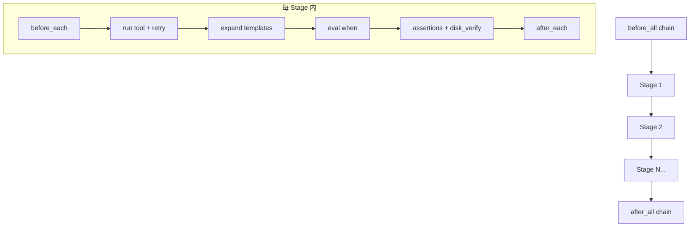

# C++ 测试引擎重构方案 — Drone CI 风格精细化流水线

> **状态**：已批准（2026-06-18），待执行
> **范围**：`extensions/src/testing/` 全量重构 + `tests/yaml_tests/` 25 文件迁移
> **风险等级**：L3（破坏性 schema 变更，全量 YAML 迁移）
> **执行规划**：见 [pipeline-refactor-dag.md](pipeline-refactor-dag.md)

---

## 1. 背景与现状

### 1.1 现有引擎

| 维度 | 现状 |
|------|------|
| 核心文件 | `extensions/src/testing/` 5 个文件（test_engine.hpp/.cpp + 3 个 hpp） |
| 架构 | `TestEngine::run()` 单体 692 行，同步纯主线程 |
| 数据结构 | 全程操作 Godot `Dictionary`/`Array`，**刻意不定义测试专用结构体** |
| 生命周期 | 全局 `before_all` / `after_all` / `before_each` / `after_each` |
| 执行单元 | 扁平 `tests:` 数组 |
| 失败策略 | `on_failure`: `continue`/`stop`/`skip_remaining`（已存在） |
| 磁盘校验 | `disk_verify`（scene/project_settings/raw_text，已实现但 25 YAML 均未使用） |
| 断言 | status/has_keys/field_checks/error_contains + 类型感知比较 |
| 清理 | 双源追踪（EditorFileSystem 快照 ∩ tracked res:// 路径）+ project.godot 备份恢复 |
| 测试文件 | `tests/yaml_tests/` 25 个 YAML，均用扁平 `tests:` 格式 |

### 1.2 痛点

- 扁平 `step` 无法表达步骤间依赖、条件执行
- 缺乏 Step 间上下文数据传递（仅靠 Godot 编辑器状态副作用隐式耦合）
- 无局部生命周期管理（`before_each`/`after_each` 仅全局）
- 无重试、允许失败等精细化错误处理
- 无层级化组织（Pipeline → Stage → Step）

---

## 2. 已锁定的关键决策

| 决策点 | 选择 | 理由 |
|--------|------|------|
| **并发模型** | 串行执行 + DAG 调度 | 项目硬约束「纯主线程无锁」（Godot API 要求所有调用在主线程）。`std::mutex`/`lock_guard` 作为 Context 防御性封装，当前无真实并发 |
| **迁移策略** | 全量替换 + 迁移 25 YAML | 新引擎只认新 schema；`TestEngine` 类名保留为薄门面降低爆破半径 |
| **Context 数据流** | 工具返回值引用 + 前置 step 状态可见 | `${steps.<id>.result.<path>}` 模板展开 + `when` 条件路由；不做 env 注入、不做 workspace 键值袋 |
| **retry** | 纯重试 + 可选延迟 | `retry: { count: N, delay_ms: M }`，失败后原样重调 N 次，不清理状态 |

---

## 3. 目标架构

### 3.1 层级模型

```
Pipeline
├── before_all: [ChainStep]          # 全局前置工具链
├── after_all: [ChainStep]           # 全局后置工具链
├── on_failure: FailPolicy           # pipeline 级默认策略
└── stages: [Stage]
    └── Stage
        ├── id, name
        ├── before_each: [ChainStep] # 局部前置（替代全局 before_each）
        ├── after_each: [ChainStep]  # 局部后置（替代全局 after_each）
        ├── on_failure: FailPolicy   # stage 级策略
        └── steps: [Step]
            └── Step
                ├── id               # 命名，供 depends_on/when/${} 引用
                ├── tool, args       # 可含 ${...} 模板
                ├── depends_on       # 同 Stage 内依赖
                ├── when             # 条件路由
                ├── expect           # 断言（复用现有）
                ├── disk_verify      # 磁盘校验（复用现有）
                ├── on_failure       # step 级策略
                ├── retry            # 重试配置
                └── allow_failure    # 允许失败
```

### 3.2 类型定义（`pipeline_types.hpp`）

```cpp
namespace godot_mcp::pipeline {

// --- 枚举 ---

enum class FailPolicy  { Continue, Stop, FailFast };
enum class StepStatus  { Pending, Running, Passed, Failed, Skipped };

// --- 错误与结果（替代错误码/异常） ---

struct StepError {
    godot::String code;
    godot::String message;
};

struct ExecResult {
    godot::Dictionary raw;
    std::optional<StepError> error;     // nullopt = 成功
    int64_t duration_us = 0;
};

struct StepResult {
    StepStatus status = StepStatus::Pending;
    std::optional<ExecResult> exec;     // 跳过的 step 为 nullopt
    godot::Dictionary raw_result;       // 供 ${...} 引用
    std::optional<StepError> error;
    int64_t duration_us = 0;
    int retry_attempts = 0;
};

// --- 条件与依赖 ---

struct WhenClause {
    godot::String step_id;              // 引用的前置 step id
    godot::String field;                // "passed" | "failed" | "skipped"
    bool expected = true;               // 期望值
};

// --- 链步骤（before_all/after_all/before_each/after_each） ---

struct ChainStep {
    godot::String tool;
    godot::Dictionary args;
    FailPolicy on_failure = FailPolicy::Stop;
};

// --- 核心定义 ---

struct StepDef {
    godot::String id;
    godot::String tool;
    godot::String description;
    godot::Dictionary args;
    godot::Dictionary expect;
    godot::Dictionary disk_verify;
    std::vector<godot::String> depends_on;
    std::optional<WhenClause> when;
    FailPolicy on_failure = FailPolicy::Continue;
    std::optional<int> retry_count;
    std::optional<int> retry_delay_ms;
    bool allow_failure = false;
};

struct StageDef {
    godot::String id;
    godot::String name;
    std::vector<StepDef> steps;
    std::vector<ChainStep> before_each;
    std::vector<ChainStep> after_each;
    FailPolicy on_failure = FailPolicy::FailFast;
};

struct PipelineDef {
    godot::String name;
    godot::String description;
    bool headless = true;
    std::vector<ChainStep> before_all;
    std::vector<ChainStep> after_all;
    std::vector<StageDef> stages;
    FailPolicy on_failure = FailPolicy::FailFast;
};

// --- 解析结果（variant 替代异常） ---

struct ParseError {
    godot::String message;
    godot::String field;                // 出错字段路径
};

using ParseResult = std::variant<std::shared_ptr<PipelineDef>, ParseError>;

} // namespace godot_mcp::pipeline
```

### 3.3 所有权设计

| 对象 | 管理方式 | 理由 |
|------|----------|------|
| `PipelineDef` | `std::shared_ptr` | 解析产物，引擎与 runner 共享只读 |
| `PipelineContext` | `std::shared_ptr` | 执行上下文，跨 stage/step 共享 |
| `PipelineRunner` | `std::unique_ptr` | 引擎内部独占持有 |
| `std::vector<StepDef>` / `StageDef` | 值语义 | 同质集合无需 unique_ptr 间接 |
| `when` 谓词 | `std::function` | 可插拔条件逻辑 |

### 3.4 Context 与模板展开（`pipeline_context.hpp/.cpp`）

```cpp
class PipelineContext {
    std::mutex mtx_;                                    // 防御性（串行今日，备未来）
    godot::HashMap<godot::String, StepResult> step_results_;
public:
    void record_step(const godot::String& id, StepResult r);
    std::optional<StepResult> get_step(const godot::String& id) const;
    bool eval_when(const WhenClause& c) const;
    godot::Dictionary expand_templates(const godot::Dictionary& args) const;
};
```

**模板语义**：
- 整串为 `${steps.<id>.result.<path>}` → **保留原类型**（如引用 Vector2 结果仍是 Vector2）
- 嵌入较大文本 → 字符串化拼接
- 引用不存在的 step/path → Fail Fast，报 `ContextError: unknown ref '${...}'`

**when 求值**：
- `when: { step: "setup_create", status: "passed" }` → 检查 `step_results_["setup_create"].status == Passed`
- step 未执行或不存在 → 返回 `false`（安全默认）

### 3.5 DAG 调度（`pipeline_runner.hpp/.cpp`）



**调度规则**（串行执行，DAG 仅控制顺序与跳过）：

1. **解析期**：拓扑校验 `depends_on`（检测环 → Fail Fast）、step id 唯一性、必填字段
2. **Stage 间**：严格声明顺序串行，前一 Stage 完成才进下一个
3. **Stage 内**：按 `depends_on` 拓扑序执行，同层按声明序
4. **每 step**：
   - `expand_templates(args)` — 展开模板变量
   - `eval_when` — false 则 skip
   - 检查依赖 step 状态（依赖 failed/skipped → 本 step skip，除非 `allow_failure` 或 `when` 覆盖）
   - `before_each`（Stage 局部）
   - 执行（含 retry: 失败后原样重调 N 次，可选 delay_ms 间隔）
   - 断言 + disk_verify
   - `after_each`（Stage 局部）
5. **失败策略**：
   - `fail_fast` — 本 stage 剩余 step 全 skip
   - `stop` — 立即结束整个 pipeline
   - `continue` — 记录继续
6. **`allow_failure`**：step 失败但计为 passed（不传播 skip 给下游）

### 3.6 清理逻辑移植

从 `test_engine.cpp` 移植到 `pipeline_runner.cpp`（逻辑不变，仅归属迁移）：

| 函数 | 来源 | 目标 |
|------|------|------|
| `take_snapshot()` | test_engine.cpp:22 | pipeline_runner.cpp |
| `track_paths()` | test_engine.cpp:99 | pipeline_runner.cpp |
| `cleanup()` | test_engine.cpp:109 | pipeline_runner.cpp |
| `record_setting_before_call()` | test_engine.cpp:213 | pipeline_runner.cpp |
| `restore_settings()` | test_engine.cpp:229 | pipeline_runner.cpp |
| `backup_project_godot()` | test_engine.cpp:255 | pipeline_runner.cpp |
| `restore_project_godot()` | test_engine.cpp:262 | pipeline_runner.cpp |

---

## 4. 新 YAML Schema 规范

### 4.1 完整 Schema

```yaml
name: suite_name                    # 必填
description: suite description       # 可选
headless: true                       # 可选，默认 true

pipeline:
  on_failure: fail_fast              # fail_fast | stop | continue（pipeline 默认）

  before_all:                        # 全局前置工具链
    - tool: new_scene
      args: { root_type: "Node2D", root_name: "TestRoot" }
      on_failure: stop               # 可选，覆盖 pipeline 级

  after_all:                         # 全局后置工具链
    - tool: delete_file
      args: { path: "res://test_mcp_scene", recursive: true }

  stages:
    - id: setup                      # 必填，Stage 标识
      name: Scene setup              # 可选
      on_failure: fail_fast          # 可选，覆盖 pipeline 级

      before_each:                   # Stage 局部前置
        - tool: save_scene
          args: { path: "res://ckpt.tscn" }

      after_each:                    # Stage 局部后置
        - tool: close_scene
          args: {}

      steps:
        - id: create_sprite          # 必填，Step 标识
          tool: add_node
          description: Add Sprite2D  # 可选
          args:
            class_name: "Sprite2D"
            node_name: "TestSprite"
            parent_path: ""
          depends_on: []             # 可选，同 Stage 内 step id 列表
          when:                      # 可选，条件执行
            step: "create_scene"     # 引用的前置 step id
            status: "passed"         # passed | failed | skipped
          on_failure: continue       # 可选，step 级策略
          retry:                     # 可选，重试配置
            count: 3
            delay_ms: 100
          allow_failure: true        # 可选，默认 false
          expect:                    # 断言（复用现有语义）
            status: success
            has_keys: [node, type, name]
            field_checks:
              - key: type
                value: "Sprite2D"
            error_contains: "..."
          disk_verify:                # 磁盘校验（复用现有语义）
            scene:
              path: "res://test.tscn"
              nodes: [...]
            project_settings: [...]
            raw_text: [...]
```

### 4.2 Scope 规则

| 规则 | 说明 |
|------|------|
| `depends_on` 范围 | **仅同 Stage 内**（跨 Stage 顺序由 stage 声明序隐式保证） |
| Context 引用范围 | **pipeline 级跨 Stage 可见**（`${...}` / `when` 可引用任意已执行 step） |
| `before_each`/`after_each` | **Stage 局部**（替代旧全局钩子，更精细控制） |
| `disk_verify`/`expect` | **语义完全不变**（复用现有断言/验证器） |

### 4.3 模板变量语法

| 语法 | 含义 | 类型保留 |
|------|------|----------|
| `${steps.<id>.result.<path>}` | 引用 step 返回值中的字段 | 是（整串为模板时） |
| `${steps.<id>.result}` | 引用 step 完整返回值 | 是 |
| `${steps.<id>.status}` | 引用 step 状态（passed/failed/skipped） | String |
| `prefix_${...}_suffix` | 嵌入式拼接 | String（字符串化） |

**示例**：
```yaml
steps:
  - id: create_node
    tool: add_node
    args: { class_name: "Node2D", node_name: "MyNode" }
  - id: rename
    tool: rename_node
    args:
      node_path: "${steps.create_node.result.node}"
      new_name: "Renamed"
```

---

## 5. 复用现有资产

| 现有文件 | 复用方式 | 改动 |
|----------|----------|------|
| `yaml_parser.hpp` | 不动 — ryml → Variant 转换 | 无 |
| `test_assertions.hpp` | 不动 — 断言引擎 | 无 |
| `type_utils.hpp` | 不动 — 类型感知比较 | 无 |
| `godot_file_verifier.hpp` | 不动 — 磁盘校验 | 无 |
| `test_engine.cpp` 清理逻辑 | **移植**到 `pipeline_runner.cpp` | 删除旧实现 |
| `test_engine.hpp/.cpp` | **降级为薄门面** | 委托 PipelineRunner |
| `test_http_handler.hpp` | **不动** — 响应 JSON 形状保持兼容 | 无 |
| `http_server.cpp` | **不动** — /run-tests 路由不变 | 无 |
| `editor_plugin.hpp/.cpp` | **不动** — `TestEngine test_engine_{&registry_}` 不变 | 无 |
| `test_orchestrator.py` | **不动** — 响应 JSON 形状保持兼容 | 无 |

---

## 6. 文件变更清单

### 6.1 新增文件（`extensions/src/testing/`）

| 文件 | 职责 | 行数估算 |
|------|------|----------|
| `pipeline_types.hpp` | 全部结构体 + 枚举（header-only） | ~120 |
| `pipeline_parser.hpp` | 解析器声明 | ~30 |
| `pipeline_parser.cpp` | Dictionary → `shared_ptr<PipelineDef>` + 校验 | ~250 |
| `pipeline_context.hpp` | Context 声明 | ~40 |
| `pipeline_context.cpp` | 模板展开 + when 求值 | ~180 |
| `pipeline_runner.hpp` | Runner 声明 | ~40 |
| `pipeline_runner.cpp` | 执行引擎 + 移植清理逻辑 | ~450 |

### 6.2 修改文件

| 文件 | 改动 |
|------|------|
| `test_engine.hpp` | 降级为薄门面：保留 `run()` 接口，内部委托 `PipelineRunner` |
| `test_engine.cpp` | 删除所有旧实现，仅保留 `run()` → `runner_->run()` 转发 |
| `extensions/CMakeLists.txt:83` | `test_engine.cpp` 旁加 3 个新 `.cpp`（parser/context/runner） |
| `tests/yaml_tests/*.yaml` (25 个) | 全部改写为 `pipeline:` schema |

### 6.3 不动文件

`yaml_parser.hpp`、`test_assertions.hpp`、`type_utils.hpp`、`godot_file_verifier.hpp`、`test_http_handler.hpp`、`http_server.cpp`、`editor_plugin.hpp/.cpp`、`test_orchestrator.py`

---

## 7. 响应 JSON 兼容性

**响应 JSON 形状保持兼容**，Python 编排器零改动：

```json
{
  "success": true,
  "suite_name": "...",
  "suite_description": "...",
  "summary": {
    "total": N,
    "passed": N,
    "failed": N,
    "skipped": N,
    "call_count": N,
    "call_success": N,
    "call_fail": N,
    "call_skip": N,
    "unique_tools": [...],
    "unique_success": [...],
    "unique_fail": [...],
    "unique_skip": [...],
    "duration_ms": N,
    "errors": [...],
    "cleanup_deleted": [...],
    "cleanup_skipped": [...]
  },
  "tests": [
    {
      "tool": "...",
      "description": "...",
      "passed": true,
      "status": "PASS",
      "duration_ms": N,
      "error": "...",
      "stage": "setup",           // ← 新增可选字段
      "step_id": "create_sprite"  // ← 新增可选字段
    }
  ]
}
```

---

## 8. 现代 C++ 特性映射

| 特性 | 应用点 | 规范条款 |
|------|--------|----------|
| `std::shared_ptr` | `PipelineDef`、`PipelineContext` | 内存管理 |
| `std::unique_ptr` | `PipelineRunner`（引擎持有） | 内存管理 |
| `std::optional` | `WhenClause`、retry count/delay、`StepError`、step 查找 | 状态与错误处理 |
| `std::variant` | `ParseResult = variant<shared_ptr<PipelineDef>, ParseError>` | 状态与错误处理 |
| `std::function` | `when` 谓词（可插拔条件逻辑） | 多态与回调 |
| `std::string_view` | 解析期已知字段名查找 | C++17 |
| 结构化绑定 | `auto [k,v]` 解析 Dictionary/std::map 对 | C++17 |
| `if constexpr` | 模板展开类型分发 | C++17 |
| `std::mutex`/`lock_guard` | `PipelineContext` 防御性封装 | 并发（当前串行，备未来） |
| `std::any` | **不使用** | 无真实需求，variant 已覆盖（YAGNI） |

---

## 9. 已知易错模式（必须遵守）

来自 `AGENTS.md` 和 `.repo_wiki`：

- **Unity build**：`#include` 绝不放在 `namespace{}` 内（展开会污染 `std::`）
- **`Dictionary::ptr()` 不存在** → 用 `has()` + `operator[]`
- **`int64_t`→`int` 截断**：Godot `size()` 返回 int64_t，循环计数用 int64_t，传参才 cast
- **`std::sort` 不能用于 `godot::Vector::Iterator`** → 拓扑排序用 `std::vector`
- **`HashMap` range-for 内 `erase()`** → 推 dead 列表循环外清理
- **DLL 文件锁**：重建前关 Godot 编辑器
- **全英文源码**：不嵌入中文字符串字面量
- **`save_scene` 后不访问 `ctx.root`**
- **`EditorProgress` → `Main::iteration()` → 重入**：用 `save_scene_as(path, false)` 跳过预览
- **`StreamPeerSocket` 不存在** → 用 `StreamPeerTCP`
- **`try_read_body` 逐字节 push_back** → 统一用 `resize+copy_n`

---

## 10. 验证策略

| 阶段 | 验证方式 | 标准 |
|------|----------|------|
| P1-P2 | 编译 + 手动构造测试用例 | 结构体字段正确、解析校验逻辑正确 |
| P3-P4 | `uv run python main.py build` | 编译零错误零警告 |
| P5 | 逐文件语义对照 | 25 YAML 语义与旧格式等价 |
| P6 | `uv run python main.py test` | 全量测试全绿；报告对比基线无回归 |

---

## 11. 假设清单（已确认）

1. `TestEngine` 保留为薄门面（最小化 `editor_plugin`/`http_server` 改动）
2. 响应 JSON 形状保持兼容（`summary` + 扁平 `tests[]`，仅加可选 `stage`/`step_id` 字段）
3. `depends_on` 限同 Stage 内，Context/when 跨 Stage 可见
4. `std::any` 不引入（无真实需求，variant 已覆盖）
5. `.repo_wiki/testing/test-engine.md` 文档同步重写纳入最终验证阶段
