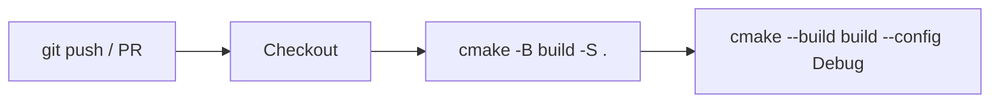
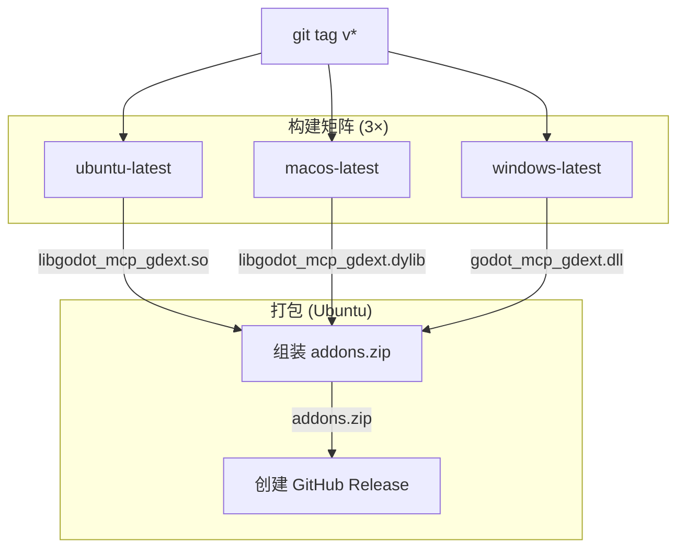

# CI/CD 流水线

## CI (`.github/workflows/ci.yml`)

在 Ubuntu 上运行，触发条件：push/PR 到 master 分支。



| 步骤 | 命令 | 作用 |
|------|------|------|
| Configure | `cmake -B build -S .` | CMake 配置（拉取 godot-cpp FetchContent） |
| Build | `cmake --build build --config Debug` | 编译 C++ GDExtension |

## Release (`.github/workflows/release.yml`)

触发条件：推送 `v*` 标签。



**构建矩阵**：

| 平台 | GDExt 库 |
|------|----------|
| Ubuntu | `libgodot_mcp_gdext.so` |
| macOS | `libgodot_mcp_gdext.dylib` |
| Windows | `godot_mcp_gdext.dll` |

**发布产物**：
- `addons.zip`：跨平台的 Godot 插件包（含三个平台的 GDExt 库）

## 本地等价命令

```bash
# CI 流程
cmake -B build -S .
cmake --build build --config Debug

# Release 构建
cmake -B build -S . -DRELEASE=ON
cmake --build build --config Release
```
