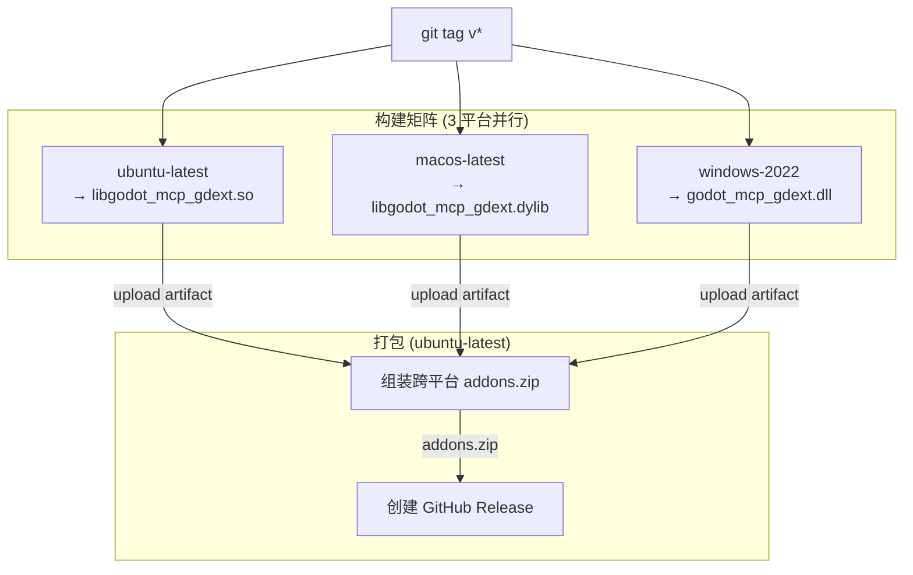

# CI/CD 流水线

> `.github/workflows/` 下两个 workflow：`release.yml`（构建+发布）和 `docs.yml`（文档部署）。

## Release（`.github/workflows/release.yml`）

触发条件：推送 `v*` 标签。



**构建矩阵**（`release.yml:17-23`）：

| 平台 | runner | GDExt 库 |
|------|--------|----------|
| Linux | `ubuntu-latest` | `libgodot_mcp_gdext.so` |
| macOS | `macos-latest` | `libgodot_mcp_gdext.dylib` |
| Windows | `windows-2022` | `godot_mcp_gdext.dll` |

**构建步骤**（每个平台）：

| 步骤 | 说明 |
|------|------|
| Checkout | `actions/checkout@v4` |
| Ninja | `seanmiddleditch/gha-setup-ninja@v5` |
| sccache | `mozilla-actions/sccache-action@v0.0.8` |
| MSVC (Windows) | `ilammy/msvc-dev-cmd@v1` |
| Cache godot-cpp | `actions/cache@v4`，key 含 `10.0.0-rc1-v1` |
| Configure | `cmake -B build -S . -G Ninja -DRELEASE=ON` + sccache |
| Build | `cmake --build build --config Release` |
| Upload | `upload-artifact@v4` → `gdext-{os}` |

**打包步骤**（仅 ubuntu-latest，`release.yml:62-96`）：

1. 下载三个平台的 artifact
2. 组装 `addons/godot_mcp/bin/`（含三个库）+ `plugin.cfg` + `.gdextension`
3. 打包为 `addons.zip`
4. `softprops/action-gh-release@v2` 创建 Release

## Docs（`.github/workflows/docs.yml`）

触发条件：推送 `v*` 标签（与 Release 同步）。

| 步骤 | 说明 |
|------|------|
| Checkout | `actions/checkout@v4` |
| pnpm | `pnpm/action-setup@v4` |
| Node | `setup-node@v4`，版本 22 |
| Build | `pnpm run build`（Rspress） |
| Deploy | `deploy-pages@v5` → GitHub Pages |

## 本地等价命令

```bash
# Release 构建（与 CI 等价）
uv run python build.py --release
# 或手动
cmake -B build -S . -G Ninja -DRELEASE=ON
cmake --build build --config Release
```
