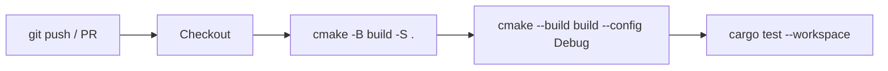
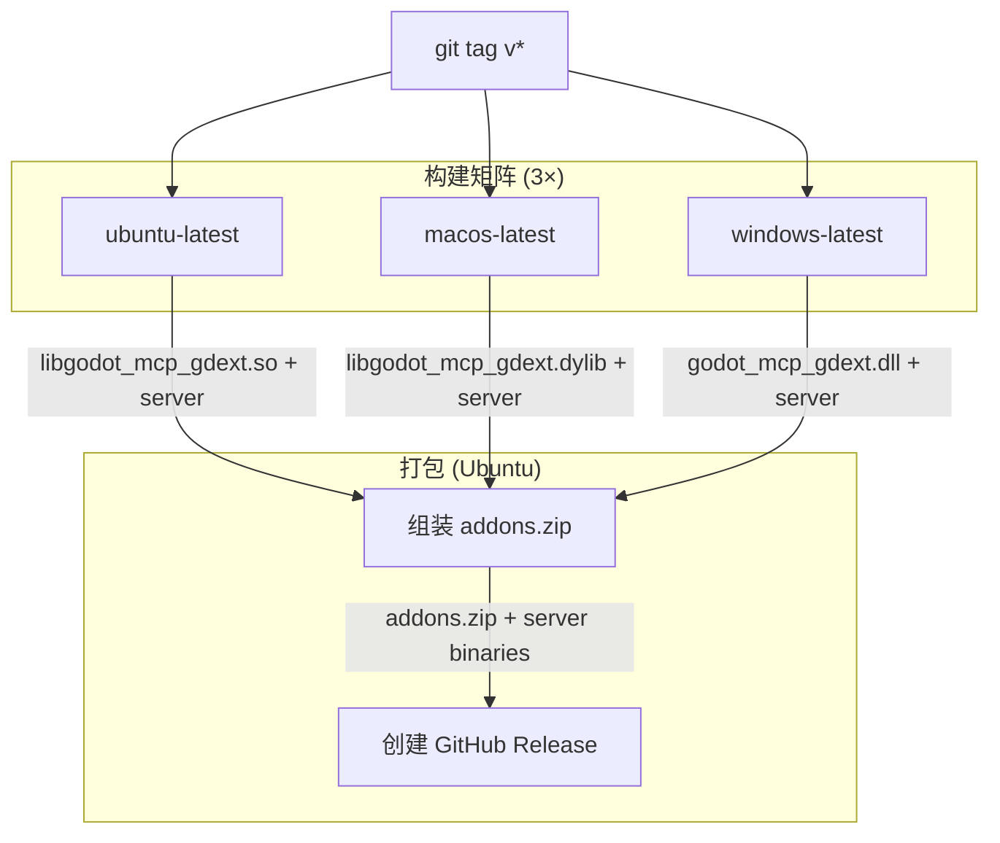

# CI/CD 流水线

## CI (`.github/workflows/ci.yml`)

在 Ubuntu 上运行，触发条件：push/PR 到 master 分支。



| 步骤 | 命令 | 作用 |
|------|------|------|
| Configure | `cmake -B build -S .` | CMake 配置（拉取 godot-cpp FetchContent + Cython server 编译） |
| Build | `cmake --build build --config Debug` | 编译 C++ GDExtension + Python/Cython 服务器 |
| Test | `cargo test --workspace` | 运行 Rust 离线测试（core + 遗留 gdext，无需 Godot） |

**注意**：CI 不再运行 `cargo fmt --check` / `cargo clippy`，因为当前实现使用 C++（不在 Cargo workspace 中）。Rust 遗留代码仅通过 `cargo test` 验证。

## Release (`.github/workflows/release.yml`)

触发条件：推送 `v*` 标签。



**构建矩阵**：

| 平台 | GDExt 库 | 服务端二进制 |
|------|----------|-------------|
| Ubuntu | `libgodot_mcp_gdext.so` | `godot-mcp-server_linux` |
| macOS | `libgodot_mcp_gdext.dylib` | `godot-mcp-server_macos` |
| Windows | `godot_mcp_gdext.dll` | `godot-mcp-server_windows.exe` |

**发布产物**：
- `addons.zip`：跨平台的 Godot 插件包（含三个平台的 GDExt 库）
- 各平台的 `godot-mcp-server` 二进制文件

**注意**：服务器二进制是 Python/Cython 编译产物，与 GDExtension C++ 编译在同一 CMake 流程中。

## 本地等价命令

```bash
# CI 流程
cmake -B build -S .
cmake --build build --config Debug
cargo test --workspace

# Release 构建
cmake -B build -S . -DRELEASE=ON
cmake --build build --config Release
```
