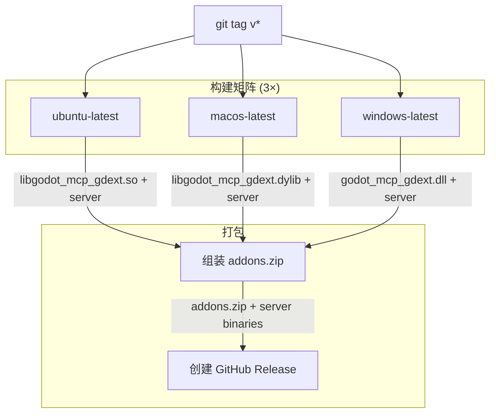

# CI/CD 流水线

## CI (`.github/workflows/ci.yml`)

在 Ubuntu 上运行，触发条件：push/PR 到 master 分支。

```mermaid
flowchart LR
    A[git push / PR] --> B[Checkout]
    B --> C[dtolnay/rust-toolchain]
    C --> D[Swatinem/rust-cache]
    D --> E[apt install libclang-dev]
    E --> F[cargo fmt --check --all]
    F --> G[cargo clippy -- -D warnings]
    G --> H[cmake -B build -S .]
    H --> I[cmake --build build]
    I --> J[cargo test --workspace]
```



| 步骤 | 命令 | 作用 |
|------|------|------|
| Formatting | `cargo fmt --check --all` | Rust 代码格式检查 |
| Lint | `cargo clippy --workspace -- -D warnings` | 静态分析，告警报错 |
| Configure | `cmake -B build -S .` | CMake 配置（含 Corrosion） |
| Build | `cmake --build build --config Debug` | 编译所有 crate |
| Test | `cargo test --workspace` | 运行 50 个离线测试（无需 Godot） |

## Release (`.github/workflows/release.yml`)

触发条件：推送 `v*` 标签。



**构建矩阵**：

| 平台 | 目标 triple | GDExt 库 | 服务端二进制 |
|------|-------------|----------|-------------|
| Ubuntu | `x86_64-unknown-linux-gnu` | `libgodot_mcp_gdext.so` | `godot-mcp-server_linux` |
| macOS | `x86_64-apple-darwin` | `libgodot_mcp_gdext.dylib` | `godot-mcp-server_macos` |
| Windows | `x86_64-pc-windows-msvc` | `godot_mcp_gdext.dll` | `godot-mcp-server_windows.exe` |

**发布产物**：
- `addons.zip`：跨平台的 Godot 插件包（含三个平台的 GDExt 库）
- 各平台的 `godot-mcp-server` 二进制文件

## 本地等价命令

```bash
# CI 流程
cargo fmt --check --all
cargo clippy --workspace -- -D warnings
cmake -B build -S .
cmake --build build --config Debug
cargo test --workspace

# Release 构建
cmake -B build -S . -DRELEASE=ON
cmake --build build --config Release
```
