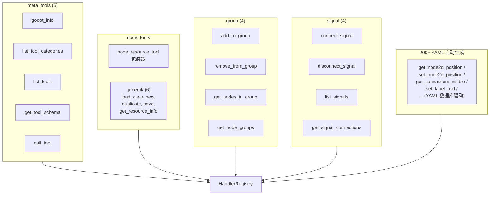

# 工具目录

> **已废弃——历史参考。** 本文档描述了 commit `c4318ee refactor(tools): 删除旧工具文件` 之前（~2026-06-02）的工具快照，含 17 组 124 个工具。
>
> **当前真相**：
> - **19 个手写 ITool**（`extensions/src/built_in/tools/**/*.hpp` 标 `// @tool register`）
> - **200+ YAML 自动生成的节点属性工具**（`extensions/src/built_in/tools/node_props/db/*.yaml` + `NodePropertyGetTool` / `NodePropertySetTool` 通用模板）
>
> **如何获取当前真实工具列表**：
>
> ```bash
> # 方法 1：通过 MCP 元工具查询
> list_tools(category="")  # 或留空 category 获取所有
>
> # 方法 2：直接读生成代码
> cat build/extensions/generated/generated_registration.cpp | grep '"get_\|"set_\|"list_\|"add_\|"remove_\|"create_\|"delete_\|"update_\|"save_\|"load_\|"call_\|"play_\|"stop_\|"is_\|"godot_\|"csharp_\|"rename_\|"duplicate_\|"move_\|"find_\|"search_\|"validate_\|"attach_\|"detach_\|"reset_\|"set_as_\|"batch_\|"refresh_\|"undo\|"redo'
> ```
>
> **保留此文档仅作为设计演进参考**，新工具/新查询请使用上方方法。

## 旧分组速览（已废弃）

| 旧组 | 旧计数 | 旧映射后路径 | 状态 |
|------|:------:|-------------|------|
| MetaTools | 5 | `other/meta` | → `meta_tools/`（5 个新 .hpp） |
| NodeTools | 21 | `node/operation` | → 部分被 `node_props/` 模板替代（get/set_position/rotation/scale 已迁移） |
| PropertyTools | 21 | `node/property/2d` | → `get/set_node2d_*` / `get/set_canvasitem_*`（YAML 生成） |
| CollisionTools | 2 | `node/collision` | → 已删除（旧 22 文件） |
| FindTools | 4 | `node/find` | → 已删除（功能被 `find_nodes_by_*` 替代） |
| ScriptHelpersTools | 3 | `script/helpers` | → 已删除 |
| ProjectSettingsTools | 7 | `settings/project` | → 合并到 `project_settings_ext` |
| SceneTools | 16 | `scene` | → 已删除 |
| ScriptGdTools | 5 | `script/gdscript` | → `lsp_client` 工具集 |
| ScriptCsTools | 6 | `script/csharp` | → 保留 6 个工具 |
| SearchTools | 3 | `editor/search` | → 已删除 |
| UndoTools | 2 | `other/undo` | → 保留 |
| Property3dTools | 6 | `node/property/3d` | → `get/set_node3d_*`（YAML 生成） |
| EditorControlTools | 7 | `editor/general` | → 合并到 `meta_tools/godot_info` |
| ProjectSettingsExtTools | 10 | `settings/extended` | → 保留 |
| PluginManagementTools | 2 | `other/plugin_management` | → 保留 |
| InputMapTools | 4 | `settings/input_map` | → 保留 |

## 当前活跃工具概览（高置信度）



## 详细工具文档迁移映射

| 旧工具 | 旧文件章节 | 当前位置（去重） |
|--------|-----------|----------------|
| `get_node_position` / `set_node_position` | PropertyTools | `get/set_canvasitem_position`（YAML 生成） + 别名 `node2d_*` / `control_*` |
| `get_node_rotation` / `set_node_rotation` | PropertyTools | `get/set_canvasitem_rotation` + 别名 |
| `get_node_scale` / `set_node_scale` | PropertyTools | `get/set_canvasitem_scale` + 别名 |
| `get_node_visible` / `set_node_visible` | PropertyTools | `get/set_canvasitem_visible` + 别名 |
| `get_node_modulate` / `set_node_modulate` | PropertyTools | `get/set_canvasitem_modulate` + 别名 |
| `get_node_z_index` / `set_node_z_index` | PropertyTools | `get/set_canvasitem_z_index` + 别名 |
| `get_node_text` / `set_node_text` | PropertyTools | `get/set_label_text`（YAML 生成） |
| `get_node_texture` / `set_node_texture` | PropertyTools | `get/set_sprite2d_texture`（YAML 生成） |
| `get/set_node_collision_layer/mask` | PropertyTools | `get/set_collisionobject2d_collision_layer/mask`（YAML 生成） |
| `set_node_unique_name` | PropertyTools | `get/set_node_unique_name_in_owner`（YAML 生成） |
| `get_node_position_3d` / `set_node_position_3d` | Property3dTools | `get/set_node3d_position`（YAML 生成） |
| `get_node_rotation_3d` / `set_node_rotation_3d` | Property3dTools | `get/set_node3d_rotation`（YAML 生成） |
| `get_node_scale_3d` / `set_node_scale_3d` | Property3dTools | `get/set_node3d_scale`（YAML 生成） |
| `add_circle_collision` / `add_rectangle_collision` | CollisionTools | 已删除——使用 `create_node` + 子节点添加 |
| `find_nodes_by_name/type/group/script` | FindTools | 已删除——使用 `walk_project_dir` 或 `get_node_path` |
| `call_method` / `get_variable` / `set_variable` | ScriptHelpersTools | 已删除——使用 `set_property` + 通用属性读取 |
| `play_current_scene` / `play_main_scene` / `stop_scene` / `is_scene_playing` / `refresh_filesystem` / `godot_editor_restart` / `get_editor_info` | EditorControlTools | 合并到 `meta_tools/godot_info` |
| 16 个 SceneTools（create/delete/save/open/...） | SceneTools | 已删除——使用 `EditorInterface` + `cmd_utils` |
| 3 个 SearchTools（find_in_file / search_project / find_and_replace） | SearchTools | 已删除——使用 Godot Editor 搜索或 LSP |
| `set_property` / `batch_set_property` / `get_property_list` | NodeTools（保留通用） | 保留在 `node_tools/` 通用工具 |

## YAML 节点属性工具

详见 [design/node-property-system.md](../design/node-property-system.md)（已实现）。

200+ 工具通过以下模式自动注册：

```cpp
// 通用模板（extensions/src/built_in/tools/node_props/node_property_tool.hpp）
class NodePropertyGetTool : public ITool { /* ... */ };
class NodePropertySetTool : public ITool { /* ... */ };
```

每个 YAML 数据库文件（`db/<NodeClass>.yaml`）对应 1 个节点类型的独有属性。`tools/codegen.py` 在编译期为每对 (node, property) 生成 Get + Set 工具注册代码到 `build/extensions/generated/generated_registration.cpp`。
