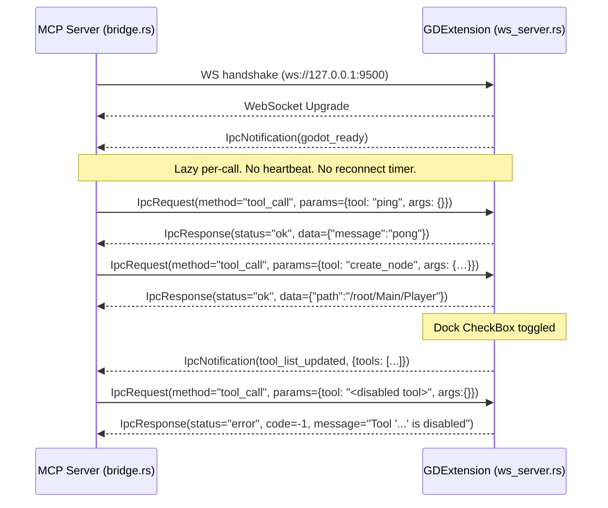

# IPC Protocol Specification

> Wire format between `godot-mcp-server` and `godot_mcp_gdext`. WebSocket transport, JSON-RPC-style framing. Types defined in `crates/core/src/protocol.rs`.

## Transport

- WebSocket over TCP loopback, `ws://127.0.0.1:9500`.
- One server (GDExtension) accepts; one client (MCP server) connects.
- No handshake beyond the WebSocket upgrade. No auth, no TLS, no compression. Loopback only.

## Frame types

Three top-level shapes. Discriminate by presence of fields — there is no `type` tag at the top.

### `IpcRequest`  (server → editor)

```jsonc
{ "id": "<uuid v4>", "method": "<string>", "params": <any json> }
```

| Field | Required | Notes |
|-------|----------|-------|
| `id` | yes | UUID v4 string. Server generates per call. Used to match `IpcResponse.id`. |
| `method` | yes | In current code always `"tool_call"`. Older single-method names like `"ping"` still work as a fallback path but are not used by the production server. |
| `params` | yes | When `method == "tool_call"` this is a `ToolCallParams` object; otherwise the GDExtension treats the whole `params` as args and the `method` as the tool name. |

### `ToolCallParams`  (inside `IpcRequest.params` for `method == "tool_call"`)

```jsonc
{ "tool": "<tool name>", "args": { ... } }
```

`args` defaults to `{}` if omitted (`#[serde(default)]`).

### `IpcResponse`  (editor → server)

```jsonc
// success
{ "id": "<uuid>", "status": "ok",    "data": <any json> }

// error
{ "id": "<uuid>", "status": "error", "code": <int>, "message": "<string>" }
```

`IpcResponse.id` matches the originating `IpcRequest.id`. The `status` field is the discriminator — Rust models it as `#[serde(tag = "status")]` flattened into the response — so `data` and the `(code, message)` pair never appear together.

Error codes used today:

| code | Meaning |
|------|---------|
| `-1` | Tool execution failure (anything `cmd_*` returned `{"error": …}` for) |
| `-2` | Reserved (unused at the moment) |
| `-3` | `Invalid tool_call params` — sent when `ToolCallParams` deserialisation fails |

The MCP server passes the `message` string straight back to the AI client (wrapped in an rmcp `ErrorData::invalid_params` for `Unknown tool` / `disabled`, otherwise as the JSON-stringified `IpcResponse.data`).

### `IpcNotification`  (editor → server, no id)

```jsonc
{ "type": "notification", "event": "<event name>", "data": <any json> }
```

| Field | Notes |
|-------|-------|
| `type` | Always literally `"notification"`. Distinguishes from `IpcResponse` (which has `status`) when both are parsed loosely. |
| `event` | One of the events below. |
| `data` | Event-specific payload. |

Events:

| `event` | Direction | Trigger | `data` shape |
|---------|-----------|---------|--------------|
| `godot_ready` | editor → server, on connect | `IpcWebSocketServer::handle_connection` sends this immediately after accept | `{ "engine_version": "4.6.2", "plugin_version": "0.1.0", "protocol_version": "1.0" }` |
| `tool_list_updated` | editor → server, on dock-toggle (or programmatically via `McpEditorPlugin::broadcast_tool_list_updated`) | Sent via the broadcast channel to every connected client | `{ "tools": [ { "name": "<tool>", "enabled": true|false }, ... ] }` |

Unknown events are logged and dropped on the server side.

## Lifecycle



## Rust definitions

```rust
// crates/core/src/protocol.rs

pub struct IpcRequest      { pub id: String, pub method: String, pub params: Value }
pub struct IpcResponse     { pub id: String, #[serde(flatten)] pub result: IpcResult }
pub enum   IpcResult       { Success { data: Value }, Error { code: i32, message: String } }   // #[serde(tag = "status")]
pub struct IpcNotification { #[serde(rename = "type")] pub msg_type: String, pub event: String, pub data: Value }
pub struct ToolCallParams  { pub tool: String, #[serde(default)] pub args: Value }
```

## Protocol versioning

The literal string `protocol_version: "1.0"` is announced in `godot_ready`. There is no negotiation — both sides must agree statically. When making a wire-breaking change:

1. Bump `protocol_version` here and in the GDExtension's hardcoded notification.
2. Update consumer code on both sides.
3. Add a migration note in [log.md](../log.md).

There is no inter-version compatibility path. Mismatched server + plugin will produce silent JSON parse failures on one side.
