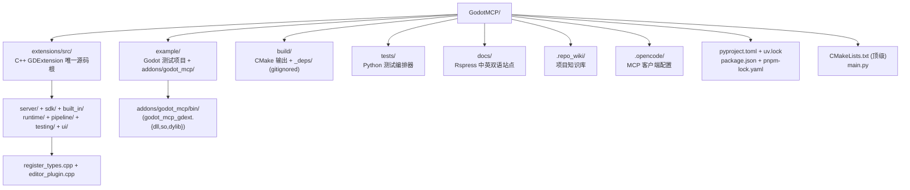

# 项目结构

## 目录布局



```
GodotMCP/
├── .opencode/                     # MCP 客户端配置（opencode 预配置 streamable-http）
├── .repo_wiki/                    # 项目知识库（Agent 快速上手参考）
├── .github/workflows/             # release.yml (构建+发布) + docs.yml (文档部署)
├── docs/                          # Rspress 站点（中/英双语，i18n 由 i18n.json 驱动）
├── example/                       # Godot 测试项目
│   ├── project.godot              #   gitignore 仅保留这 3 个文件
│   ├── icon.svg                   #
│   ├── .gitignore                 #
│   └── addons/godot_mcp/          # 构建产物目录
│       ├── plugin.cfg             # 由 CMake 从 PROJECT_VERSION 生成
│       ├── godot_mcp.gdextension  # entry_symbol = gdext_mcp_init, compatibility_minimum = 4.6
│       └── bin/                   # godot_mcp_gdext.dll/.so/.dylib（gitignored）
├── extensions/
│   ├── CMakeLists.txt             # godot-cpp + ryml FetchContent
│   └── src/                       # C++ 源码唯一根
│       ├── register_types.cpp     # GDExtension 入口（gdext_mcp_init）
│       ├── editor_plugin.cpp/.hpp # McpEditorPlugin 生命周期
│       ├── client_config_registry.hpp    # 11 种 AI 客户端配置模板
│       ├── built_in/              # ITool + cmd_utils + tools/
│       ├── server/                # ipc/ + mcp/ + registry/
│       ├── runtime/               # bridge.cpp + game_bridge.cpp
│       ├── sdk/                   # McpToolDefinition + McpToolRegistry
│       └── testing/               # C++ TestEngine + YAML pipeline（PipelineRunner 复用）
├── tests/
│   ├── test_orchestrator.py       # Python 编排器（管理 Godot 生命周期）
│   ├── godot_manager.py           # Godot 进程管理
│   ├── report.py                  # 报告生成（JSON + Markdown）
│   ├── requirements.txt           # mcp / pytest / httpx / python-dotenv / PyYAML
│   ├── .env.example               # GODOT_PATH 等环境变量模板（.env gitignored）
│   ├── output/                    # 报告输出（gitignored）
│   └── backup/                    # 测试前备份（gitignored）
├── build/                         # CMake 输出（gitignored）
│   ├── _deps/                     #   godot-cpp + ryml FetchContent 缓存
│   └── addons.zip                 #   CPack 产物
├── CMakeLists.txt                 # 顶级构建（PROJECT_VERSION 唯一来源）
├── main.py                        # argparse 包装的便捷构建脚本
├── pyproject.toml                 # Python ≥3.14 + pyyaml
├── uv.lock                        # uv 锁定
├── package.json                   # pnpm + Rspress
├── pnpm-lock.yaml
├── i18n.json                      # Rspress 中英映射
├── rspress.config.ts
├── README.md / README-zh.md
└── License                        # MIT
```

## CMake 构建流程

```mermaid
flowchart LR
    A["uv run python main.py build"] --> B["cmake -B build -S ."]
    B --> C["extensions/CMakeLists.txt<br/>FetchContent: godot-cpp 10.0.0-rc1 + ryml v0.7.0"]
    C --> D["add_library(godot_mcp_gdext)<br/>GLOB tools/*.cpp + X-macro register_itools.cpp"]
    D --> E["编译 .cpp + .hpp (Unity Build, batch_size = CPU 核数)"]
    E --> F["link godot_mcp_gdext.dll/.so/.dylib"]
    F --> G["copy_if_different → example/addons/godot_mcp/bin/"]
    G --> H["CPack ZIP → build/addons.zip"]
```



## Godot 测试项目

| 路径 | 用途 |
|------|------|
| `example/project.godot` | Godot 项目配置（git 跟踪） |
| `example/icon.svg` | 默认图标（git 跟踪） |
| `example/.gitignore` | `example/*` 除上述 3 个外全部 gitignored |
| `example/addons/godot_mcp/` | 构建产物（CMake 输出） |

`.gitignore` 中 `example/*` + `!example/project.godot` + `!example/icon.svg` + `!example/.gitignore` 模式确保只有这 3 个文件被版本控制。
