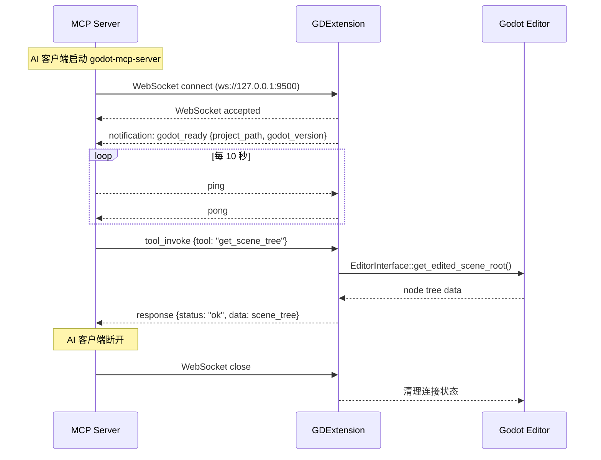

# IPC 与 MCP 协议

## 相关页面

- [架构概览](../overview/architecture.md) — 协议在整体架构中的位置
- [IPC 桥接细节](../design/ipc-bridge.md) — 桥接代码实现
- [工具清单与热切换](../design/tools.md) — 工具通知协议

---

## IPC 协议（Server ↔ GDExtension）

基于 WebSocket 的 JSON-RPC 2.0 风格消息协议。

### 消息格式

#### 请求（Server → GDExtension）

```json
{
  "id": "a1b2c3d4-e5f6-7890-abcd-ef1234567890",
  "method": "tool_invoke",
  "params": {
    "tool": "create_node",
    "args": {
      "parent_path": "/root/Main",
      "node_type": "Node3D",
      "name": "Player",
      "position": [0.0, 1.0, 0.0]
    }
  }
}
```

| 字段 | 类型 | 说明 |
|------|------|------|
| `id` | UUID v4 string | 请求标识，用于匹配响应 |
| `method` | string | 操作类型：`tool_invoke` / `resource_read` / `ping` |
| `params.tool` | string | 工具名称 |
| `params.args` | object | 工具参数 |

#### 响应（GDExtension → Server）

```json
{
  "id": "a1b2c3d4-e5f6-7890-abcd-ef1234567890",
  "status": "ok",
  "data": {
    "node_path": "/root/Main/Player",
    "instance_id": 123456789
  }
}
```

```json
{
  "id": "a1b2c3d4-e5f6-7890-abcd-ef1234567890",
  "status": "error",
  "code": -1,
  "message": "Node type 'FooBar' not registered in ClassDB"
}
```

| 字段 | 类型 | 说明 |
|------|------|------|
| `id` | string | 与请求一致 |
| `status` | "ok" / "error" | 执行结果 |
| `data` | object | 成功时返回的数据 |
| `code` | int | 错误码 |
| `message` | string | 错误描述 |

#### 通知（GDExtension → Server）

```json
{
  "type": "notification",
  "event": "tool_list_updated",
  "data": {
    "categories": [
      { "name": "scene", "enabled": true },
      { "name": "debug", "enabled": false }
    ]
  }
}
```

| 字段 | 说明 |
|------|------|
| `event` | 事件类型：`godot_ready` / `tool_list_updated` / `client_connected` / `client_disconnected` / `error` |
| `data` | 事件相关数据 |

### 生命周期



### Rust 类型定义

```rust
// crates/core/src/protocol.rs
use serde::{Serialize, Deserialize};
use serde_json::Value;

#[derive(Debug, Serialize, Deserialize)]
pub struct IpcRequest {
    pub id: String,
    pub method: String,
    pub params: Value,
}

#[derive(Debug, Serialize, Deserialize)]
pub struct IpcResponse {
    pub id: String,
    #[serde(flatten)]
    pub result: IpcResult,
}

#[derive(Debug, Serialize, Deserialize)]
#[serde(tag = "status")]
pub enum IpcResult {
    #[serde(rename = "ok")]
    Success { data: Value },
    #[serde(rename = "error")]
    Error { code: i32, message: String },
}

#[derive(Debug, Serialize, Deserialize)]
pub struct IpcNotification {
    #[serde(rename = "type")]
    pub msg_type: String,
    pub event: String,
    pub data: Value,
}
```

## MCP 协议（AI Client ↔ Server）

使用 MCP 2025-03-26 协议规范。

### stdio 传输

由 `rmcp` crate 的 `transport-io` feature 提供。通过 tokio stdin/stdout 传输 JSON-RPC 2.0 消息。

```rust
use rmcp::ServiceExt;
use rmcp::transport::io::stdio;
use tokio::io::{stdin, stdout};

let service = handler.serve((stdin(), stdout())).await?;
service.waiting().await?;
```

### Streamable HTTP 传输

由 `rmcp` crate 的 `transport-streamable-http-server` feature 提供。使用 axum 在 `:8900/mcp` 端点监听。

```rust
use rmcp::transport::streamable_http_server::StreamableHttpService;

let mcp_service = StreamableHttpService::builder()
    .service_factory(move || Ok(handler.clone()))
    .build();

let app = Router::new()
    .nest_service("/mcp", mcp_service.into_router());

let listener = tokio::net::TcpListener::bind("127.0.0.1:8900").await?;
axum::serve(listener, app).await?;
```

### ServerHandler 实现

```rust
use rmcp::handler::server::ServerHandler;
use rmcp::model::*;
use rmcp::tool;
use rmcp::ServiceExt;

#[derive(Clone)]
pub struct GodotMcpHandler { /* ... */ }

#[tool_router]
impl GodotMcpHandler {
    #[tool(description = "获取当前编辑场景的完整节点树结构")]
    async fn get_scene_tree(&self) -> Result<CallToolResult, McpError> {
        let result = self.bridge.call("get_scene_tree", json!({})).await?;
        Ok(CallToolResult::success(vec![
            Content::text(serde_json::to_string_pretty(&result).unwrap())
        ]))
    }
}
```

### ServerHandler Trait（Resources）

```rust
impl ServerHandler for GodotMcpHandler {
    fn get_info(&self) -> ServerInfo {
        ServerInfo {
            protocol_version: ProtocolVersion::V_2025_03_26,
            capabilities: ServerCapabilities::builder()
                .enable_tools()
                .enable_resources()
                .build(),
            server_info: Implementation::new("Godot MCP", env!("CARGO_PKG_VERSION")),
            instructions: Some("Godot MCP Server — 通过 AI 控制 Godot 编辑器".into()),
            ..Default::default()
        }
    }

    async fn list_resources(&self, ...) -> Result<ListResourcesResult, McpError> {
        Ok(ListResourcesResult {
            resources: vec![
                RawResource::new("godot://scene/current", "当前编辑场景"),
                RawResource::new("godot://project/settings", "项目设置"),
                RawResource::new("godot://editor/console", "控制台输出"),
                RawResource::new("godot://project/scripts", "项目脚本列表"),
            ],
            next_cursor: None,
            meta: None,
        })
    }
}
```

## 协议兼容性

| 客户端 | 首选传输 | MCP 协议版本 | 配置方式 |
|--------|----------|-------------|--------|
| Claude Code | stdio | 2025-03-26 | `claude mcp add` |
| Claude Desktop | stdio | 2025-03-26 | `claude_desktop_config.json` |
| Cursor | Streamable HTTP | 2025-03-26 | `.cursor/mcp.json` |
| Windsurf | Streamable HTTP | 2025-03-26 | `.windsurf/mcp.json` |
| Codex | Streamable HTTP | 2025-03-26 | `config.toml` |
| VS Code Copilot | Streamable HTTP | 2025-03-26 | `.vscode/mcp.json` |
| Cline | stdio | 2025-03-26 | `cline_mcp_settings.json` |
| OpenCode | stdio | 2025-03-26 | runtime config |