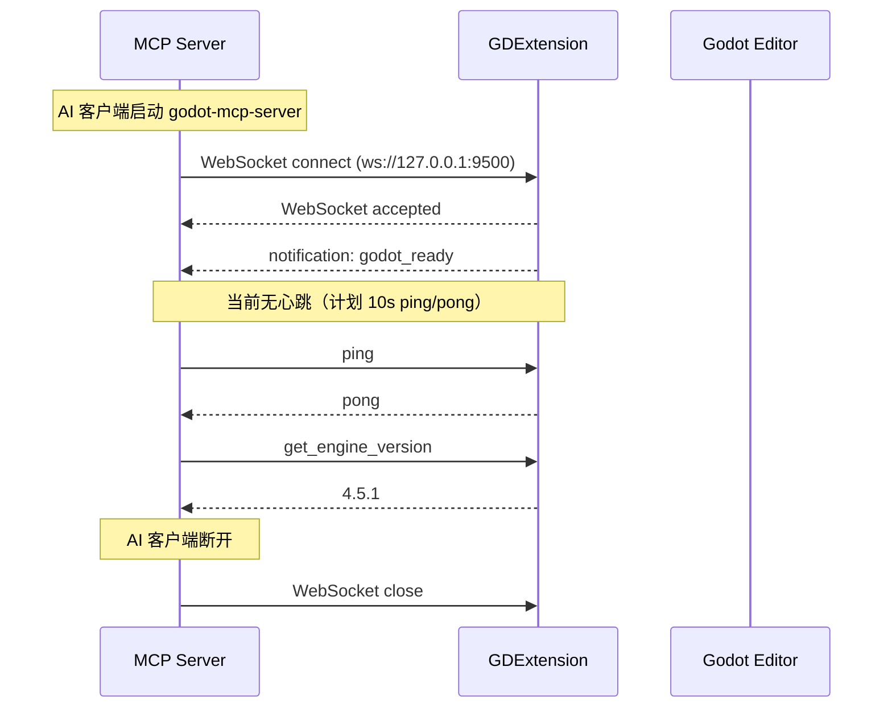

# IPC 与 MCP 协议

## 相关页面

- [架构概览](../overview/architecture.md) — 协议在整体架构中的位置
- [IPC 桥接细节](../design/ipc-bridge.md) — 桥接代码实现（含当前实现与计划）
- [当前实现状态](../implementation/current-status.md) — 已完成与待实现的对照
- [工具清单与热切换](../design/tools.md) — 工具通知协议（计划）

---

## IPC 协议（Server ↔ GDExtension）

基于 WebSocket 的 JSON-RPC 2.0 风格消息协议。

### 消息格式

#### 请求（Server → GDExtension）

```json
{
  "id": "a1b2c3d4-e5f6-7890-abcd-ef1234567890",
  "method": "ping",
  "params": {}
}
```

| 字段 | 类型 | 说明 |
|------|------|------|
| `id` | UUID v4 string | 请求标识，用于匹配响应 |
| `method` | string | 操作名称：`ping` / `get_engine_version` / `get_plugin_version` |
| `params` | object | 任意 JSON 对象参数 |

> **当前实现**：`method` 直接对应操作名，`params` 为扁平的 `serde_json::Value`。未来 48 工具时，`params` 将包含 `tool` 和 `args` 子字段。

#### 响应（GDExtension → Server）

```json
{
  "id": "a1b2c3d4-e5f6-7890-abcd-ef1234567890",
  "status": "ok",
  "data": {
    "message": "pong"
  }
}
```

```json
{
  "id": "a1b2c3d4-e5f6-7890-abcd-ef1234567890",
  "status": "error",
  "code": -2,
  "message": "Unknown method: foo_bar"
}
```

| 字段 | 类型 | 说明 |
|------|------|------|
| `id` | string | 与请求一致 |
| `status` | `"ok"` / `"error"` | 执行结果 |
| `data` | object | 成功时返回的数据 |
| `code` | int | 错误码（-1: 执行错误, -2: 未知方法） |
| `message` | string | 错误描述 |

#### 通知（GDExtension → Server）

```json
{
  "type": "notification",
  "event": "godot_ready",
  "data": {
    "engine_version": "4.5.1",
    "plugin_version": "0.1.0",
    "protocol_version": "1.0"
  }
}
```

| 字段 | 说明 |
|------|------|
| `event` | 事件类型：`godot_ready`（已实现）/ `tool_list_updated`（计划）/ `client_connected`（计划）/ `client_disconnected`（计划）|
| `data` | 事件相关数据 |

### 当前支持的 RPC 方法

| 方法 | 参数 | 响应 |
|------|------|------|
| `ping` | `{}` | `{ "message": "pong" }` |
| `get_engine_version` | `{}` | `{ "engine_version": "4.x.y" }` |
| `get_plugin_version` | `{}` | `{ "plugin_version": "0.1.0" }` |

### 生命周期



### Rust 类型定义（实际代码）

```rust
// crates/core/src/protocol.rs
use serde::{Serialize, Deserialize};
use serde_json::Value;

#[derive(Debug, Clone, Serialize, Deserialize)]
pub struct IpcRequest {
    pub id: String,
    pub method: String,
    pub params: Value,
}

#[derive(Debug, Clone, Serialize, Deserialize)]
pub struct IpcResponse {
    pub id: String,
    #[serde(flatten)]
    pub result: IpcResult,
}

#[derive(Debug, Clone, Serialize, Deserialize)]
#[serde(tag = "status")]
pub enum IpcResult {
    #[serde(rename = "ok")]
    Success { data: Value },
    #[serde(rename = "error")]
    Error { code: i32, message: String },
}

#[derive(Debug, Clone, Serialize, Deserialize)]
pub struct IpcNotification {
    #[serde(rename = "type")]
    pub msg_type: String,
    pub event: String,
    pub data: Value,
}
```

> **注意**：`IpcResult` 使用 `#[serde(tag = "status")]` 进行内部标记枚举序列化。`IpcResponse` 使用 `#[serde(flatten)]` 将 `result` 展开到顶层。

---

## MCP 协议（AI Client ↔ Server）

使用 MCP 2025-03-26 协议规范。当前仅实现 stdio 传输。

### stdio 传输（已实现）

由 `rmcp` crate 的 `transport-io` feature 提供。

```rust
// crates/server/src/main.rs
use rmcp::ServiceExt;

let service = handler
    .serve((tokio::io::stdin(), tokio::io::stdout()))
    .await?;
service.waiting().await?;
```

### ServerHandler 实现（当前）

```rust
// crates/server/src/handler.rs
use rmcp::handler::server::ServerHandler;
use rmcp::model::*;

impl ServerHandler for GodotMcpHandler {
    fn get_info(&self) -> ServerInfo {
        // protocol_version: V_2025_03_26
        // capabilities: tools  only
        // server_info: "Godot MCP" + CARGO_PKG_VERSION
    }

    async fn list_tools(&self, ...) -> Result<ListToolsResult, ErrorData> {
        // 4 个工具: ping, get_engine_version, get_plugin_version, get_server_version
    }

    async fn call_tool(&self, ...) -> Result<CallToolResult, ErrorData> {
        // match request.name: 4 个工具 + 离线兜底消息
    }
}
```

### Streamable HTTP 传输（计划，未实现）

计划使用 `rmcp` crate 的 `transport-streamable-http-server` feature，通过 axum 在 `:8900/mcp` 端点监听。

```rust
// 计划代码，尚未实现
use rmcp::transport::streamable_http_server::StreamableHttpService;

let mcp_service = StreamableHttpService::builder()
    .service_factory(move || Ok(handler.clone()))
    .build();

let app = axum::Router::new()
    .nest_service("/mcp", mcp_service.into_router());

let listener = tokio::net::TcpListener::bind("127.0.0.1:8900").await?;
axum::serve(listener, app).await?;
```

---

## 协议兼容性

| 客户端 | 传输 | MCP 协议 | 状态 |
|--------|------|---------|------|
| OpenCode / Claude Code / Codex（stdio） | stdio | 2025-03-26 | ✅ 可用 |
| Cursor / Copilot / Trae / Gemini CLI 等（HTTP） | Streamable HTTP | 2025-03-26 | ❌ 待实现 |

完整 12 客户端配置模板见 [客户端配置指南](../guide/client-config.md)。