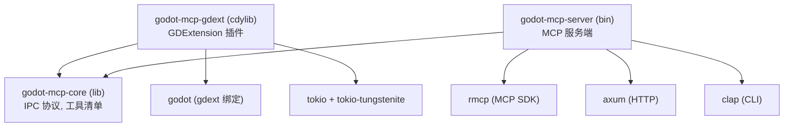

# Cargo Workspace 结构

## 相关页面

- [架构概览](../overview/architecture.md) — 整体架构
- [当前实现状态](../implementation/current-status.md) — 已完成与待实现的对照
- [IPC 与 MCP 协议](protocol.md) — 协议类型定义（在 core crate 中）
- [Dock UI 面板](../design/dock-ui.md) — gdext crate 的 UI 实现（计划）
- [IPC 桥接细节](../design/ipc-bridge.md) — gdext + server 的 IPC 实现

---

## Workspace 概览

```toml
# Cargo.toml
[workspace]
members = ["crates/*"]
resolver = "2"

[workspace.package]
version = "0.1.0"
edition = "2024"
```

## crate 依赖关系



## 实际目录树（已实现）

```
crates/
├── core/                          # godot-mcp-core
│   ├── Cargo.toml
│   └── src/
│       ├── lib.rs                 # pub mod protocol; pub mod tool_manifest;
│       ├── protocol.rs            # IpcRequest, IpcResponse, IpcResult, IpcNotification
│       └── tool_manifest.rs       # ToolManifest, ToolCategory, ToolInfo, ToolListUpdate, ToolState
│
├── gdext/                         # godot-mcp-gdext (cdylib)
│   ├── Cargo.toml
│   └── src/
│       ├── lib.rs                 # #[gdextension] 入口 (InitLevel::Editor)
│       ├── editor_plugin.rs       # McpEditorPlugin (enter_tree / exit_tree)
│       ├── ipc/
│       │   ├── mod.rs             # pub mod ws_server; pub mod plugin_state;
│       │   ├── plugin_state.rs    # PluginState { engine_version, plugin_version }
│       │   └── ws_server.rs       # IpcWebSocketServer (TCP :9500, 3 个方法)
│       └── commands/              # [空，未实现]
│
└── server/                        # godot-mcp-server (bin)
    ├── Cargo.toml
    └── src/
        ├── main.rs                # CLI 入口 (clap, --godot-port 9500, stdio)
        ├── handler.rs             # ServerHandler 实现 + 4 个工具
        ├── bridge.rs              # GodotBridge (WebSocket 客户端, oneshot 应答)
        └── transports/            # [空，未实现]
```

## 计划中的目录树（Phase 2+ 待实现）

```diff
crates/gdext/src/
- └── (上述已有文件)
+ ├── dock/                        # Dock UI 面板组件
+ │   ├── mod.rs
+ │   ├── main_dock.rs             # 主 Dock 容器
+ │   ├── status_bar.rs            # 状态指示器
+ │   ├── client_list.rs           # 客户端列表
+ │   ├── integration.rs           # 12 客户端一键配置
+ │   ├── tool_manager.rs          # 工具组开关
+ │   └── settings.rs              # 高级设置
+ └── commands/                    # 命令路由 + 6 个工具模块
+     ├── mod.rs                   # CommandHandler trait + create_registry()
+     ├── scene.rs                 # SceneCommands
+     ├── asset.rs                 # AssetCommands
+     ├── script.rs                # ScriptCommands
+     ├── editor.rs                # EditorCommands
+     ├── project.rs               # ProjectCommands
+     └── debug.rs                 # DebugCommands

crates/server/src/
- └── (上述已有文件)
+ ├── transports/                  # 传输层
+ │   ├── mod.rs
+ │   └── factory.rs               # run_stdio / run_streamable_http
+ └── tools/                       # 48 工具实现
+     ├── mod.rs                   # register_tools(handler)
+     ├── scene.rs
+     ├── asset.rs
+     ├── script.rs
+     ├── editor.rs
+     ├── project.rs
+     └── debug.rs
```

## 关键 Cargo.toml 依赖（当前实际值）

### core

```toml
[package]
name = "godot-mcp-core"
version.workspace = true
edition.workspace = true

[dependencies]
serde = { version = "1", features = ["derive"] }
serde_json = "1"
uuid = { version = "1", features = ["v4", "serde"] }
```

### gdext

```toml
[package]
name = "godot-mcp-gdext"
version.workspace = true
edition.workspace = true

[lib]
name = "godot_mcp_gdext"
crate-type = ["cdylib"]

[package.metadata.godot]
extension-library.name = "godot_mcp_gdext"

[dependencies]
godot = { version = "=0.5", features = ["default"] }
tokio = { version = "1", features = ["full"] }
tokio-tungstenite = "0.24"
futures-util = "0.3"
serde = "1"
serde_json = "1"
anyhow = "1"
godot-mcp-core = { path = "../core" }
```

### server

```toml
[package]
name = "godot-mcp-server"
version.workspace = true
edition.workspace = true

[[bin]]
name = "godot-mcp-server"
path = "src/main.rs"

[dependencies]
clap = { version = "4", features = ["derive"] }
serde = { version = "1", features = ["derive"] }
serde_json = "1"
anyhow = "1"
tokio = { version = "1", features = ["full"] }
tokio-tungstenite = "0.24"
futures-util = "0.3"
uuid = { version = "1", features = ["v4"] }
dashmap = "6"
async-trait = "0.1"
rmcp = { version = "=1.7", features = ["server", "macros", "schemars", "transport-io", "transport-streamable-http-server"] }
axum = "0.8"
godot-mcp-core = { path = "../core" }
```

## 构建产物

```bash
cargo build -p godot-mcp-gdext   # target/debug/godot_mcp_gdext.{dll,so,dylib}
cargo build -p godot-mcp-server  # target/debug/godot-mcp-server(.exe)
cargo build --release -p ...     # 生产构建
```

一键构建打包：

```bash
python package_addons.py          # 编译两个 crate + 复制库到 addons/bin/ + 打包 addons.zip
```

## GDExtension 配置

```ini
# addons/godot_mcp/godot_mcp.gdextension
[configuration]
entry_symbol = "gdext_rust_init"
compatibility_minimum = "4.6"
reloadable = true

[libraries]
windows.debug.x86_64 = "res://addons/godot_mcp/bin/godot_mcp_gdext.dll"
windows.release.x86_64 = "res://addons/godot_mcp/bin/godot_mcp_gdext.dll"
linux.debug.x86_64 = "res://addons/godot_mcp/bin/libgodot_mcp_gdext.so"
linux.release.x86_64 = "res://addons/godot_mcp/bin/libgodot_mcp_gdext.so"
macos.debug = "res://addons/godot_mcp/bin/libgodot_mcp_gdext.dylib"
macos.release = "res://addons/godot_mcp/bin/libgodot_mcp_gdext.dylib"
```

> **注意**：入口符号为 `gdext_rust_init`（godot-rust/gdext v0.5 默认），而非旧版的 `godot_mcp_gdext_init`。

```ini
# addons/godot_mcp/plugin.cfg
[plugin]
name="Godot MCP"
description="Model Context Protocol bridge for Godot Engine."
author=""
version="0.1.0"
script=""
```

> `script=""` 是有意为之——所有逻辑位于原生 GDExtension 中，不依赖 GDScript 或 C# 脚本。