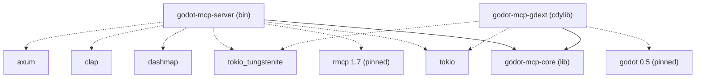

# Workspace Specification

> Real `Cargo.toml` content per crate, addon manifests, build artefact layout. Verified 2026-05-22.

## Workspace root

```toml
# Cargo.toml
[workspace]
members  = ["crates/*"]
resolver = "2"

[workspace.package]
version = "0.1.0"
edition = "2024"
```

Edition `2024` is required — several `let ... else` / `if-let` chain patterns in `scene.rs` rely on it.

## Toolchain

```toml
# rust-toolchain.toml
[toolchain]
channel    = "stable"
components = ["rustfmt", "clippy"]
```

CI installs the same via `dtolnay/rust-toolchain@stable`.

## Crate dependency graph



`core` is the only crate that compiles without `godot` or `rmcp` in scope. That's deliberate; see [crates/core.md](../crates/core.md).

## `crates/core/Cargo.toml`

```toml
[package]
name           = "godot-mcp-core"
version.workspace = true
edition.workspace = true

[dependencies]
serde      = { version = "1", features = ["derive"] }
serde_json = "1"
uuid       = { version = "1", features = ["v4", "serde"] }
```

## `crates/gdext/Cargo.toml`

```toml
[package]
name           = "godot-mcp-gdext"
version.workspace = true
edition.workspace = true

[lib]
name       = "godot_mcp_gdext"
crate-type = ["cdylib"]

[package.metadata.godot]
extension-library.name = "godot_mcp_gdext"

[dependencies]
godot               = { version = "=0.5", features = ["default"] }
tokio               = { version = "1", features = ["full"] }
tokio-tungstenite   = "0.24"
futures-util        = "0.3"
serde               = "1"
serde_json          = "1"
anyhow              = "1"
godot-mcp-core      = { path = "../core" }
```

Notes:

- `godot = "=0.5"` is **pinned hard**. Minor versions break trait shapes. The verified working version is 0.5.3 (per `Cargo.lock`).
- `[package.metadata.godot]` exists for tooling; the runtime registration comes from `#[gdextension] unsafe impl ExtensionLibrary for GodotMcpExtension` in `lib.rs`.
- `crate-type = ["cdylib"]` means the build artefact is a shared library Godot dlopens; there is no `bin` target.

## `crates/server/Cargo.toml`

```toml
[package]
name           = "godot-mcp-server"
version.workspace = true
edition.workspace = true

[[bin]]
name = "godot-mcp-server"
path = "src/main.rs"

[dependencies]
clap                = { version = "4", features = ["derive"] }
serde               = { version = "1", features = ["derive"] }
serde_json          = "1"
anyhow              = "1"
tokio               = { version = "1", features = ["full"] }
tokio-tungstenite   = "0.24"
futures-util        = "0.3"
uuid                = { version = "1", features = ["v4"] }
dashmap             = "6"
async-trait         = "0.1"
rmcp                = { version = "=1.7", features = ["server", "macros", "schemars", "transport-io", "transport-streamable-http-server"] }
axum                = "0.8"
godot-mcp-core      = { path = "../core" }
```

Notes:

- `rmcp = "=1.7"` is pinned. 1.x has had breaking minor releases; do not bump without re-checking `ServerHandler`.
- `axum`, `transport-streamable-http-server` feature, and the empty `transports/` slot were placeholders for the planned HTTP MCP mode. Currently dead code; safe to remove once HTTP plans are dropped.
- `dashmap` is used both for the registry (`ToolRegistry`) and the bridge's pending-id map.

## Build artefacts

```
target/{debug,release}/
├── godot-mcp-server[.exe]            # MCP server binary; AI client launches this
├── godot_mcp_gdext.{dll,so,dylib}    # GDExtension shared library
├── *.d                               # rustc dep files (ignore)
└── deps/                             # transitive build cache
```

`package_addons.py` copies the appropriate gdext artefact into `addons/godot_mcp/bin/godot_mcp_gdext.{dll,so,dylib}` so the addon picks it up via the `.gdextension` manifest.

## Addon manifest

```ini
# addons/godot_mcp/godot_mcp.gdextension
[configuration]
entry_symbol         = "gdext_rust_init"
compatibility_minimum = "4.6"
reloadable            = true

[libraries]
windows.debug.x86_64   = "res://addons/godot_mcp/bin/godot_mcp_gdext.dll"
windows.release.x86_64 = "res://addons/godot_mcp/bin/godot_mcp_gdext.dll"
linux.debug.x86_64     = "res://addons/godot_mcp/bin/libgodot_mcp_gdext.so"
linux.release.x86_64   = "res://addons/godot_mcp/bin/libgodot_mcp_gdext.so"
macos.debug            = "res://addons/godot_mcp/bin/libgodot_mcp_gdext.dylib"
macos.release          = "res://addons/godot_mcp/bin/libgodot_mcp_gdext.dylib"
```

- `entry_symbol = "gdext_rust_init"` is gdext 0.5's default — do not invent a custom one.
- `compatibility_minimum = "4.6"` matches gdext 0.5's API level. Bumping requires verifying every `EditorInterface` call still compiles.
- `reloadable = true` lets the editor pick up a fresh dll on demand, *if no other handle holds the file open* (see [reference/build-and-package.md](../reference/build-and-package.md)).

```ini
# addons/godot_mcp/plugin.cfg
[plugin]
name        = "Godot MCP"
description = "Model Context Protocol bridge for Godot Engine."
author      = ""
version     = "0.1.0"
script      = ""
```

`script = ""` is intentional: every plugin behaviour comes from the native GDExtension. There is no `.gd` script.

## What `Cargo.lock` is committed (and why)

This repo has a `bin` crate, so `Cargo.lock` is committed and authoritative. It pins every transitive version. Do not regenerate it as part of an unrelated change.

`.gitignore` excludes `target/`, `addons/godot_mcp/bin/*` (except `.gitkeep`), `*.dll`/`*.so`/`*.dylib` anywhere in the tree, and `*.zip`. Run `package_addons.py` to repopulate the addon `bin/` whenever you switch branches.
