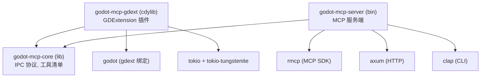

# Cargo Workspace 结构

## 相关页面

- [架构概览](../overview/architecture.md) — 整体架构
- [IPC 与 MCP 协议](protocol.md) — 协议类型定义（在 core crate 中）
- [Dock UI 面板](../design/dock-ui.md) — gdext crate 的 UI 实现
- [IPC 桥接细节](../design/ipc-bridge.md) — gdext + server 的 IPC 实现

---

## Workspace 概览

```toml
# Cargo.toml
[workspace]
members = ["crates/*"]
resolver = "2"
```

## crate 依赖关系



## 目录树

```
crates/
├── core/                          # godot-mcp-core
│   ├── Cargo.toml                 # serde, serde_json, uuid
│   └── src/
│       ├── lib.rs
│       ├── protocol.rs            # IpcRequest, IpcResponse, IpcResult
│       ├── tool_manifest.rs       # ToolMeta, ToolCategory, ToolState
│       └── error.rs               # McpBridgeError
│
├── gdext/                         # godot-mcp-gdext (cdylib)
│   ├── Cargo.toml                 # godot 0.5, tokio, tokio-tungstenite, core
│   └── src/
│       ├── lib.rs                 # #[gdextension] 入口
│       ├── editor_plugin.rs       # MCPEditorPlugin
│       ├── dock/
│       │   ├── mod.rs
│       │   ├── main_dock.rs       # 主 Dock 容器
│       │   ├── status_bar.rs      # 状态指示器
│       │   ├── client_list.rs     # 客户端列表
│       │   ├── integration.rs     # 客户端一键配置
│       │   ├── tool_manager.rs    # 工具组开关
│       │   └── settings.rs        # 高级设置
│       ├── ipc/
│       │   ├── mod.rs
│       │   └── ws_server.rs       # WebSocket 服务端
│       ├── handler.rs             # 命令路由
│       └── commands/
│           ├── mod.rs             # CommandHandler trait
│           ├── scene.rs
│           ├── asset.rs
│           ├── script.rs
│           ├── editor.rs
│           ├── project.rs
│           └── debug.rs
│
└── server/                        # godot-mcp-server (bin)
    ├── Cargo.toml                 # rmcp, axum, tokio, clap, core
    └── src/
        ├── main.rs                # CLI 入口
        ├── handler.rs             # ServerHandler + #[tool] 宏
        ├── bridge.rs              # WebSocket 客户端
        ├── transports/
        │   ├── mod.rs
        │   └── factory.rs         # run_stdio / run_streamable_http
        └── tools/
            ├── mod.rs             # 工具注册
            ├── scene.rs
            ├── asset.rs
            ├── script.rs
            ├── editor.rs
            ├── project.rs
            └── debug.rs
```

## 关键 Cargo.toml 依赖

### core

```toml
[package]
name = "godot-mcp-core"
version = "0.1.0"
edition = "2024"

[dependencies]
serde = { version = "1", features = ["derive"] }
serde_json = "1"
uuid = { version = "1", features = ["v4"] }
```

### gdext

```toml
[package]
name = "godot-mcp-gdext"
version = "0.1.0"
edition = "2024"

[lib]
crate-type = ["cdylib"]

[dependencies]
godot = { version = "=0.5", features = ["codegen"] }
tokio = { version = "1", features = ["full"] }
tokio-tungstenite = "0.24"
futures-util = "0.3"
serde = "1"
serde_json = "1"
parking_lot = "0.12"
godot-mcp-core = { path = "../core" }
```

### server

```toml
[package]
name = "godot-mcp-server"
version = "0.1.0"
edition = "2024"

[[bin]]
name = "godot-mcp-server"
path = "src/main.rs"

[dependencies]
rmcp = { version = "1.7", features = [
    "server", "macros", "schemars",
    "transport-io", "transport-streamable-http-server",
] }
axum = "0.8"
tokio = { version = "1", features = ["full"] }
tokio-tungstenite = "0.24"
futures-util = "0.3"
serde = "1"
serde_json = "1"
clap = { version = "4", features = ["derive"] }
uuid = "1"
dashmap = "6"
anyhow = "1"
tracing = "0.1"
tracing-subscriber = "0.3"
godot-mcp-core = { path = "../core" }
```

## 构建产物

```bash
cargo build --release -p godot-mcp-gdext   # target/release/godot_mcp_gdext.{dll,so,dylib}
cargo build --release -p godot-mcp-server  # target/release/godot-mcp-server(.exe)
```

## 添加 GDExtension

```ini
# addons/godot_mcp/godot_mcp.gdextension
[configuration]
entry_symbol = "godot_mcp_gdext_init"
compatibility_minimum = "4.6"
reloadable = true

[libraries]
windows.debug.x86_64 = "res://addons/godot_mcp/bin/godot_mcp_gdext.dll"
windows.release.x86_64 = "res://addons/godot_mcp/bin/godot_mcp_gdext.dll"
linux.debug.x86_64 = "res://addons/godot_mcp/bin/libgodot_mcp_gdext.so"
linux.release.x86_64 = "res://addons/godot_mcp/bin/libgodot_mcp_gdext.so"
macos.debug = "res://addons/godot_mcp/bin/libgodot_mcp_gdext.dylib"
macos.release = "res://addons/godot_mcp/bin/libgodot_mcp_gdext.dylib"
```

```ini
# addons/godot_mcp/plugin.cfg
[plugin]
name="Godot MCP"
description="Model Context Protocol bridge for Godot Engine."
author=""
version="0.1.0"
script=""
```