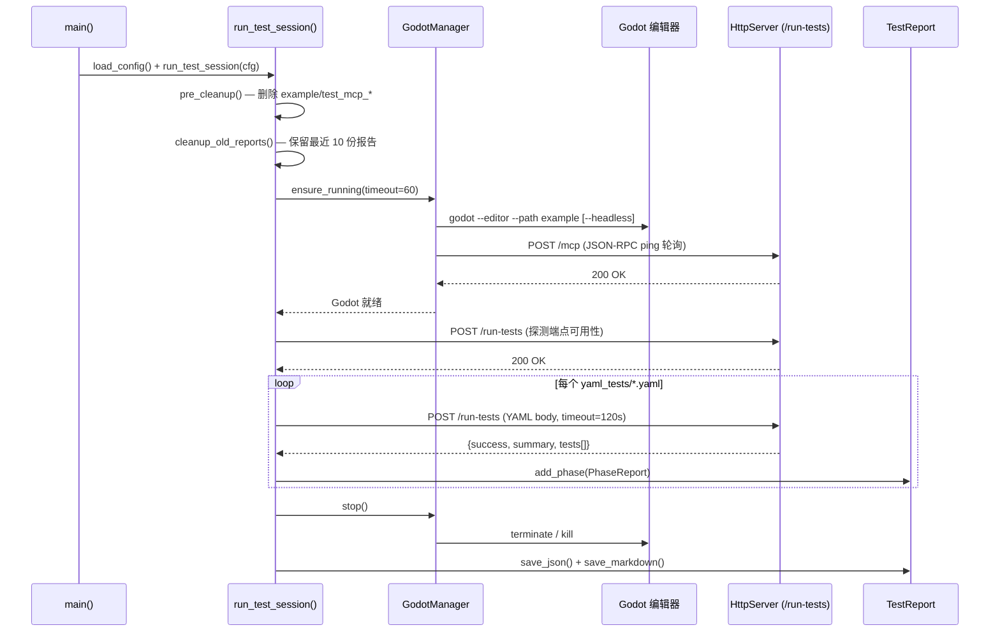

# 测试编排器

> `tests/test_orchestrator.py`——管理 Godot 编辑器生命周期，发现 YAML 测试文件，逐个 POST 到 `/run-tests` 端点，聚合结果生成 JSON + Markdown 报告。

## 生命周期



## 模块

### test_orchestrator.py

| 函数 | 说明 | 行号 |
|------|------|------|
| `load_config()` | 从 `.env` 加载环境变量，计算路径 | `:71` |
| `discover_yaml_files(cfg)` | 扫描 `tests/yaml_tests/` 下 `.yaml`/`.yml` 文件 | `:28` |
| `pre_cleanup(cfg)` | 删除 `example/` 下 `test_mcp_*` 目录 | `:90` |
| `cleanup_old_reports(cfg)` | 清理 `output/` 中旧 JSON 报告，保留最近 10 份 | `:99` |
| `check_run_tests_endpoint(port)` | POST 空 YAML 探测 `/run-tests` 可用性 | `:41` |
| `run_yaml_test_file(path, port)` | 读取 YAML 文件并 POST 到 `/run-tests` | `:56` |
| `run_test_session(cfg)` | 异步主流程：启动 → 探测 → 遍历 YAML → 报告 | `:117` |
| `main()` | 入口点，验证 `GODOT_PATH`，失败退出码 1 | `:291` |

### GodotManager（`godot_manager.py`）

| 方法 | 说明 | 行号 |
|------|------|------|
| `ensure_running(timeout)` | 检查 MCP 就绪，未就绪则启动 | `:26` |
| `_start(timeout)` | 启动 Godot 进程，headless 失败时自动重试非 headless | `:46` |
| `_check_mcp_ready()` | POST `/mcp` JSON-RPC ping 检测就绪 | `:89` |
| `stop(timeout)` | terminate → 等待 → kill 兜底 | `:32` |

启动命令：`godot --editor --path <project> [--headless]`（`godot_manager.py:56-58`）

### 报告（`report.py`）

| 类 | 说明 | 行号 |
|---|---|---|
| `TestReport` | 聚合所有 PhaseReport，生成 JSON + Markdown | `:9` |
| `PhaseReport` | 单个 YAML 文件的结果集（`test_phases/base.py:36`） | — |
| `TestResult` | 单个测试结果：`tool`/`status`/`expected`/`actual`/`error`（`test_phases/base.py:6`） | — |

报告聚合属性：`total_tools` / `passed` / `failed` / `skipped` / `total_duration`（`report.py:22-43`）

## 配置

`tests/.env`（复制自 `.env.example`）：

| 变量 | 默认值 | 说明 |
|------|--------|------|
| `GODOT_PATH` | （必填） | Godot 4.6 可执行文件路径 |
| `GODOT_HEADLESS` | `false` | 是否使用 `--headless` 启动（代码默认 `"false"`，见 `test_orchestrator.py:77`） |
| `GODOT_MCP_HTTP_PORT` | `9600` | MCP HTTP 端口 |
| `GODOT_PROJECT_PATH` | `../example` | 测试用 Godot 项目路径 |

## 响应解析

编排器从 `/run-tests` 响应中提取（`test_orchestrator.py:188-203`）：

```
summary.total / summary.passed / summary.failed
summary.cleanup_deleted / summary.cleanup_skipped
tests[].tool / tests[].description / tests[].passed / tests[].error
```

每个 YAML 文件映射为一个 `PhaseReport`，每个 `tests[]` 条目映射为一个 `TestResult`（`passed=true` → `status="PASS"`）。

## 路径约定

| 路径 | 用途 |
|------|------|
| `tests/yaml_tests/` | YAML 测试文件目录（由 `discover_yaml_files()` 扫描） |
| `tests/output/` | 报告输出目录（JSON + Markdown） |
| `tests/.env` | 环境配置 |
| `example/` | Godot 测试项目根目录 |

## 运行

```bash
# 直接运行（需先配置 tests/.env）
uv run python tests/test_orchestrator.py

# 通过 pytest
pytest tests/test_orchestrator.py -v --asyncio-mode=auto
```

退出码：`0` = 全部通过，`1` = 有失败或致命错误（`test_orchestrator.py:303-309`）。
