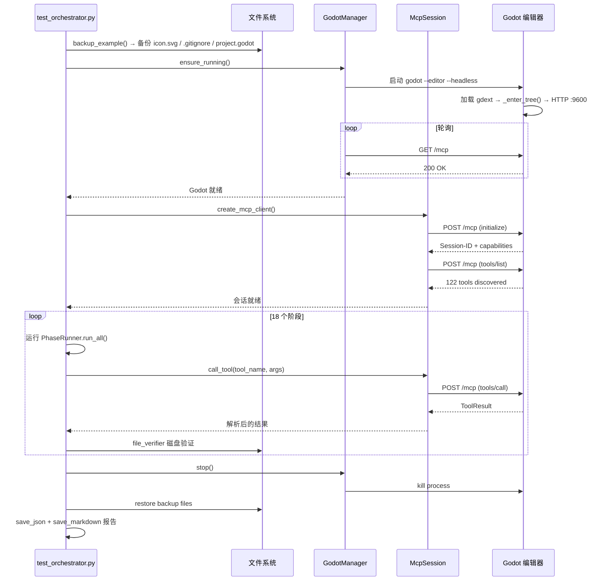

# 测试编排器

> `test_orchestrator.py`——管理 Godot 编辑器生命周期、运行所有测试阶段、生成报告。

## 生命周期

## 关键函数

| 函数 | 说明 |
|------|------|
| `load_config()` | 从 `.env` 加载环境变量，计算路径 |
| `backup_example()` | 备份 `icon.svg`、`.gitignore`、`project.godot` 到 `tests/backup/` |
| `run_test_session()` | 异步主流程：启动 → 连接 → 执行 → 停止 → 报告 |
| `_restore_fallback()` | 清理阶段未运行时回退恢复文件 |
| `main()` | 入口点，验证 `GODOT_PATH`，异常退出码 1 |

## 路径约定

| 路径 | 用途 |
|------|------|
| `tests/backup/` | 预测试备份目录 |
| `tests/output/` | 报告输出目录 |
| `tests/.env` | 环境配置 |
| `example/` | Godot 测试项目根目录 |
