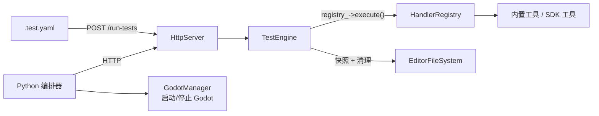

# 测试框架总览

> C++ 进程内测试引擎（`TestEngine` + `POST /run-tests`）执行 YAML 测试，Python 编排器管理 Godot 生命周期并生成报告。

## 架构



- **进程内**：`TestEngine` 直接调用 `HandlerRegistry::execute()`，绕过 MCP 协议
- **配置驱动**：YAML 文件定义测试，零脚本代码
- **磁盘校验**：`.tscn`/`project.godot`/原始文本，类型转换 + 浮点容差
- **自动清理**：EditorFileSystem 快照差分 + 工具返回值双源追踪，只删交集

## 入口

| 入口 | 方式 | 适用 |
|------|------|------|
| `POST /run-tests` | HTTP，YAML body → JSON 结果 | Python 编排器 / CI / curl |
| `uv run python tests/test_orchestrator.py` | Python 编排器（自动管理 Godot 生命周期） | CI / 开发调试 |

## 文件结构

```
tests/
├── test_orchestrator.py        # 主编排器：启动 Godot → POST YAML → 报告
├── godot_manager.py            # Godot 编辑器进程生命周期管理
├── report.py                   # TestReport: JSON + Markdown 报告生成
├── test_phases/
│   └── base.py                 # PhaseReport / TestResult 数据类
├── test_data/                  # 测试用静态文件
├── yaml_tests/                 # YAML 测试文件（由编排器发现）
├── # 备份通过 TestRunner 的内存 backup_project_godot() 实现，无独立目录
├── output/                     # 报告输出目录
├── .env / .env.example         # 环境配置
└── requirements.txt            # Python 依赖
```

## C++ 引擎结构

C++ 测试引擎已重构为三层继承体系，所有执行引擎位于 `extensions/src/pipeline/`：

- `PipelineRunnerBase` — 核心执行器：拓扑排序、chain 执行、step 循环
- `TestRunner` — 继承 PipelineRunnerBase，添加断言/磁盘校验/清理
- `WorkflowRunner` — 继承 PipelineRunnerBase，用于 execute_workflow 元工具

详见 [C++ 测试引擎](test-engine.md)。

## 运行

```bash
# C++ 测试引擎（需要 Godot 运行中 + 插件已启用）
curl -X POST http://localhost:9600/run-tests \
  -H "Content-Type: application/x-yaml" \
  --data-binary @tests/yaml_tests/<name>.yaml

# Python 编排器（自动管理 Godot 生命周期）
uv run python tests/test_orchestrator.py

# 通过 pytest 运行编排器
pytest tests/test_orchestrator.py -v --asyncio-mode=auto
```

## 依赖

- **C++ 引擎**：ryml（rapidyaml，通过 CMake FetchContent）
- **Python**：`pytest`、`pytest-asyncio`、`httpx`、`python-dotenv`、`mcp`（见 `tests/requirements.txt`；YAML 以 raw text 发送到服务端由 ryml 解析）
- **前置**：复制 `tests/.env.example` → `tests/.env`，设置 `GODOT_PATH`
- **Windows**：必须使用 `uv run python`（`.python-version` 锁定 3.14）

## 详细文档

| 文档 | 说明 |
|------|------|
| [C++ 测试引擎](test-engine.md) | TestEngine 架构、三层继承体系、YAML 格式、断言引擎、磁盘校验、清理策略 |
| [测试编排器](orchestrator.md) | Python 编排器生命周期、配置、报告格式 |
