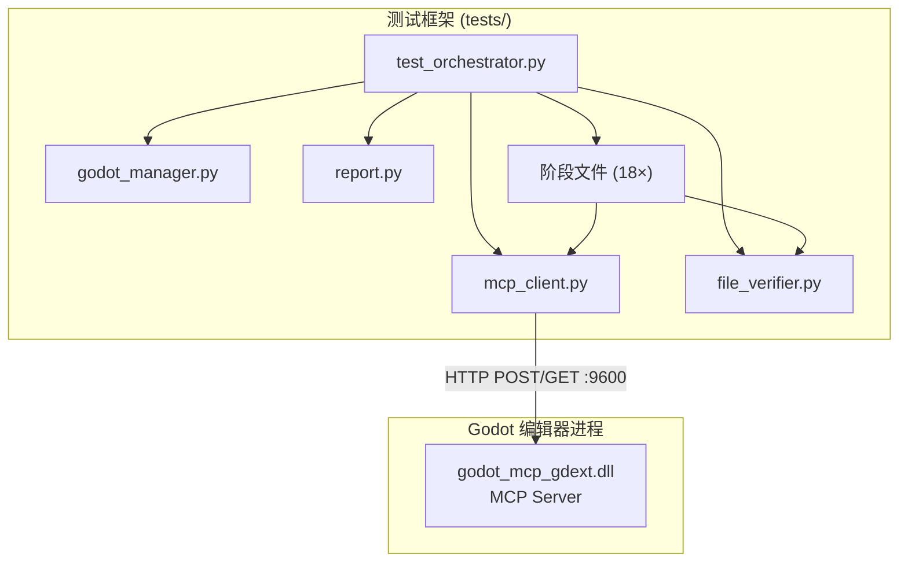

# 测试框架总览

> Python 集成测试框架，通过 MCP 协议连接运行中的 Godot 编辑器，执行自动化的工具测试。

## 架构



## 设计原则

- **顺序执行**：18 个阶段按序执行，前一个阶段的产出（创建的场景、节点）为后续阶段提供输入
- **自动发现**：运行时调用 `tools/list` 发现可用工具，缺失的工具自动跳过（`SKIP`）
- **磁盘验证**：通过 `file_verifier.py` 直接解析 `.tscn`/`project.godot` 文件，无需 Godot 介入
- **状态隔离**：每个阶段自行 cleanup，最终阶段 (`phase_18`) 从 `tests/backup/` 恢复原始项目文件
- **异步 MCP 通信**：使用 `httpx.AsyncClient` 的 `McpSession`，绕过 MCP SDK 的 pydantic float ID 校验问题

## 运行

```bash
uv run python tests/smoke_test.py         # 导入检查（不需要 Godot）
uv run python tests/test_orchestrator.py  # 完整集成测试（需要 Godot 运行）
```

## 依赖

- `tests/.env`：设置 `GODOT_PATH`、`GODOT_HEADLESS`、`GODOT_MCP_HTTP_PORT`、`GODOT_PROJECT_PATH`
- Python 包：`mcp>=1.27`、`httpx>=0.27`、`pytest>=8.0`、`pytest-asyncio>=0.24`、`python-dotenv>=1.0`
- **Windows 注意**：必须使用 `uv run python` 而非裸 `python`（Microsoft Store python 路由桩会卡死）

## 上次运行结果

| 指标 | 值 |
|------|-----|
| 总工具 | 116 |
| 测试工具 | 113 |
| 通过 | 43 |
| 失败 | 70 |
| 跳过 | 3 |
| 总耗时 | 13.0 秒 |
| 发现工具数 | 122 |
| .NET 可用 | 否 |

大部分失败原因是工具响应格式与测试断言不匹配——需要调整个别阶段的 `_parse()` 函数以匹配 GodotMCP 的实际 API 输出格式。
