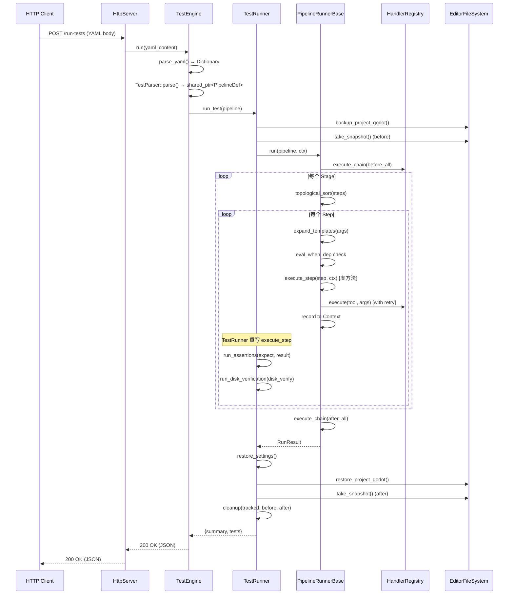
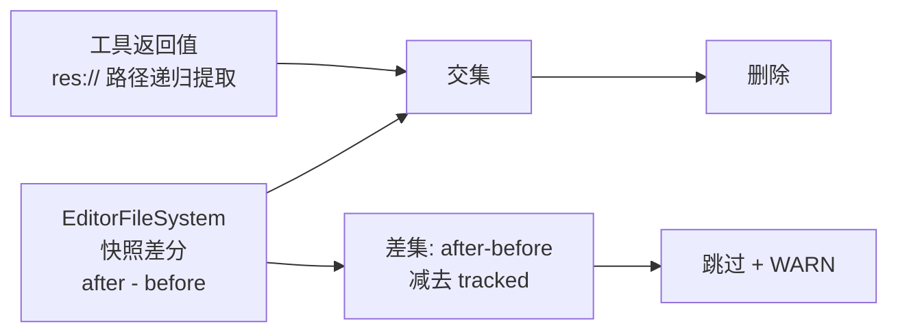

# C++ 测试引擎

> 进程内 YAML 测试引擎，通过 `POST /run-tests` 接收 YAML，直接调用 `HandlerRegistry::execute()` 执行工具，自动清理测试产物。
> 
> 测试引擎是**双前端架构**的一部分：`TestRunner`（测试）和 `WorkflowRunner`（工作流）共享同一纯执行基类 `PipelineRunnerBase`。详见 [`design/05-lld-yaml-workflow.md`](../design/05-lld-yaml-workflow.md)。

## 架构

`TestEngine` 是普通 C++ 类（非 `Object` 子类），持有 `HandlerRegistry*` 指针，**绕过 MCP 协议层**直接调用工具，避免"工具测试工具"的套娃问题。

### 类继承体系

```
PipelineRunnerBase (pipeline/ — 纯执行核心)
  ↙                    ↘
TestRunner (testing/)   WorkflowRunner (pipeline/)
(快照+断言+cleanup)       (vars+结果聚合)
```

**内部架构（重构后）**：

```mermaid
flowchart TB
    subgraph TestEngine["TestEngine (门面)"]
        run["run(yaml) → parse_yaml → parse_pipeline → TestRunner.run_test"]
    end

    subgraph TestRunner["TestRunner (继承 PipelineRunnerBase)"]
        direction TB
        P[backup→snapshot(before)]
        BA[before_all chain]
        S[stages loop]
        AA[after_all chain]
        CL[cleanup→snapshot(after)]
        RS[restore settings]
        P --> BA --> S --> AA --> RS --> CL
    end

    subgraph Stage["每 Stage 内"]
        TS[topological_sort steps]
        SE[逐 step 执行]
        TS --> SE
        subgraph Step["每 Step"]
            EXP[expand_templates] --> WHEN[eval when]
            WHEN --> DEP[check depends_on]
            DEP --> BE[before_each]
            BE --> EX[execute tool + retry]
            EX --> AS[run_assertions]
            AS --> DV[disk_verify]
            DV --> AE[after_each]
        end
    end
```

**类职责**：

| 类 | 文件 | 职责 |
|------|------|------|
| `PipelineDef` | `pipeline/pipeline_types.hpp` | 解析产的 Pipeline 配置（只读） |
| `StageDef` | `pipeline/pipeline_types.hpp` | Stage 定义（steps + 局部生命周期） |
| `StepDef` | `pipeline/pipeline_types.hpp` | Step 定义（工具/参数/断言/依赖/条件/重试） |
| `PipelineParser` | `pipeline/pipeline_parser.hpp/.cpp` | Dictionary → PipelineDef（共享解析逻辑） |
| `PipelineContext` | `pipeline/pipeline_context.hpp/.cpp` | Step 结果存储、模板展开、when 求值 |
| `PipelineRunnerBase` | `pipeline/pipeline_runner_base.hpp/.cpp` | 纯执行基类（无断言、无快照） |
| `TestRunner` | `testing/test_runner.hpp/.cpp` | 派生类：快照 + cleanup + 断言 |
| `TestEngine` | `testing/test_engine.hpp/.cpp` | 薄门面，委托 TestRunner |

**现代 C++ 特性**：`std::shared_ptr`（PipelineDef/Context 共享所有权）、`std::unique_ptr`（Runner 独占）、`std::optional`（可选字段）、`std::variant`（ParseResult）、`std::function`（when 谓词）、`std::mutex`（Context 防御性封装）、结构化绑定、`std::string_view`。

## 入口

唯一入口为 `POST /run-tests`，绕过 MCP JSON-RPC 协议，直接解析 YAML body。

```http
POST /run-tests HTTP/1.1
Content-Type: application/x-yaml

name: scene_test
pipeline:
  on_failure: fail_fast
  stages:
    - id: main
      steps:
        - id: create_node
          tool: add_node
          description: 创建 Node2D
          args: { class_name: "Node2D", node_name: "test_node" }
          expect:
            status: success
```

### 成功响应

```json
{
  "success": true,
  "suite_name": "scene_test",
  "summary": {
    "total": 1, "passed": 1, "failed": 0,
    "call_count": 1, "call_success": 1,
    "unique_tools": ["add_node"],
    "errors": [],
    "cleanup_deleted": [],
    "cleanup_skipped": [],
    "duration_ms": 500
  },
  "tests": [
    {
      "tool": "add_node",
      "description": "创建 Node2D",
      "passed": true,
      "step_id": "create_node",
      "stage": "main",
      "status": "PASS"
    }
  ]
}
```

**响应构建**：PipelineRunner::run() → 扁平 `tests[]` 数组 + `summary`。**JSON 形状向后兼容**，仅新增可选字段 `step_id`/`stage`。

## 执行流程



## YAML 配置格式

### 顶层

| 键 | 类型 | 必填 | 说明 |
|---|---|---|---|
| `name` | String | 是 | 套件名称 |
| `description` | String | 否 | 套件描述 |
| `headless` | Bool | 否 | 默认 true |
| `pipeline` | Dictionary | 是 | 流水线定义 |

### pipeline 块

| 键 | 类型 | 默认 | 说明 |
|---|---|---|---|
| `on_failure` | String | `fail_fast` | 策略：`fail_fast`/`stop`/`continue` |
| `before_all` | Array | `[]` | 全局前置工具链 |
| `after_all` | Array | `[]` | 全局后置工具链 |
| `stages` | Array | — | Stage 列表（按声明序串行执行） |

### 工具链步骤（before_all / before_each / after_each / after_all）

```yaml
- tool: create_scene
  args: { root_type: "Node2D", root_name: "TestRoot" }
  on_failure: stop          # fail_fast | stop | continue
```

链中任一步失败则按 `on_failure` 策略处理。

### Stage 定义

| 键 | 类型 | 默认 | 说明 |
|---|---|---|---|
| `id` | String | — | Stage 标识（必填） |
| `name` | String | =id | 显示名称 |
| `on_failure` | String | 继承 pipeline | 局部策略覆盖 |
| `before_each` | Array | `[]` | 该 Stage 每 step 前执行 |
| `after_each` | Array | `[]` | 该 Stage 每 step 后执行 |
| `steps` | Array | — | Step 列表（必填） |

### Step 定义

```yaml
- id: create_node           # 必填，命名供 depends_on/when/模板引用
  tool: add_node            # 必填，工具名
  description: "创建 Node"  # 可选
  args:                     # 可选，工具参数（可含 ${...} 模板）
    class_name: "Node2D"
    node_name: "${steps.create_sprite.result.node_name}"
  depends_on: []            # 可选，同 Stage 内依赖的 step id 列表
  when:                     # 可选，条件执行
    step: "create_sprite"   # 引用的前置 step id
    status: "passed"        # passed | failed | skipped
  on_failure: continue      # fail_fast | stop | continue
  retry:                    # 可选，重试
    count: 3
    delay_ms: 100
  allow_failure: false      # 可选，默认 false
  expect:                   # 断言（见下方）
    status: success
    has_keys: [node, name]
    field_checks:
      - key: name
        type: int
        value: 42
    error_contains: "..."
  disk_verify:               # 磁盘校验
    scene: { path: "...", nodes: [...] }
    project_settings: [...]
    raw_text: [...]
```

### Scope 规则

| 规则 | 说明 |
|------|------|
| `depends_on` 范围 | **仅同 Stage 内**（跨 Stage 顺序由 stage 声明序隐式保证） |
| Context 引用范围 | **pipeline 级跨 Stage 可见**（`${...}` / `when` 可引用任意已执行 step） |
| `before_each`/`after_each` | **Stage 局部** |

### 模板变量语法

| 语法 | 含义 | 类型保留 |
|------|------|----------|
| `${steps.<id>.result.<path>}` | 引用 step 返回值中的字段 | 是 |
| `${steps.<id>.result}` | 引用 step 完整返回值 | 是 |
| `${steps.<id>.status}` | 引用 step 状态（passed/failed/skipped） | String |

### 失败策略对比

| 策略 | 对 chain 的效果 | 对 step 的效果 |
|------|----------------|----------------|
| `continue` | 记录错误，继续下一个 | 记录失败，继续下一个 |
| `stop` | 立即终止整条 chain | 立即终止整个 pipeline |
| `fail_fast` | 跳过 chain 中后续步骤 | 跳过本 stage 内后续步骤 |

## 断言引擎

`TestRunner::execute_step()`（重写基类的虚方法）在工具执行后调用 `run_assertions()`（`test_assertions.hpp:27-204`）对工具返回结果执行 4 类检查：

### 结果解包

若结果含 `success` + `data`，自动解包为 `data` Dictionary 再检查 `has_keys` / `field_checks`（`test_assertions.hpp:16-25`）。

### 1. status 检查

| expect.status | 通过条件 |
|:---|---|
| `success` | 结果无 `error` 键 |
| `error` | 结果有 `error` 键 |

### 2. has_keys 检查

`expect.has_keys` 数组中的每个 key 必须存在于（解包后的）结果中。

### 3. field_checks 检查

| 字段 | 说明 |
|---|---|
| `path` 或 `key` | 点分隔路径，如 `"data.node_path"`，逐层遍历 Dictionary |
| `expect` 或 `value` | 期望值 |
| `type` | 类型提示（见下表），控制比较方式 |
| `tolerance` | 浮点容差，默认 `0.0001` |
| `not_empty` | bool，校验非 nil/空字符串/空数组/空字典 |

### 4. error_contains 检查

`expect.error_contains` 子串匹配错误消息。

## 支持类型（不变）

| type | YAML 示例 | 比较方式 |
|---|---|---|
| `Vector2` / `Vector2i` | `[100, 100]` | 分量距离 ≤ tolerance |
| `Vector3` / `Vector3i` | `[1, 2, 3]` | 分量距离 ≤ tolerance |
| `Color` | `[1, 0, 0, 1]` | 四通道距离 ≤ tolerance |
| `float` / `double` | `3.14` | `|a-b|` ≤ tolerance |
| `int` / `integer` | `42` | 精确等于 |
| `bool` | `true` | 精确等于 |
| `String` / `string` | `"hello"` | 精确等于 |
| 未指定 | — | 通用 Variant `!=` 比较 |

**不支持 `Rect2`。**

## 磁盘校验（不变）

`run_disk_verification()` 支持 3 类校验：

### scene（场景文件校验）

```yaml
disk_verify:
  scene:
    path: "res://scenes/test_scene.tscn"
    nodes:
      - path: "test_node"
        type: "Node2D"
        exists: true
        properties:
          - path: "position"
            expect: [100, 100]
            type: Vector2
```

### project_settings（project.godot 校验）

```yaml
disk_verify:
  project_settings:
    - section: "application"
      key: "config/name"
      expect: "TestGame"
```

### raw_text（原始文本校验）

```yaml
disk_verify:
  raw_text:
    - path: "res://scenes/test_scene.tscn"
      contains: "visible = false"
    - path: "res://project.godot"
      not_contains: "DEBUG"
```

## 清理策略：双源追踪（不变）



**规则**：只删除同时在「快照差分」和「追踪路径」中的文件。

## 完整 YAML 示例

```yaml
name: property_tests
description: 属性操作完整验证
headless: false

pipeline:
  on_failure: fail_fast
  before_all:
    - tool: new_scene
      args: { root_type: "Node2D", root_name: "TestRoot" }
  after_all:
    - tool: new_scene
      args: { root_type: "Node", root_name: "Cleanup" }
  stages:
    - id: node_ops
      name: Node operations
      steps:
        - id: create_node
          tool: add_node
          description: 创建 Sprite2D
          args: { class_name: "Sprite2D", node_name: "TestSprite" }
          expect:
            status: success
          disk_verify:
            scene:
              path: "res://scenes/test_scene.tscn"
              nodes:
                - path: "TestSprite"
                  exists: true

        - id: set_position
          tool: set_node_property
          description: 设置 position
          args: { node_path: "TestSprite", property: "position", value: [100, 100] }
          depends_on: [create_node]
          when:
            step: create_node
            status: passed
          retry:
            count: 2
            delay_ms: 50
          expect:
            status: success
```

## 文件结构

```
extensions/src/pipeline/              ← 共享核心
├── yaml_parser.hpp                   ryml → Godot Variant 递归转换
├── type_utils.hpp                    类型别名归一化 + 默认容差常量
├── pipeline_types.hpp                Pipeline/Stage/Step/ChainStep 类型定义
├── pipeline_parser.hpp/.cpp          Dictionary → PipelineDef + 校验
├── pipeline_context.hpp/.cpp         Step 结果存储、模板展开、when 求值
├── pipeline_runner_base.hpp/.cpp     纯执行基类（无断言、无快照）
└── workflow_parser.hpp/.cpp          工作流解析器（vars、timeout、JSON/YAML）

extensions/src/testing/               ← 仅测试前端
├── test_engine.hpp/.cpp              薄门面，委托 TestRunner
├── test_runner.hpp/.cpp              继承 PipelineRunnerBase，加快照/断言/cleanup
├── test_parser.hpp/.cpp              测试专用解析器（expect、disk_verify、allow_failure）
├── test_assertions.hpp               断言引擎
└── godot_file_verifier.hpp           磁盘校验
```

## 外部调用

```bash
# 需要 Godot 编辑器运行中，插件已启用
curl -X POST http://localhost:9600/run-tests \
  -H "Content-Type: application/x-yaml" \
  --data-binary @tests/yaml_tests/<name>.yaml
```
