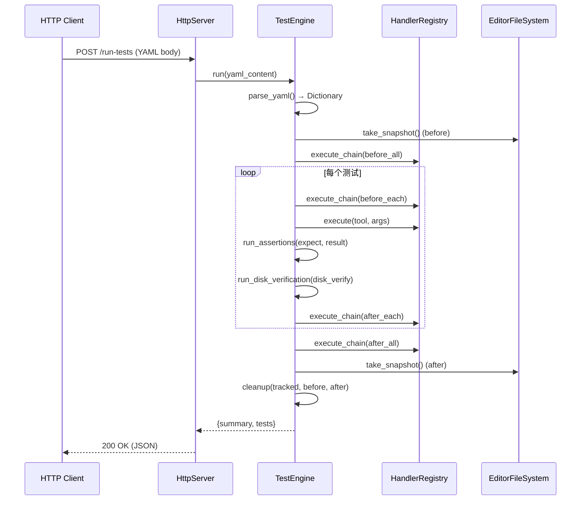
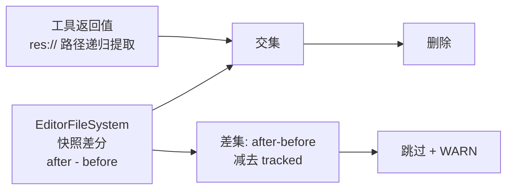

# C++ 测试引擎

> 进程内 YAML 测试引擎，通过 `POST /run-tests` 接收 YAML，直接调用 `HandlerRegistry::execute()` 执行工具，自动清理测试产物。

## 架构

`TestEngine` 是普通 C++ 类（非 `Object` 子类），持有 `HandlerRegistry*` 指针，**绕过 MCP 协议层**直接调用工具，避免"工具测试工具"的套娃问题。

- 归属：`McpEditorPlugin::test_engine_`（`editor_plugin.hpp:44`）
- 注入：`HttpServer::set_test_engine()`（`editor_plugin.cpp:131`）
- YAML 解析：ryml → Godot Variant 递归转换（`yaml_parser.hpp:49-108`）

## 入口

唯一入口为 `POST /run-tests`（`http_server.cpp:268`），绕过 MCP JSON-RPC 协议，直接解析 YAML body。

```http
POST /run-tests HTTP/1.1
Content-Type: application/x-yaml

name: scene_test
tests:
  - tool: create_node
    description: 创建 Node2D
    args: { type: "Node2D", name: "test_node" }
    expect:
      status: success
```

### 成功响应

```json
{
  "success": true,
  "suite_name": "scene_test",
  "suite_description": "",
  "summary": {
    "total": 1,
    "passed": 1,
    "failed": 0,
    "cleanup_deleted": ["res://scenes/test.tscn"],
    "cleanup_skipped": []
  },
  "tests": [
    {
      "tool": "create_node",
      "description": "创建 Node2D",
      "passed": true
    }
  ]
}
```

**响应构建**：`test_http_handler.hpp:24-31`

### 失败响应

YAML 解析失败时返回 `{"success": false, "error": "..."}`（`test_http_handler.hpp:17-22`）。

单个测试失败不影响整体响应，失败信息在 `tests[].passed=false` + `tests[].error` 中体现。

## 执行流程



### 数据流（无中间结构体）

引擎全程操作 Godot `Dictionary`/`Array`，**不定义任何测试专用结构体**。YAML 解析后即为 `Dictionary`，测试结果也是 `Dictionary`。唯一内部结构体是 `FileSnapshot`（`test_engine.hpp:36-38`），仅含 `PackedStringArray paths`。

## YAML 配置格式

### 顶层

| 键 | 类型 | 说明 |
|---|---|---|
| `name` | String | 套件名称 |
| `description` | String | 套件描述 |
| `before_all` | Array | 全局前置工具链，失败则跳过所有测试（`test_engine.cpp:284-299`） |
| `before_each` | Array | 每个测试前执行 |
| `after_each` | Array | 每个测试后执行 |
| `after_all` | Array | 全局后置工具链 |
| `tests` | Array | 测试用例列表 |

### 工具链步骤（before_all / before_each / after_each / after_all）

```yaml
- tool: create_scene
  args: { name: "test_scene", root_type: "Node2D" }
```

链中任一步返回 `error` 或 `success=false` 则整条链中止（`test_engine.cpp:189-208`）。

### 测试用例

```yaml
- tool: create_node
  description: 创建 Node2D
  args: { type: "Node2D", name: "test_node", parent: "." }
  expect:
    status: success
    has_keys: [node_path]
    field_checks:
      - path: "node_path"
        type: String
        not_empty: true
    error_contains: "..."
  disk_verify:
    scene:
      path: "res://scenes/test_scene.tscn"
      nodes: [...]
    project_settings: [...]
    raw_text: [...]
```

## 断言引擎

`run_assertions()`（`test_assertions.hpp:27-204`）对工具返回结果执行 4 类检查：

### 结果解包

若结果含 `success` + `data`，自动解包为 `data` Dictionary 再检查 `has_keys` / `field_checks`（`test_assertions.hpp:16-25`）。

### 1. status 检查

| expect.status | 通过条件 |
|---|---|
| `success` | 结果无 `error` 键 |
| `error` | 结果有 `error` 键 |

### 2. has_keys 检查

`expect.has_keys` 数组中的每个 key 必须存在于（解包后的）结果中。

### 3. field_checks 检查

数组，每项：

| 字段 | 说明 |
|---|---|
| `path` 或 `key` | 点分隔路径，如 `"data.node_path"`，逐层遍历 Dictionary |
| `expect` 或 `value` | 期望值 |
| `type` | 类型提示（见下表），控制比较方式 |
| `tolerance` | 浮点容差，默认 `0.0001` |
| `not_empty` | bool，校验非 nil/空字符串/空数组/空字典 |

支持 `not_empty` 单独使用（不提供 `expect`/`value` 时仅做非空检查）。

### 4. error_contains 检查

`expect.error_contains` 子串匹配错误消息。仅在 `expect.status: error` 时有意义。

## 支持类型

`type` 字段控制 `field_checks` 和磁盘校验的值比较方式：

| type | YAML 示例 | 比较方式 |
|---|---|---|
| `Vector2` / `Vector2i` | `[100, 100]` | 分量距离 ≤ tolerance |
| `Vector3` / `Vector3i` | `[1, 2, 3]` | 分量距离 ≤ tolerance |
| `Color` | `[1, 0, 0, 1]` | 四通道距离 ≤ tolerance（alpha 可选，默认 1.0） |
| `float` / `double` | `3.14` | `|a - b|` ≤ tolerance |
| `int` / `integer` | `42` | 精确等于 |
| `bool` | `true` | 精确等于 |
| `String` / `string` | `"hello"` | 精确等于 |
| 未指定 | — | 通用 `Variant::operator!=` 比较 |

**类型别名**（`type_utils.hpp:9-16`）：`list`→`Array`、`dict`→`Dictionary`、`number`→`float`、`any`→无类型约束。

**不支持 `Rect2`。**

## 磁盘校验

`run_disk_verification()`（`godot_file_verifier.hpp:265-294`）在断言通过后执行，支持 3 类校验：

### scene（场景文件校验）

```yaml
disk_verify:
  scene:
    path: "res://scenes/test_scene.tscn"
    nodes:
      - path: "test_node"
        type: "Node2D"
        exists: true
        properties:
          - path: "position"
            expect: [100, 100]
            type: Vector2
            tolerance: 0.001
```

通过 `ResourceLoader::load()` → `PackedScene::instantiate()` 加载场景，遍历节点树校验（`godot_file_verifier.hpp:100-191`）。属性路径支持点分隔嵌套（如 `"material/0/albedo_color"`）。

### project_settings（project.godot 校验）

```yaml
disk_verify:
  project_settings:
    - section: "application"
      key: "config/name"
      expect: "TestGame"
      type: String
```

通过 `ConfigFile::load("res://project.godot")` 加载，逐 key 比较（`godot_file_verifier.hpp:224-260`）。

> **注意**：YAML 键名是 `project_settings`，不是 `project_godot`（`godot_file_verifier.hpp:277`）。

### raw_text（原始文本校验）

```yaml
disk_verify:
  raw_text:
    - path: "res://scenes/test_scene.tscn"
      contains: "visible = false"
    - path: "res://project.godot"
      not_contains: "DEBUG"
```

通过 `FileAccess::get_file_as_string()` 读取，子串包含/不包含检查（`godot_file_verifier.hpp:194-221`）。

## 清理策略：双源追踪



| 来源 | 收集方式 | 代码 |
|---|---|---|
| 文件系统快照 | BFS 遍历 `EditorFileSystemDirectory`，记录所有文件路径 | `test_engine.cpp:17-49` |
| 工具返回值路径 | 递归搜索结果 Dictionary 中所有 `res://` 开头的字符串值 | `test_engine.cpp:57-92` |

**规则**：只删除同时在「快照差分」和「追踪路径」中的文件。差分中未被追踪的文件视为用户手动创建，报告但**不删除**。

清理后自底向上删除空父目录，遇到 `res://` 停止（`test_engine.cpp:154-181`）。

## 完整 YAML 示例

```yaml
name: property_tests
description: 属性操作完整验证

before_all:
  - tool: create_scene
    args: { name: "test_scene", root_type: "Node2D" }

after_all:
  - tool: close_scene
    args: {}

tests:
  - tool: create_node
    description: 创建 Node2D
    args: { type: "Node2D", name: "test_node", parent: "." }
    expect:
      status: success
    disk_verify:
      scene:
        path: "res://scenes/test_scene.tscn"
        nodes:
          - path: "test_node"
            type: "Node2D"
            exists: true

  - tool: set_property
    description: position → (100,100)
    args: { node: "test_node", property: "position", value: [100, 100] }
    expect:
      status: success
    disk_verify:
      scene:
        path: "res://scenes/test_scene.tscn"
        nodes:
          - path: "test_node"
            properties:
              - path: "position"
                expect: [100, 100]
                type: Vector2
                tolerance: 0.001

  - tool: create_node
    description: 非法类型应报错
    args: { type: "NonExistentType" }
    expect:
      status: error
      error_contains: "Unknown"

  - tool: set_project_setting
    description: 改项目名
    args: { setting: "application/config/name", value: "TestGame" }
    expect:
      status: success
    disk_verify:
      project_settings:
        - section: "application"
          key: "config/name"
          expect: "TestGame"
          type: String

  - tool: set_property
    description: visible=false
    args: { node: "test_node", property: "visible", value: false }
    expect:
      status: success
    disk_verify:
      raw_text:
        - path: "res://scenes/test_scene.tscn"
          contains: "visible = false"
```

## 文件结构

```
extensions/src/testing/
├── yaml_parser.hpp             # ryml → Godot Variant 递归转换
├── type_utils.hpp              # 类型别名归一化 + 默认容差常量
├── test_assertions.hpp         # 断言引擎: status/has_keys/field_checks/error_contains
├── godot_file_verifier.hpp     # 磁盘校验: scene/project_settings/raw_text + 类型转换 + 容差比较
└── test_engine.hpp/.cpp        # TestEngine: 编排/快照/清理

extensions/src/server/ipc/
├── http_server.cpp             # /run-tests 路由 (:268)
└── test_http_handler.hpp       # YAML→TestEngine→JSON 响应构建
```

## 外部调用

```bash
# 需要 Godot 编辑器运行中，插件已启用
curl -X POST http://localhost:9600/run-tests \
  -H "Content-Type: application/x-yaml" \
  --data-binary @tests/yaml_tests/<name>.yaml

# 通过 Python 编排器（管理 Godot 生命周期）
uv run python tests/test_orchestrator.py
```
