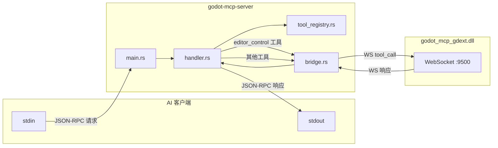

# `crates/server` — MCP 服务器

> 一个标准的 Rust 二进制，使用 `rmcp` crate 实现 MCP 协议，通过 stdio 与 AI 客户端通信。



## 文件

### `main.rs`

- 使用 `clap` 解析 CLI 参数：`--port`（WebSocket 端口，默认 9500）
- 创建 `GodotMcpHandler` 实例
- 调用 `serve_stdio(GodotMcpHandler)` 启动 MCP 服务器
- 不包含任何 tokio 运行时管理——`rmcp` 负责

### `handler.rs`

`GodotMcpHandler` 实现 `ServerHandler` trait（`rmcp` 提供）：

```
handle_request(request) → Result
  ├─ match: list_request_tools  → 返回 tool_registry 的完整列表
  ├─ match: call_tool(name, args)
  │   ├─ 前缀 "godot_editor_" → 直接处理（不经过 WebSocket）
  │   └─ 否则 → forward_tool_call(name, args) → WebSocket → gdext
  └─ match: 其他 → 默认实现
```

**测试断言**：`assert_eq!(total, 99)`

### `bridge.rs`

`GodotBridge` — WebSocket 客户端实现：

```
connect(url) → WebSocket 连接
  └─ send(&[u8]) → serde_json 序列化的 IpcRequest
  └─ read() → serde_json 反序列化的 IpcResponse
  └─ call_later(duration, f) → 异步延迟执行
```

- 从环境变量 `GODOT_PATH` 获取 Godot 编辑器路径
- `launch_editor()` 启动 Godot 进程并等待 WebSocket 连接
- 编辑器关闭（WebSocket 断开）后自动标记连接断开

### `tool_registry.rs`

```
ToolRegistry {
    tools: Vec<McpSchema::Tool>,
    total: AtomicUsize,
}

impl ToolRegistry {
    register(tool) → 添加工具
    register_defaults() → 注册所有默认工具（包括 server-side 的 3 个 editor control 工具）
    get_all() → 返回所有工具的 Vec
}
```

`register_defaults()` 中注册 99 个工具的完整 Schema，包括：

- 3 个服务器端工具（`godot_editor_open`、`godot_editor_close`、`godot_editor_restart`）
- 96 个通过 WebSocket 转发到 gdext 的工具

## 工具分组（工具注册表中）

工具按 `CommandHandler` 分组注册，每个组有 `tool_names()` 列表、`can_handle(name)` 检查、`handle(args)` 实现。服务器端工具在 handler 中作为 4 个独立的 `McpSchema::Tool` 注册。

## 关键细节

- **不验证**工具是否存在于 gdext 端——如果 WebSocket 收到未知工具，gdext 端会返回错误
- `GODOT_PATH` 环境变量**必须**在 MCP 客户端 `env` 配置中设置（stdio 服务器不继承 shell 环境变量）
- `project_path` 默认为 `godot/`（测试项目）。相对路径以 CWD 为基准解析