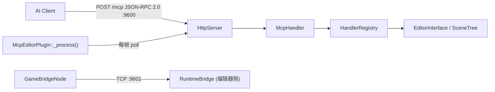

# GodotMCP

Godot 4.6+ 编辑器 MCP 服务器（C++ GDExtension，纯主线程无锁，Streamable HTTP :9600）。

## Build

```bash
uv run python build.py                  # Debug + addons 复制到 example/
uv run python build.py --release        # Release
uv run python build.py --no-zip         # 跳过 zip 快速迭代
uv run python build.py --clean          # 清 build/（保留 _deps/）
uv run python build.py --clean-all      # 删整个 build/（含 _deps/）
uv run python build.py --purge-cache    # 仅清 _deps/（强制重下载）
cmake --build build --target deep-clean # 仅清 addons/bin/ + _deps/
```

- **始终用 `uv run python`**（`uv` 自动激活 `.venv`，依赖锁在 `pyproject.toml`）
- **Python 版本**：`.python-version` 锁定 `3.14`，`pyproject.toml` 要求 `>=3.14`
- **DLL 文件锁**：`example/addons/godot_mcp/bin/godot_mcp_gdext.dll` 被 Godot 编辑器持有，重建失败先关编辑器
- **老旧缓存**：`build.py` 自动检测 MSB4019/VCTargetsPath/编译器路径变更 → 自动 `--clean` 重试；SSL 错误自动 `CMAKE_TLS_VERIFY=0` 降级重试
- **优化**：sccache/ccache 自动检测；Unity build 默认开（batch_size=CPU 核数）；lld-link 自动检测

## 关键约束

- **版本号**只存在于根 `CMakeLists.txt:22`（`PROJECT_VERSION`）。`plugin.cfg` 与 `.gdextension` 由 CMake 自动生成。
- **入口符号** `gdext_mcp_init`（`register_types.cpp:60`）。
- **`compatibility_minimum = "4.6"`** 与 `GODOTCPP_API_VERSION "4.6"` 必须同步（`extensions/CMakeLists.txt:15`）。
- **Pinned deps**：`godot-cpp 10.0.0-rc1`、`ryml v0.7.0`（header-only）。升级前必须测试。
- 源码根 `extensions/src/`（不是仓库根 `src/`）。`register_types.cpp` 用 `MODULE_INITIALIZATION_LEVEL_SCENE`（游戏进程注册 `GameBridgeNode`）+ `LEVEL_EDITOR`（编辑器进程注册 `McpEditorPlugin`）。

## 架构



- **端口**：HTTP 9600（`GODOT_MCP_HTTP_PORT`），桥接 9601（`GODOT_MCP_BRIDGE_PORT`）
- **端点**：`/mcp`（JSON-RPC 2.0 + SSE），`/run-tests`（YAML 测试引擎）
- **轮询**：`McpEditorPlugin::_process()` 驱动 `HttpServer::poll()` + `RuntimeBridge::poll()`，非 `_on_process_frame` 信号
- **运行时桥接**：
  - `GameBridgeNode`（`game_bridge.cpp`）：游戏进程内 TCP 服务端，`_self_add` 通过 `call_deferred` 加入场景树，7 个命令
  - `RuntimeBridge`（`bridge.cpp`）：编辑器侧 TCP 客户端，`send_command()` 发送 JSON 命令，`make_response()` 展平 `{ok,data}` → `{success,data}`
  - 生命周期：`_try_bridge_connect()` 通过 `ei->is_playing_scene()` 感知游戏启停，自动 connect/disconnect
- **双重注册**：`GDREGISTER` 注册 SDK 类（`McpToolDefinition`/`McpToolRegistry`）+ EditorPlugin；`HandlerRegistry` 管理 `ITool` 主表 + SDK `CommandFn` 旁路表
- **工具数**：~170（174 注册行，3 个跨文件重复；全部 X-macro 注册，无 codegen）

## 添加内置工具

**自动编译**：`extensions/src/built_in/tools/**/*.hpp` 通过 `register_itools.cpp` 的 `#include` 收集（无需 `.cpp` 文件）。
**注册方式**：X-macro 分文件注册（`extensions/src/built_in/tools/register/*.hpp`）。

```cpp
// extensions/src/built_in/tools/<category>/my_tool.hpp
class MyTool : public ITool {
    String name() const override { return "my_tool"; }
    String category() const override { return "editor_tools/my_category"; }
    String brief() const override { ... }
    String description() const override { ... }  // 纯虚函数，必须实现
    Dictionary input_schema() const override { ... }
    bool is_meta() const override { return false; }
    bool needs_scene() const override { return false; }
    bool needs_node() const override { return false; }
    Dictionary execute_impl(const ToolContext &ctx) override { ... }
};
```

- **注册步骤**：创建 `.hpp` 文件后，在 `extensions/src/built_in/tools/register/` 下对应分类的 X-macro 注册文件中加一行：
  ```cpp
  GODOT_MCP_TOOL(MyTool, false)
  ```
  `GODOT_MCP_TOOL` 宏签名：`(cls, is_destructive_val)` — 定义于 `register_itools.cpp:229`。
  `name()`、`category()`、`is_meta()`、`needs_scene()`、`needs_node()` 等其他属性通过类上的虚方法重写提供。
- **同时**需要在 `extensions/src/built_in/register_itools.cpp` 中对应分类区域加 `#include` 指令。
- **不需要** `// @tool register` 注释，不需要运行 codegen。编译器原生处理注册。
- **顶级分类**自动发现：`category()` 第一个 `/` 前的段即为顶级分类名，label 自动美化（`editor_tools` → `Editor tools`）。
- **顶级分类描述**：在该分类任一工具上覆盖 `category_description()` 即可自动填充。
- **场景树修改**：必须用 `EditorUndoRedoManager`（`ei->get_editor_undo_redo()`），不用裸 `UndoRedo`。
- **写入文件**：不能直接写 `.tscn`，须经 EditorInterface API 或写后 `notify_file_changed()`。

## C++ 注意事项

- **MSVC UTF-8**：根 `CMakeLists.txt:43` 已加 `/utf-8 /bigobj`。**不要用 `String::utf8("中文")`** — 全英文化后直接 `String("English")` 即可。
- **编辑器内部类**不在 godot-cpp 绑定中，用 `find_children("*", "ClassName")` + `call()` 动态调用。
- **常用 helper**（`cmd_utils.hpp`）：
  - `resolve_node()`：接受 `""`/`"."`/`"/"`/根节点名/`"Root/Child"`
  - `undoable_set()`：改节点属性优先用（立即应用 + 注册撤销）
  - `variant_to_json` / `json_to_variant`：Variant ↔ JSON 递归转换
  - `json_to_variant` 支持 `{"path": "res://..."}` 加载 Resource
- **底部面板**：`add_control_to_bottom_panel` 在 godot-cpp 10.0.0-rc1 未绑定，用 `call()` 兜底
- **`ITool::execute()` 类型验证**：`tool_base.cpp:99` 允许 `Variant::FLOAT` 通过 integer 类型检查

## 已知易错模式

- **`EditorProgress` → `Main::iteration()` → 重入**：`ei->save_scene()` 默认走 `_save_scene_with_preview()`，内部 `EditorProgress::step()` 调 `Main::iteration()` → 递归 `_process()` → `http_server_.poll()` 重入。**编辑器工具绝对不要触发嵌套事件循环**。应在保存时用 `ei->save_scene_as(path, false)` 跳过预览。
- **`HashMap` range-for 内 `erase()`**：调用 `connections_.erase()` 会使 range-for 内置迭代器失效 → UB → 崩溃。如需删除，应推入 `dead` 列表，循环外统一清理。
- **`json_to_variant` 前置声明**：`game_bridge.cpp` 前向声明了 `cmd_utils_json.cpp` 中的 `json_to_variant`。如需新增转换工具，直接 `#include "built_in/cmd_utils.hpp"`，不要重复前向声明（ODR 风险）。
- **`save_scene` 后不要访问 `ctx.root`**：`ei->save_scene()` 后编辑器可能释放/重建根节点。
- **`is_file()` 在文件删除后恒 false**：需在删除前捕获状态。
- **`set_node_property` 的 value 参数 schema 不应声明 `"type": "object"`** — 否则 string 值会被 `ITool::execute()` 的类型检查拒绝。移除 type 约束即可。
- **`add_node` 的 name 参数**：schema 中参数名为 `node_name`，但客户端可能传 `name`。`execute_impl` 中需 `args_string(ctx.args, "name")` 后备。
- **`std::sort` 不能用于 `godot::Vector::Iterator`**（非 random-access）。如需排序，用 `std::vector<T>` 替代。
- **`register_existing.hpp` 与 `register_docs.hpp` 重复注册**：`SearchDocsTool`、`GetClassInfoTool`、`GetBestPracticesTool` 在两个文件中各注册一次。`HandlerRegistry::register_tool()` 按 name 覆盖，不影响运行，但添加新工具时注意不要重复。

## 测试

YAML 驱动，C++ `TestEngine` 在编辑器进程内执行。

```bash
# 单个 YAML 测试文件（需要 Godot 编辑器运行中）
curl -X POST http://localhost:9600/run-tests \
  -H "Content-Type: application/x-yaml" \
  --data-binary @tests/yaml_tests/<name>.yaml

# 完整测试套件（自动启动/关闭 Godot）
pytest tests/test_orchestrator.py -v --asyncio-mode=auto
```

- **前置配置**：复制 `tests/.env.example` → `tests/.env`，设置 `GODOT_PATH` 指向 Godot 4.6 可执行文件
- **测试依赖**：`pytest`、`pytest-asyncio`、`httpx`、`python-dotenv`、`PyYAML`、`mcp`（见 `tests/requirements.txt`）

## 本地开发 MCP 连接

`.opencode/opencode.json` 已预配 `http://127.0.0.1:9600/mcp`。启动 Godot 并启用插件即可通过 MCP 工具操作编辑器。

## 文档

- `docs/`：Rspress 站点（中/英双语），`pnpm run dev` 启动本地预览
- [项目 Wiki](.repo_wiki/index.md) — 模块文档、架构图、设计决策、变更日志

## 目录结构速查

```
extensions/src/           # C++ 源码根（不是仓库根 src/）
  built_in/tools/         # 所有 ITool 工具实现（.hpp only，按 category 分目录）
  built_in/tools/register/ # X-macro 注册文件（register_meta/existing/fallback/docs.hpp）
  built_in/register_itools.cpp  # 工具 #include 汇总 + GODOT_MCP_TOOL 宏定义
  server/                 # HTTP 服务器 + MCP 协议处理
  runtime/                # 运行时桥接（bridge.cpp, game_bridge.cpp）
  sdk/                    # GDScript SDK 类（McpToolDefinition/Registry）
  lsp/                    # LSP 客户端
  ui/                     # 编辑器 UI（dock, console, logger）
  testing/                # C++ 测试引擎
tests/                    # Python 测试编排器 + YAML 测试用例
example/                  # Godot 测试项目（addons/ 由构建自动填充）
  docs/                     # Rspress 文档站（zh/ + en/）
```

## 项目知识库

- [项目 Wiki](.repo_wiki/index.md)
