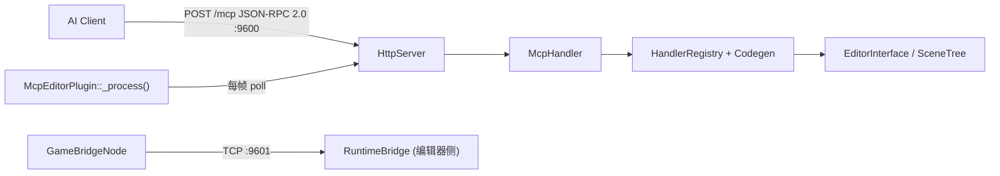

# GodotMCP

Godot 4.6+ 编辑器 MCP 服务器（C++ GDExtension，纯主线程无锁，Streamable HTTP :9600）。

## Build

```bash
uv run python build.py                  # Debug + addons 复制到 example/
uv run python build.py --release        # Release
uv run python build.py --no-zip         # 跳过 zip 快速迭代
uv run python build.py --clean          # 清 CMake 缓存（保留 _deps/）
uv run python build.py --purge-cache    # 清 _deps/（强制重下载）
cmake --build build --target deep-clean # 仅清 addons/bin/ + _deps/
```

- **始终用 `uv run python`**（`uv` 自动激活 `.venv`，依赖锁在 `pyproject.toml`）
- **DLL 文件锁**：`example/addons/godot_mcp/bin/godot_mcp_gdext.dll` 被 Godot 编辑器持有，重建失败先关编辑器
- **老旧缓存**：`build.py:145-147` 检测 MSB4019/VCTargetsPath 自动 `--clean` 重试；SSL 错误自动 `CMAKE_TLS_VERIFY=0` 降级重试
- **优化**：sccache/ccache 自动检测；Unity build 默认开（batch_size=CPU 核数）；lld-link 自动检测

## 关键约束

- **版本号**只存在于根 `CMakeLists.txt:22`（`PROJECT_VERSION`）。`plugin.cfg` 与 `.gdextension` 由 CMake 自动生成。
- **入口符号** `gdext_mcp_init`（`register_types.cpp:56`）。
- **`compatibility_minimum = "4.6"`** 与 `GODOTCPP_API_VERSION "4.6"` 必须同步（`extensions/CMakeLists.txt:15`）。
- **Pinned deps**：`godot-cpp 10.0.0-rc1`、`ryml v0.7.0`（header-only）。升级前必须测试。
- 源码根 `extensions/src/`（不是仓库根 `src/`）。`register_types.cpp` 用 `MODULE_INITIALIZATION_LEVEL_SCENE`（游戏进程注册 `GameBridgeNode`）+ `LEVEL_EDITOR`（编辑器进程注册 `McpEditorPlugin`）。

## 架构



- **端口**：HTTP 9600（`GODOT_MCP_HTTP_PORT`），桥接 9601（`GODOT_MCP_BRIDGE_PORT`）
- **端点**：`/mcp`（JSON-RPC 2.0 + SSE），`/run-tests`（YAML 测试引擎）
- **轮询**：`McpEditorPlugin::_process()` 驱动 `HttpServer::poll()` + `RuntimeBridge::poll()`，非 `_on_process_frame` 信号
- **运行时桥接**：
  - `GameBridgeNode`（`game_bridge.cpp`）：游戏进程内 TCP 服务端，`_self_add` 通过 `call_deferred` 加入场景树，7 个命令：`get_scene_tree`/`get_property`/`set_property`/`call_method`/`screenshot`/`simulate_input`/`set_pause`
  - `RuntimeBridge`（`bridge.cpp`）：编辑器侧 TCP 客户端，`send_command()` 发送 JSON 命令，`make_response()` 展平 `{ok,data}` → `{success,data}`
  - 生命周期：`_try_bridge_connect()` 通过 `ei->is_playing_scene()` 感知游戏启停，自动 connect/disconnect
- **双重注册**：`GDREGISTER` 注册 SDK 类（`McpToolDefinition`/`McpToolRegistry`）+ EditorPlugin；`HandlerRegistry` 管理 `ITool` 主表 + SDK `CommandFn` 旁路表
- **工具数**：~11758（`@tool register` + 节点属性 ×2 + 资源属性 ×2 + 设置项 ×2）

## 添加内置工具

**自动编译**：`extensions/src/built_in/tools/**/*.cpp` 通过 `file(GLOB_RECURSE)` 收集。
**注册方式**：X-macro 分文件注册（`extensions/src/built_in/tools/register/*.hpp`）。

```cpp
// extensions/src/built_in/tools/<category>/my_tool.hpp
class MyTool : public ITool {
    String name() const override { return "my_tool"; }
    String category() const override { return "node_tools"; }
    String brief() const override { ... }
    String description() const override { ... }  // 纯虚函数，必须实现
    Dictionary input_schema() const override { ... }
    bool is_meta() const override { return false; }
    bool needs_scene() const override { return false; }
    bool needs_node() const override { return false; }
    Dictionary execute_impl(const ToolContext &ctx) override { ... }
};
```

- **注册步骤**：创建 `.hpp` 文件后，在 `extensions/src/built_in/tools/register/` 下对应分类的 X-macro 注册文件中加一行：
  ```cpp
  GODOT_MCP_TOOL(MyTool, "my_tool", "node_tools", false, false)
  ```
- **不需要** `// @tool register` 注释，不需要运行 codegen。编译器原生处理注册。
- **顶级分类**硬编码于 `handler_registry.cpp::top_level_meta()`：`meta_tools`、`node_tools`、`editor_tools`、`runtime_tools`。新增须同步加 meta（ADR-015 决策 8 计划改为自动发现）。
- **场景树修改**：必须用 `EditorUndoRedoManager`（`ei->get_editor_undo_redo()`），不用裸 `UndoRedo`。
- **写入文件**：不能直接写 `.tscn`，须经 EditorInterface API 或写后 `notify_file_changed()`。

## YAML 数据库（仅文档用途）

| 类型 | YAML 目录 | 文件数 | 用途 |
|------|----------|--------|------|
| 节点属性 | `node_props/db/*.yaml` | 283 | 文档参考，不参与构建 |
| 资源属性 | `node_resource/db/*.yaml` | 419 | 文档参考，不参与构建 |
| 项目设置 | `editor_tools/settings/db/*.yaml` | 24 | 文档参考，不参与构建 |

YAML 数据库不再生成工具注册代码。指令数据由 Godot 内置文档系统（`EditorHelp::get_doc_data()`）提供，通过 Layer 3 文档工具（`get_class_doc`、`get_property_doc` 等）查询。

如需重新生成：`uv run python tools/collect_node_props.py --godot /path/to/godot`

## C++ 注意事项

- **MSVC UTF-8**：根 `CMakeLists.txt:43` 已加 `/utf-8 /bigobj`。非 ASCII 字符串**必须**用 `String::utf8("中文")`。
- **编辑器内部类**不在 godot-cpp 绑定中，用 `find_children("*", "ClassName")` + `call()` 动态调用。
- **常用 helper**（`cmd_utils.hpp`）：
  - `resolve_node()`：接受 `""`/`"."`/`"/"`/根节点名/`"Root/Child"`
  - `undoable_set()`：改节点属性优先用（立即应用 + 注册撤销）
  - `variant_to_json` / `json_to_variant`：Variant ↔ JSON 递归转换
- **底部面板**：`add_control_to_bottom_panel` 在 godot-cpp 10.0.0-rc1 未绑定，用 `call()` 兜底

## 已知易错模式（Agent 务必注意）

- **`EditorProgress` → `Main::iteration()` → 重入**：`ei->save_scene()` 默认走 `_save_scene_with_preview()`，内部 `EditorProgress::step()` 调 `Main::iteration()` → 递归 `_process()` → `http_server_.poll()` 重入。**编辑器工具绝对不要触发嵌套事件循环**。应在保存时用 `ei->save_scene_as(path, false)` 跳过预览。
- **`HashMap` range-for 内 `erase()`**：调用 `connections_.erase()` 会使 range-for 内置迭代器失效 → UB → 崩溃。如需删除，应推入 `dead` 列表，循环外统一清理。
- **`json_to_variant` 前置声明**：`game_bridge.cpp` 前向声明了 `cmd_utils_json.cpp` 中的 `json_to_variant`。如需新增转换工具，直接 `#include "built_in/cmd_utils.hpp"`，不要重复前向声明（ODR 风险）。
- **`save_scene` 后不要访问 `ctx.root`**：`ei->save_scene()` 后编辑器可能释放/重建根节点。
- **`is_file()` 在文件删除后恒 false**：需在删除前捕获状态。

## 测试

YAML 驱动，C++ `TestEngine` 在编辑器进程内执行。

```bash
curl -X POST http://localhost:9600/run-tests \
  -H "Content-Type: application/x-yaml" \
  --data-binary @tests/yaml_tests/<name>.yaml
```

测试依赖：`pytest`、`pytest-asyncio`、`httpx`、`python-dotenv`、`PyYAML`、`mcp`（见 `tests/requirements.txt`）。

## 本地开发 MCP 连接

`.opencode/opencode.json` 已预配 `http://127.0.0.1:9600/mcp`。启动 Godot 并启用插件即可通过 MCP 工具操作编辑器。

## 文档

- `docs/`：Rspress 站点（中/英双语），`pnpm run dev`

## 项目知识库

- [项目 Wiki](.repo_wiki/index.md) — 模块文档、架构图、设计决策、变更日志
