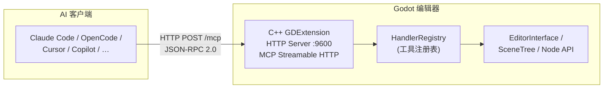

# Godot MCP

[](https://github.com/jessp/godot-mcp)
[](https://isocpp.org)
[](https://godotengine.org)
[](https://modelcontextprotocol.io)
[](License)

> Model Context Protocol 桥接插件，让 AI 助手直接操控 Godot 引擎编辑器。

*[English](README.md)*



Godot MCP 通过 **115+ 个编辑器命令**将 Godot 4.6+ 编辑器暴露给 AI 工具——创建节点、修改属性、管理场景、遍历场景树、编辑 GDScript/C# 文件等。

## 特性

- **115+ 个编辑器命令** — 场景/节点操控、属性编辑、搜索、撤销/重做、碰撞体、GDScript/C# 脚本管理、LSP 验证、文件搜索替换、项目设置、多场景操作
- **单进程架构** — 纯 C++ GDExtension 插件（godot-cpp 10.0.0-rc1），运行在 Godot 编辑器进程内
- **Streamable HTTP 传输** — MCP Streamable HTTP 协议（`:9600`），支持 SSE 服务器推送事件
- **纯主线程 C++** — 无工作线程、无 tokio、无锁。所有代码通过 `process_frame` 在 Godot 主线程运行
- **AI 客户端支持** — 支持 Claude Code、OpenCode、Cursor、GitHub Copilot、Codex、Trae 等（Streamable HTTP 传输）
- **跨平台** — Windows、macOS、Linux

## 工作原理

```
AI 助手 ──► Godot 编辑器（C++ GDExtension）
  (HTTP POST /mcp, :9600, JSON-RPC 2.0)
```

AI 客户端通过 MCP Streamable HTTP 协议直接连接 Godot 编辑器内的 GDExtension HTTP 服务器（`localhost:9600`）。插件通过 `EditorPlugin::_on_process_frame()` 将每次调用调度到 Godot 主线程，安全执行编辑器 API 并返回结果。

## 安装

### 前置条件

- [Godot 4.6+](https://godotengine.org/download)
- [CMake 3.22+](https://cmake.org/download)
- [Visual Studio 2022](https://visualstudio.microsoft.com)（Windows）或等效的 C++ 工具链（macOS/Linux）

> 构建脚本 `build.py` 需要 Python，但 Python 仅作为构建运行器使用，运行时不需要。

### 构建

```bash
git clone https://github.com/jessp/godot-mcp.git
cd godot-mcp
py -3 build.py
```

构建产物：
- `build/addons.zip` — 解压到任意 Godot 项目根目录即可安装编辑器插件

> **Windows 下**务必使用 `py -3` 而非 `python`——Microsoft Store 的路由桩会静默卡死。

### 在 Godot 中安装插件

1. 将 `build/addons.zip` 解压到你的 Godot 项目根目录。
2. 在 Godot 中打开该项目。
3. 前往 **项目 → 项目设置 → 插件**，启用 **Godot MCP**。
4. 输出面板中应出现 `[Godot MCP] Plugin loaded!`。

### 配置 AI 客户端

在 MCP 客户端配置中添加以下内容：

```json
{
  "mcpServers": {
    "godot": {
      "type": "streamable-http",
      "url": "http://localhost:9600/mcp"
    }
  }
}
```

### 客户端配置路径

| 客户端 | 配置文件路径 |
|--------|-------------|
| Claude Code | `~/.claude/mcp.json` |
| OpenCode | `~/.config/opencode/config.json` |
| Cursor | `<project>/.cursor/mcp.json` |
| GitHub Copilot | `<project>/.vscode/mcp.json` |
| Trae / Trae CN | `<project>/.trae/mcp.json` |
| Codex | `~/.codex/config.toml` |

## 使用

1. **启动 Godot 编辑器**（插件已启用）——服务器自动在 9600 端口（HTTP）启动。
2. **使用上述配置连接 AI 客户端。**
3. **从 AI 助手调用任意工具。**

### 快速示例

```
# 检查连接状态
"ping 一下 godot 编辑器"

# 创建场景并填充内容
"打开场景 res://main.tscn"
"在根节点下创建一个叫 Player 的 Node2D"

# 查看和修改
"获取场景树结构"
"把 Player 的位置设为 x=100, y=200"
"给 Player 节点挂载脚本 res://player.gd"
```

### 可用工具

| 分类 | 数量 | 工具 |
|------|------|------|
| 元命令 | 3 | `ping`、`get_engine_version`、`get_plugin_version` |
| 节点：读取 | 4 | `get_scene_tree`、`get_node_path`、`get_property`、`get_property_list` |
| 节点：写入 | 13 | 创建/删除/重命名/复制/移动节点、`set_property`、重设父节点、设置根节点、批量设置属性、挂载/卸载脚本、添加/移除节点分组 |
| 2D 属性 | 21 | 位置/旋转/缩放的 get/set、可见性/调制/Z 轴/文本/碰撞层/碰撞掩码的 get/set、纹理 get/set、唯一名称设置 |
| 3D 属性 | 6 | `get/set_node_position_3d`、`get/set_node_rotation_3d`、`get/set_node_scale_3d` |
| 碰撞体 | 2 | `add_circle_collision`、`add_rectangle_collision` |
| 节点搜索 | 4 | 按名称/类型/组/脚本搜索节点 |
| 脚本辅助 | 3 | `call_method`、`get_variable`、`set_variable` |
| 项目设置 | 7 | 读取/写入项目设置、设置主场景、列出/添加/移除 Autoload、列出场景文件 |
| 场景：文件 | 6 | 创建/删除/重命名场景、分支转场景、场景转分支、实例化子场景 |
| 场景：编辑器标签页 | 9 | 打开/关闭/保存/另存/全部保存/重新加载场景、获取已打开场景/根节点列表、标记未保存 |
| GDScript | 5 | 创建/编辑/读取/列出脚本、LSP 语法验证 |
| C# | 6 | 生成 Solution、创建/编辑/读取/列出脚本、dotnet build |
| 搜索 | 3 | `find_in_file`、`search_project`、`find_and_replace` |
| 编辑器控制（gdext 端） | 6 | `play_current_scene`、`play_main_scene`、`stop_scene`、`is_scene_playing`、`refresh_filesystem`、`get_editor_info` |
| 撤销/重做 | 2 | `undo`、`redo` |
| 节点便捷操作 | 4 | `set_node_transform_2d/3d`、`get_node_info`、`get_script_variables` |
| 场景信息 | 1 | `is_scene_dirty` |
| 显示设置 | 2 | `get/set_display_settings` |
| 项目信息 | 2 | `get/set_project_info` |
| 物理设置 | 2 | `get/set_physics_settings` |
| 渲染设置 | 2 | `get/set_rendering_settings` |
| 层名称 | 2 | `get/set_layer_names` |
| 插件管理 | 2 | `list_plugins`、`set_plugin_enabled` |
| 输入映射 | 4 | `list/add/remove_input_action`、`set_input_action_events` |

详细的参数格式和返回值请参阅[工具目录](.repo_wiki/reference/tools-catalog.md)。

## 开发

### 项目结构

```
extensions/gdext/           C++ GDExtension 插件（godot-cpp 10.0.0-rc1）
├── CMakeLists.txt
└── src/
    ├── register_types.cpp  GDExtension 入口（符号：gdext_rust_init）
    ├── editor_plugin.cpp   EditorPlugin — HTTP 轮询 via _on_process_frame()
    ├── ipc/
    │   └── http_server.cpp MCP Streamable HTTP 服务器 :9600
    ├── mcp/
    │   └── mcp_handler.cpp MCP JSON-RPC 2.0 会话管理
    ├── lsp/client.cpp      Godot LSP 客户端（GDScript 验证）
    └── commands/           17 个处理器文件（16 组活跃注册）
        ├── handler_registry.cpp/hpp
        ├── cmd_utils.cpp/hpp
        └── cmd_<group>.cpp
```

### CI 检查

```bash
cmake -B build -S .                           # 配置 CMake
cmake --build build --config Debug            # 构建 gdext
```

### 构建选项

```bash
py -3 build.py                                # Debug + addons.zip
py -3 build.py --release                      # Release + addons.zip
py -3 build.py --clean                        # 清空 CMake 缓存（保留 _deps/）
py -3 build.py --no-zip                       # 跳过打包（快速迭代）
cmake --build build --target deep-clean       # 同时删除 _deps/（FetchContent 缓存）
```

### 文件锁定问题

- **Godot 编辑器锁定 DLL** → 关闭编辑器或禁用插件后再构建。

### 关键约束

- **依赖锁定**：`godot-cpp` 固定为 `10.0.0-rc1`（FetchContent）。未经测试不要升级。
- **`godot_mcp.gdextension`**：入口符号 `gdext_rust_init`，`compatibility_minimum = "4.6"`，`reloadable = true`。
- **版本**在 `CMakeLists.txt` 中维护（`set(PROJECT_VERSION "...")`）。仅在此处修改——`plugin.cfg` 由 CMake 生成。
- **新增工具**：在 `extensions/gdext/src/commands/` 中创建 `cmd_<group>.cpp` → 实现 `register_<group>(HandlerRegistry &)` 自由函数 → 在 `handler_registry.cpp` 中添加声明并在 `register_all_tools()` 中调用。

## 文档

- [架构概览](.repo_wiki/overview/architecture.md) — 单进程 C++ GDExtension 架构
- [线程模型](.repo_wiki/overview/threading-model.md) — 纯主线程，HTTP 服务器轮询
- [工具目录](.repo_wiki/reference/tools-catalog.md) — 全部工具的参数与返回值
- [IPC 协议](.repo_wiki/specification/ipc-protocol.md) — MCP Streamable HTTP 通信格式
- [客户端配置](.repo_wiki/reference/client-config.md) — AI 客户端配置模板
- [构建与打包](.repo_wiki/reference/build-and-package.md) — 构建选项、CI 流程、常见问题
- [设计决策](.repo_wiki/design/decisions.md) — 已记录的架构选择
