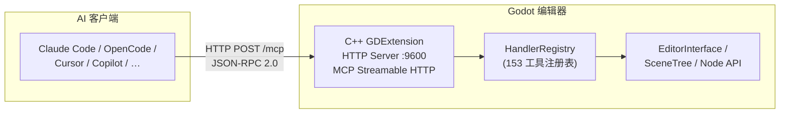

# Godot MCP

[](https://github.com/jessp/godot-mcp)
[](https://isocpp.org)
[](https://godotengine.org)
[](https://modelcontextprotocol.io)
[](License)

> Model Context Protocol 桥接插件，让 AI 助手直接操控 Godot 引擎编辑器。

*[English](README.md)*



Godot MCP 通过 **153 个编辑器命令**将 Godot 4.6+ 编辑器暴露给 AI 工具——创建节点、修改属性、管理场景、遍历场景树、编辑 GDScript/C# 文件、动画、调试等。

## 特性

- **153 个编辑器命令** — 场景/节点操控、动画、文件系统、脚本、调试器、文档查询、设置、输入映射、信号、分组、运行时桥接等
- **单进程架构** — 纯 C++ GDExtension 插件（godot-cpp 10.0.0-rc1），运行在 Godot 编辑器进程内
- **Streamable HTTP 传输** — MCP Streamable HTTP 协议（`:9600`），无外部进程
- **纯主线程 C++** — 无工作线程、无锁。所有代码通过 `_process()` 在 Godot 主线程运行
- **AI 客户端支持** — Claude Code、OpenCode、Cursor、GitHub Copilot、Codex、Trae 等
- **跨平台** — Windows、macOS、Linux

## 工作原理

```
AI 助手 ──► Godot 编辑器（C++ GDExtension）
  (HTTP POST /mcp, :9600, JSON-RPC 2.0)
```

AI 客户端通过 MCP Streamable HTTP 协议直接连接 Godot 编辑器内的 GDExtension HTTP 服务器（`localhost:9600`）。插件通过 `McpEditorPlugin::_process()` 在 Godot 主线程安全执行编辑器 API 并返回结果。支持 SSE 服务器推送事件。

## 安装

### 前置条件

- [Godot 4.6+](https://godotengine.org/download)
- [CMake 3.22+](https://cmake.org/download)
- [Visual Studio 2022](https://visualstudio.microsoft.com)（Windows）或等效的 C++ 工具链（macOS/Linux）
- Python 3.14+ 和 [uv](https://docs.astral.sh/uv/)

### 构建

```bash
git clone https://github.com/jessp/godot-mcp.git
cd godot-mcp
uv run python main.py build
```

构建产物 `build/addons.zip` — 解压到任意 Godot 项目根目录即可安装编辑器插件。

> **Windows 下**务必使用 `uv run python` 确保使用 `.venv` 环境——避免 Microsoft Store 路由桩静默卡死。

### 在 Godot 中安装插件

1. 将 `build/addons.zip` 解压到你的 Godot 项目根目录。
2. 在 Godot 中打开该项目。
3. 前往 **项目 → 项目设置 → 插件**，启用 **Godot MCP**。
4. 输出面板中应出现 `[Godot MCP] Plugin loaded!`。

### 配置 AI 客户端

在 MCP 客户端配置中添加以下内容：

```json
{
  "mcpServers": {
    "godot": {
      "type": "streamable-http",
      "url": "http://localhost:9600/mcp"
    }
  }
}
```

### 客户端配置路径

| 客户端 | 配置文件路径 |
|--------|-------------|
| Claude Code | `~/.claude/mcp.json` |
| OpenCode | `~/.config/opencode/config.json` |
| Cursor | `<project>/.cursor/mcp.json` |
| GitHub Copilot | `<project>/.vscode/mcp.json` |
| Trae / Trae CN | `<project>/.trae/mcp.json` |
| Codex | `~/.codex/config.toml` |

## 使用

1. **启动 Godot 编辑器**（插件已启用）——服务器自动在 9600 端口启动。
2. **使用上述配置连接 AI 客户端。**
3. **从 AI 助手调用任意工具。**

### 快速示例

```
# 检查连接状态
"ping 一下 godot 编辑器"

# 创建场景并填充内容
"创建一个新场景叫 Main"
"在根节点下创建一个叫 Player 的 Node2D"
"把 Player 的位置设为 x=100, y=200"

# 查看和修改
"获取场景树结构"
"给 Player 节点挂载脚本 res://player.gd"
"给 Player 节点添加动画播放器"
```

### 工具分类（共 153 个）

| 分类 | 数量 | 描述 |
|------|:----:|------|
| 元工具 | 8 | 工具发现、内省、配置 |
| 场景树 | 24 | 创建/删除/重命名/移动/复制/重设父级节点 |
| 工作区/调试器 | 13 | 视口截图、控制台、调试器、断点 |
| 脚本 | 12 | 读写/补丁/验证/列出 GDScript + C# |
| 文件系统 | 12 | 创建/删除/移动/复制/打开/搜索文件 |
| 动画 | 10 | 创建动画播放器/剪辑/轨道/关键帧/树 |
| 文档查询 | 8 | 通过 ClassDB 查询类/方法/属性/枚举 |
| 运行时（桥接+生命周期） | 13 | 运行/停止/暂停游戏、查看运行时场景树 |
| 资源管理 | 6 | 保存/加载/新建/复制/清除/获取信息 |
| 着色器 | 5 | 创建/读取/应用预设/获取/设置参数 |
| 控件/UI | 4 | 创建控件、样式盒、布局、主题覆盖 |
| 设置 | 4 | 获取/设置/重置/列出项目设置 |
| 输入映射 | 4 | 列出/添加/删除输入动作和事件绑定 |
| 信号 | 4 | 连接/断开/列出信号和连接 |
| 分组 | 4 | 添加/移除/获取节点分组 |
| 导出 | 4 | 列出/验证/创建导出预设 |
| 3D 场景 | 3 | 网格体、灯光、环境 |
| 音频 | 3 | 音频播放器、音频流、总线列表 |
| 导航 | 3 | 导航区域、导航代理、导航网格烘焙 |
| 瓦片地图 | 3 | 获取信息、设置单元格、擦除单元格 |
| 插件 | 2 | 列出/启用/禁用插件 |
| 碰撞体 | 1 | 创建碰撞形状 |
| 脚手架 | 1 | 创建项目 |
| 可视化 | 1 | 获取项目图表 |

## 开发

### 项目结构

```
extensions/                   C++ GDExtension 插件（godot-cpp 10.0.0-rc1）
  ├── src/
  │   ├── built_in/           内置工具（153 个，四层体系）
  │   │   ├── tools/          ITool 实现，按分类组织
  │   │   ├── register/       X-macro 注册文件
  │   │   ├── cmd_utils/      共享工具函数（SchemaBuilder, undo_helpers…）
  │   │   └── register_itools.cpp  X-macro 注册入口
  │   ├── server/             MCP 服务器
  │   │   ├── ipc/            HTTP 服务器、SSE、HTTP 解析器
  │   │   ├── mcp/            McpHandler、ToolExecutor、PromptProvider
  │   │   └── registry/       HandlerRegistry（工具表、搜索、分类树）
  │   ├── sdk/                McpToolDefinition、McpToolRegistry
  │   ├── runtime/            RuntimeBridge（编辑器↔游戏 TCP :9601）
  │   ├── testing/            C++ TestEngine、YAML 流水线
  │   ├── ui/                 底部面板、确认对话框、控制台、日志器
  │   ├── editor_plugin.cpp   EditorPlugin — _process() 驱动
  │   └── register_types.cpp  GDExtension 入口（符号：gdext_mcp_init）
  └── CMakeLists.txt
├── CMakeLists.txt             根 CMake（版本号、compatibility_minimum）
├── main.py                    构建/测试/打包编排
└── .repo_wiki/                AI Agent 知识库
```

### CI 检查

```bash
cmake -B build -S .                           # 配置 CMake
cmake --build build --config Debug            # 构建 gdext
```

### 命令说明

```bash
uv run python main.py build                           # Debug 构建 + 复制到 example/
uv run python main.py build --release                 # Release 构建
uv run python main.py build --clean                   # 清空构建缓存（保留 _deps/）
uv run python main.py build -j 8                      # 8 路并行编译
uv run python main.py test                            # 完整测试流水线（自动启停 Godot）
uv run python main.py test --file 03_*.yaml           # 运行指定测试文件
uv run python main.py package                         # 打包 addons.zip
```

### 文件锁定问题

- **Godot 编辑器锁定 DLL** → 关闭编辑器或禁用插件后再构建。

### 关键约束

- **依赖锁定**：`godot-cpp 10.0.0-rc1`、`ryml v0.7.0`（均为 FetchContent）。未经测试不要升级。
- **`godot_mcp.gdextension`**：入口符号 `gdext_mcp_init`，`compatibility_minimum = "4.6"`，`reloadable = true`。
- **版本**仅在根 `CMakeLists.txt` 的 `PROJECT_VERSION` 中维护——`plugin.cfg` 和 `.gdextension` 由 `main.py build` 自动生成。
- **添加内置工具**：创建 `.hpp`（实现 `ITool`） → 在 `register/*.hpp` 加 `GODOT_MCP_TOOL` 行 → 在 `register_itools.cpp` 加 `#include`。无需 codegen。

## 文档

| 文档 | 内容 |
|------|------|
| [快速开始](docs/zh/guide/getting-started.md) | 安装、配置、基本使用 |
| [架构概览](docs/zh/about/architecture.md) | 单进程 C++ GDExtension 架构 |
| [构建与打包](docs/zh/guide/building.md) | 构建系统、版本管理 |
| [工具概览](docs/zh/guide/tools-overview.md) | 全部 153 个工具分类 |
| [客户端配置](docs/zh/guide/client-setup.md) | 各 AI 客户端的配置方式 |
| [常见问题](docs/zh/guide/faq.md) | 常见问题解答 |
| [项目知识库](.repo_wiki/index.md) | AI Agent 知识库 |
