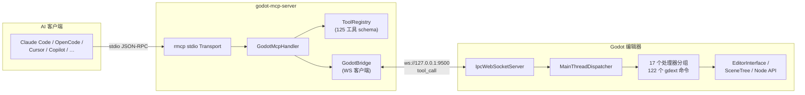

# Godot MCP

[](https://github.com/jessp/godot-mcp)
[](https://www.rust-lang.org)
[](https://godotengine.org)
[](https://modelcontextprotocol.io)
[](License)

> Model Context Protocol 桥接服务，让 AI 助手直接操控 Godot 引擎编辑器。

*[English](README.md)*



Godot MCP 通过 **125 个编辑器命令**将 Godot 4.6+ 编辑器暴露给 AI 工具——创建节点、修改属性、管理场景、遍历场景树、编辑 GDScript/C# 文件等。

## 特性

- **125 个编辑器命令** — 场景/节点操控、属性编辑、搜索、撤销/重做、碰撞体、GDScript/C# 脚本管理、LSP 验证、文件搜索替换、项目设置、多场景操作
- **双进程架构** — stdio MCP 服务器 + 编辑器内 GDExtension 插件，通过本地 WebSocket 通信
- **线程安全设计** — 异步 tokio 运行时配合主线程调度器，安全访问 Godot API
- **12 种 AI 客户端** — 支持 Claude Code、OpenCode、Cursor、GitHub Copilot、Codex、Trae 等（stdio 传输）
- **跨平台** — Windows、macOS、Linux
- **58 项离线测试** — 覆盖协议往返、工具注册表正确性和 E2E 处理器链路（无需 Godot）

## 工作原理

```
AI 助手 ──► godot-mcp-server ──► godot_mcp_gdext
 (stdio)     (Rust 二进制)   ws://127.0.0.1:9500   (GDExtension 插件)
```

1. AI 客户端启动 `godot-mcp-server`，通过 stdio 以 MCP 协议与其通信。
2. 服务器通过 WebSocket（`localhost:9500`）将工具调用转发给 Godot 编辑器插件。
3. 插件将每次调用调度到 Godot 主线程，安全执行编辑器 API，并返回结果。
4. 服务器将结果以 MCP 响应的形式传回 AI 客户端。

## 安装

### 前置条件

- [Godot 4.6+](https://godotengine.org/download)
- [Rust](https://rustup.rs)（stable 频道，通过 `rustup` 安装）
- [Python 3](https://www.python.org)（构建脚本依赖）

### 构建

```bash
git clone https://github.com/jessp/godot-mcp.git
cd godot-mcp
py -3 build.py
```

构建产物：
- `addons.zip` — 解压到任意 Godot 项目根目录即可安装编辑器插件
- `target/debug/godot-mcp-server.exe`（Windows）或 `godot-mcp-server`（Unix）

> **Windows 下**务必使用 `py -3` 而非 `python`——Microsoft Store 的路由桩会静默卡死。

### 在 Godot 中安装插件

1. 将 `addons.zip` 解压到你的 Godot 项目根目录。
2. 在 Godot 中打开该项目。
3. 前往 **项目 → 项目设置 → 插件**，启用 **Godot MCP**。
4. 输出面板中应出现 `[Godot MCP] Plugin loaded!`。

### 配置 AI 客户端

在 MCP 客户端配置中添加以下内容：

```json
{
  "mcpServers": {
    "godot-mcp": {
      "command": "/path/to/godot-mcp-server",
      "args": ["--godot-port", "9500"],
      "env": {
        "GODOT_PATH": "/path/to/Godot_v4.6-stable_win64.exe"
      }
    }
  }
}
```

`GODOT_PATH` 是编辑器控制工具（`godot_editor_open/close/restart`）的必要环境变量。stdio 服务器不继承 shell 环境，因此必须写在 `env` 块中。

### 客户端配置路径

| 客户端 | 配置文件路径 |
|--------|-------------|
| Claude Code | `~/.claude/mcp.json` |
| OpenCode | `~/.config/opencode/config.json` |
| Cursor | `<project>/.cursor/mcp.json` |
| GitHub Copilot | `<project>/.vscode/mcp.json` |
| Trae / Trae CN | `<project>/.trae/mcp.json` |
| Codex | `~/.codex/config.toml` |

> 重新构建服务器后，务必重启 MCP 客户端——客户端会持有旧二进制文件的句柄。

## 使用

1. **启动 Godot 编辑器**（插件已启用）——WebSocket 服务器自动在 9500 端口启动。
2. **使用上述配置连接 AI 客户端。**
3. **从 AI 助手调用任意工具。**

### 快速示例

```
# 检查连接状态
"ping 一下 godot 编辑器"

# 创建场景并填充内容
"打开场景 res://main.tscn"
"在根节点下创建一个叫 Player 的 Node2D"

# 查看和修改
"获取场景树结构"
"把 Player 的位置设为 x=100, y=200"
"给 Player 节点挂载脚本 res://player.gd"
```

### 可用工具（共 125 个）

| 分类 | 数量 | 工具 |
|------|------|------|
| 元命令 | 4 | `ping`、`get_engine_version`、`get_plugin_version`、`get_server_version` |
| 节点：读取 | 4 | `get_scene_tree`、`get_node_path`、`get_property`、`get_property_list` |
| 节点：写入 | 13 | 创建/删除/重命名/复制/移动节点、`set_property`、重设父节点、设置根节点、批量设置属性、挂载/卸载脚本、添加/移除节点分组 |
| 2D 属性 | 21 | 位置/旋转/缩放的 get/set、可见性/调制/Z 轴/文本/碰撞层/碰撞掩码的 get/set、纹理 get/set、唯一名称设置 |
| 3D 属性 | 6 | `get/set_node_position_3d`、`get/set_node_rotation_3d`、`get/set_node_scale_3d` |
| 碰撞体 | 2 | `add_circle_collision`、`add_rectangle_collision` |
| 节点搜索 | 4 | 按名称/类型/组/脚本搜索节点 |
| 脚本辅助 | 3 | `call_method`、`get_variable`、`set_variable` |
| 项目设置 | 3 | 读取/写入项目设置、设置主场景 |
| 场景：文件 | 6 | 创建/删除/重命名场景、分支转场景、场景转分支、实例化子场景 |
| 场景：编辑器标签页 | 9 | 打开/关闭/保存/另存/全部保存/重新加载场景、获取已打开场景/根节点列表、标记未保存 |
| GDScript | 5 | 创建/编辑/读取/列出脚本、LSP 语法验证 |
| C# | 6 | 生成 Solution、创建/编辑/读取/列出脚本、dotnet build |
| 搜索 | 3 | `find_in_file`、`search_project`、`find_and_replace` |
| 编辑器控制（服务器端） | 3 | `godot_editor_open/close/restart` |
| 编辑器控制（gdext 端） | 6 | `play_current_scene`、`play_main_scene`、`stop_scene`、`is_scene_playing`、`refresh_filesystem`、`get_editor_info` |
| 撤销/重做 | 2 | `undo`、`redo` |
| 节点便捷操作 | 4 | `set_node_transform_2d/3d`、`get_node_info`、`get_script_variables` |
| 场景信息 | 1 | `is_scene_dirty` |
| Autoload 与场景列表 | 4 | `list/add/remove_autoload`、`list_scenes` |
| 显示设置 | 2 | `get/set_display_settings` |
| 项目信息 | 2 | `get/set_project_info` |
| 物理设置 | 2 | `get/set_physics_settings` |
| 渲染设置 | 2 | `get/set_rendering_settings` |
| 层名称 | 2 | `get/set_layer_names` |
| 插件管理 | 2 | `list_plugins`、`set_plugin_enabled` |
| 输入映射 | 4 | `list/add/remove_input_action`、`set_input_action_events` |

详细的参数格式和返回值请参阅[工具目录](.repo_wiki/reference/tools-catalog.md)。

## 开发

### 项目结构

```
crates/
├── core/          共享协议类型（IpcRequest、IpcResponse、ToolCallParams）
├── server/        MCP 服务端二进制——rmcp stdio 传输、工具注册表、WS 客户端
└── gdext/         GDExtension 动态库——编辑器插件、WS 服务器、122 个命令处理器
```

### CI 检查

推送前按顺序运行：

```bash
cargo fmt --check --all                       # 格式化检查
cargo clippy --workspace -- -D warnings       # 代码检查（严格模式）
cmake -B build -S .                           # 配置 CMake
cmake --build build --config Debug            # 构建 gdext + server
cargo test --workspace                        # 测试（58 项，全部离线，无需 Godot）
```

### 构建选项

```bash
py -3 build.py                                # Debug + addons.zip
py -3 build.py --release                      # Release + addons.zip
py -3 build.py --clean                        # cargo clean + 清空 addons/bin/
py -3 build.py --no-zip                       # 跳过打包（快速迭代）
py -3 build.py --no-server                    # 只构建 DLL（仅编辑器侧修改）
```

### 文件锁定问题

- **MCP 客户端锁定服务端二进制** → `build.py` 自动结束进程（`taskkill`/`pkill`）；手动构建时先执行 `taskkill /F /IM godot-mcp-server.exe`。
- **Godot 编辑器锁定 DLL** → 关闭编辑器或禁用插件后再构建。

### 关键约束

- **依赖锁定**：`godot = "=0.5"`、`rmcp = "=1.7"`。未经测试不要升级。
- **Rust 频道**：`stable`（由 `rust-toolchain.toml` 指定）。
- **`Cargo.lock`** 已提交（二进制 crate）。
- **版本同步**：`Cargo.toml` → `plugin.cfg` 由 CMake 自动完成。只改 cargo 版本即可。
- **新增工具**：需同时在 `tool_registry.rs` 注册 Schema，并在 `ws_server.rs::route_tool_call` 添加路由分支。更新测试中的 `total == 125` 断言。

## 文档

- [架构概览](.repo_wiki/overview/architecture.md) — 双进程三 crate 设计
- [线程模型](.repo_wiki/overview/threading-model.md) — tokio ↔ 主线程分离与调度器模式
- [工具目录](.repo_wiki/reference/tools-catalog.md) — 全部 125 个工具的参数与返回值
- [客户端配置](.repo_wiki/reference/client-config.md) — 12 种 AI 客户端配置模板
- [构建与打包](.repo_wiki/reference/build-and-package.md) — 构建选项、CI 流程、常见问题
- [IPC 协议](.repo_wiki/specification/ipc-protocol.md) — 通信格式规范
- [设计决策](.repo_wiki/design/decisions.md) — 已记录的架构选择
