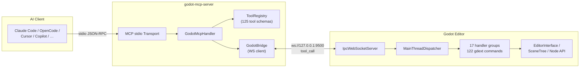

# Godot MCP

[](https://github.com/jessp/godot-mcp)
[](https://www.rust-lang.org)
[](https://godotengine.org)
[](https://modelcontextprotocol.io)
[](License)

> Model Context Protocol bridge that lets AI assistants control the Godot Engine editor.

*[中文文档](README-zh.md)*



Godot MCP exposes the Godot 4.6+ editor to AI tools through **125 commands** — create nodes, modify properties, manage scenes, inspect the scene tree, edit GDScript/C# files, and more.

## Features

- **125 Editor Commands** — Scene/node manipulation, properties, search, undo/redo, collision shapes, GDScript/C# script management, LSP validation, file search/replace, project settings, multi-scene operations
- **Dual-Process Architecture** — stdio MCP server + in-editor GDExtension plugin, connected via local WebSocket
- **Thread-Safe Design** — Async tokio runtime paired with a main-thread dispatcher for safe Godot API access
- **12 AI Client Support** — Claude Code, OpenCode, Cursor, GitHub Copilot, Codex, Trae, and more (stdio transport)
- **Cross-Platform** — Windows, macOS, and Linux
- **58 Offline Tests** — Protocol round-trips, tool registry correctness, and E2E handler tests (no Godot needed)

## How It Works

```
AI Assistant ──► godot-mcp-server ──► godot_mcp_gdext
   (stdio)      (Python/Cython)  ws://127.0.0.1:9500   (GDExtension plugin)
```

1. Your AI client launches `godot-mcp-server` and speaks to it over stdio (MCP protocol).
2. The server forwards tool calls to the Godot editor plugin via WebSocket on `localhost:9500`.
3. The plugin dispatches each call to the Godot main thread, executes editor APIs safely, and returns results.
4. The server relays results back to the AI client as MCP responses.

## Installation

### Prerequisites

- [Godot 4.6+](https://godotengine.org/download)
- [Rust](https://rustup.rs) (stable channel, via `rustup`)
- [Python 3](https://www.python.org) (for the build script)

### Build

```bash
git clone https://github.com/jessp/godot-mcp.git
cd godot-mcp
py -3 build.py
```

This produces:
- `addons.zip` — extract into any Godot project to install the editor plugin
- `build/godot-mcp-server.exe` (Windows) or `build/godot-mcp-server` (Unix)

> **On Windows**, always use `py -3` instead of `python` — the Microsoft Store stubs hang silently.

### Install the Plugin in Godot

1. Extract `addons.zip` into your Godot project root.
2. Open the project in Godot.
3. Go to **Project → Project Settings → Plugins** and enable **Godot MCP**.
4. You should see `[Godot MCP] Plugin loaded!` in the Output panel.

### Configure Your AI Client

Add this to your MCP client config:

```json
{
  "mcpServers": {
    "godot-mcp": {
      "command": "/path/to/godot-mcp-server",
      "args": ["--godot-port", "9500"],
      "env": {
        "GODOT_PATH": "/path/to/Godot_v4.6-stable_win64.exe"
      }
    }
  }
}
```

`GODOT_PATH` is required for editor control tools (`godot_editor_open/close/restart`). Stdio servers don't inherit shell env, so it must be in the `env` block.

### Client Config Locations

| Client | Config Path |
|--------|-------------|
| Claude Code | `~/.claude/mcp.json` |
| OpenCode | `~/.config/opencode/config.json` |
| Cursor | `<project>/.cursor/mcp.json` |
| GitHub Copilot | `<project>/.vscode/mcp.json` |
| Trae / Trae CN | `<project>/.trae/mcp.json` |
| Codex | `~/.codex/config.toml` |

> After rebuilding the server, restart your MCP client — it keeps the old binary handle alive.

## Usage

1. **Start the Godot editor** with the plugin enabled — the WebSocket server automatically starts on port 9500.
2. **Connect your AI client** using the config above.
3. **Call any tool** from your AI assistant.

### Quick Examples

```
# Check the connection
"ping the godot editor"

# Create a scene and populate it
"open scene res://main.tscn"
"create a Node2D called Player under the root"

# Inspect and modify
"get the scene tree"
"set the Player's position to x=100, y=200"
"attach the script res://player.gd to the Player node"
```

### Available Tools (125 total)

| Category | Count | Tools |
|----------|-------|-------|
| Meta | 4 | `ping`, `get_engine_version`, `get_plugin_version`, `get_server_version` |
| Node: Read | 4 | `get_scene_tree`, `get_node_path`, `get_property`, `get_property_list` |
| Node: Write | 13 | `create/delete/rename/duplicate/move` node, `set_property`, `reset_parent`, `set_as_root`, `batch_set_property`, `attach/detach_script`, `add/remove_node_from_group` |
| 2D Properties | 21 | `get/set_node_position/rotation/scale`, `get/set_node_visible/modulate/z_index/text`, `get/set_node_collision_layer/mask`, `get/set_node_texture`, `set_node_unique_name` |
| 3D Properties | 6 | `get/set_node_position_3d/rotation_3d/scale_3d` |
| Collision | 2 | `add_circle_collision`, `add_rectangle_collision` |
| Node Search | 4 | `find_nodes_by_name/type/group/script` |
| Script Helpers | 3 | `call_method`, `get_variable`, `set_variable` |
| Project Settings | 3 | `get/set_project_setting`, `set_main_scene` |
| Scene: File | 6 | `create/delete/rename_scene`, `branch_to_scene`, `scene_to_branch`, `instantiate_scene` |
| Scene: Editor Tabs | 9 | `open/close/save/save_as/save_all/reload_scene`, `get_open_scenes/roots`, `mark_scene_unsaved` |
| GDScript | 5 | `create/edit/read/list_gdscript`, `validate_gdscript` |
| C# | 6 | `csharp_create_solution`, `create/edit/read/list_csharp_script`, `csharp_build` |
| Search | 3 | `find_in_file`, `search_project`, `find_and_replace` |
| Editor Control (server) | 3 | `godot_editor_open/close/restart` |
| Editor Control (gdext) | 6 | `play_current_scene`, `play_main_scene`, `stop_scene`, `is_scene_playing`, `refresh_filesystem`, `get_editor_info` |
| Undo/Redo | 2 | `undo`, `redo` |
| Node Convenience | 4 | `set_node_transform_2d/3d`, `get_node_info`, `get_script_variables` |
| Scene Info | 1 | `is_scene_dirty` |
| Autoload + Scene Listing | 4 | `list/add/remove_autoload`, `list_scenes` |
| Display Settings | 2 | `get/set_display_settings` |
| Project Info | 2 | `get/set_project_info` |
| Physics Settings | 2 | `get/set_physics_settings` |
| Rendering Settings | 2 | `get/set_rendering_settings` |
| Layer Names | 2 | `get/set_layer_names` |
| Plugin Management | 2 | `list_plugins`, `set_plugin_enabled` |
| Input Map | 4 | `list/add/remove_input_action`, `set_input_action_events` |

See the [Tool Catalog](.repo_wiki/en/reference/tools-catalog.md) for detailed argument shapes and return values.

## Development

### Project Structure

```
crates/
├── core/          Shared protocol types (IpcRequest, IpcResponse, ToolCallParams)
└── gdext/         GDExtension cdylib — editor plugin, WS server, 122 command handlers

server/
├── src/           Python MCP server — MCP stdio transport, tool registry, WS client
└── entry.pyx      Cython entry point compiled to executable
```

### CI Gates

Run these in order before pushing:

```bash
cargo fmt --check --all                       # Formatting
cargo clippy --workspace -- -D warnings       # Linting (strict)
cmake -B build -S .                           # Configure CMake
cmake --build build --config Debug            # Build gdext + server
cargo test --workspace                        # Tests (58, all offline, no Godot)
```

### Build Flags

```bash
py -3 build.py                                # Debug + addons.zip
py -3 build.py --release                      # Release + addons.zip
py -3 build.py --clean                        # cargo clean + wipe addons/bin/
py -3 build.py --no-zip                       # Skip zip (fast iteration)
py -3 build.py --no-server                    # DLL only (editor changes)
```

### File Lock Tips

- **Server binary locked by MCP client** → `build.py` auto-kills it via `taskkill`/`pkill`; manual builds: `taskkill /F /IM godot-mcp-server.exe` first.
- **DLL locked by Godot editor** → close editor or disable plugin before rebuilding.

### Key Constraints

- **Pinned deps**: `godot = "=0.5"`. Don't bump without testing.
- **Rust channel**: `stable` (via `rust-toolchain.toml`).
- **`Cargo.lock`** is committed (binary crate).
- **Version** auto-syncs from `Cargo.toml` → `plugin.cfg` via CMake. Bump cargo version only.
- **Adding a tool** requires registering the schema in `server/src/godot_mcp_server/registry.py` AND adding a routing arm in `ws_server.rs::route_tool_call`.

## Documentation

- [Architecture Overview](.repo_wiki/en/overview/architecture.md) — Two-process, three-crate design
- [Threading Model](.repo_wiki/en/overview/threading-model.md) — tokio ↔ main-thread split and dispatcher pattern
- [Tool Catalog](.repo_wiki/en/reference/tools-catalog.md) — All 125 tools with args and return shapes
- [Client Configuration](.repo_wiki/en/reference/client-config.md) — 12 AI client config templates
- [Build & Package](.repo_wiki/en/reference/build-and-package.md) — Build flags, CI gates, gotchas
- [IPC Protocol](.repo_wiki/en/specification/ipc-protocol.md) — Wire format specification
- [Design Decisions](.repo_wiki/en/design/decisions.md) — Recorded architectural choices
