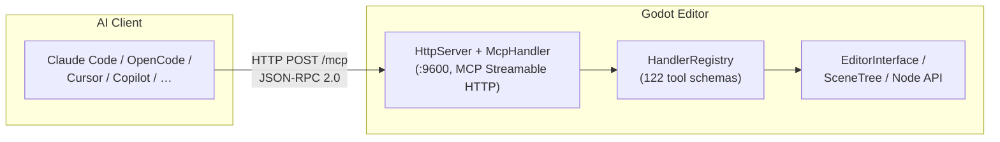

# Godot MCP

[](https://github.com/jessp/godot-mcp)
[](https://isocpp.org)
[](https://godotengine.org)
[](https://modelcontextprotocol.io)
[](License)

> Model Context Protocol bridge that lets AI assistants control the Godot Engine editor.

*[中文文档](README-zh.md)*



Godot MCP exposes the Godot 4.6+ editor to AI tools through **122 commands** — create nodes, modify properties, manage scenes, inspect the scene tree, edit GDScript/C# files, and more.

## Features

- **122 Editor Commands** — Scene/node manipulation, properties, search, undo/redo, collision shapes, GDScript/C# script management, LSP validation, file search/replace, project settings, multi-scene operations
- **Streamable HTTP Transport** — Direct MCP Streamable HTTP (`:9600`) into the GDExtension
- **Single-Process Architecture** — C++ GDExtension plugin (godot-cpp 10.0.0-rc1) running inside the Godot editor
- **Pure Main-Thread C++** — No worker threads, no tokio, no locks. Everything runs on Godot's main thread via `process_frame`
- **AI Client Support (Streamable HTTP)** — Claude Code, OpenCode, Cursor, GitHub Copilot, Codex, Trae, and more
- **Cross-Platform** — Windows, macOS, and Linux

## How It Works

```
AI Assistant ──► godot_mcp_gdext.dll
   (HTTP POST /mcp, :9600)     (C++ GDExtension, JSON-RPC 2.0)
```

AI clients connect directly to the GDExtension's HTTP server on `localhost:9600` using the MCP Streamable HTTP protocol. The plugin dispatches each call to the Godot main thread via `EditorPlugin::_on_process_frame()`, executes editor APIs safely, and returns results. Supports SSE for server-initiated events.

## Installation

### Prerequisites

- [Godot 4.6+](https://godotengine.org/download)
- [CMake 3.22+](https://cmake.org/download)
- [Visual Studio 2022](https://visualstudio.microsoft.com) (Windows) with C++ toolchain, or equivalent on macOS/Linux

### Build

```bash
git clone https://github.com/jessp/godot-mcp.git
cd godot-mcp
py -3 build.py
```

This produces `build/addons.zip` — extract into any Godot project to install the editor plugin.

> **On Windows**, always use `py -3` instead of `python` — the Microsoft Store stubs hang silently.

### Install the Plugin in Godot

1. Extract `build/addons.zip` into your Godot project root.
2. Open the project in Godot.
3. Go to **Project → Project Settings → Plugins** and enable **Godot MCP**.
4. You should see `[Godot MCP] Plugin loaded!` in the Output panel.

### Configure Your AI Client

Add this to your MCP client config:

```json
{
  "mcpServers": {
    "godot": {
      "type": "streamable-http",
      "url": "http://localhost:9600/mcp"
    }
  }
}
```

### Client Config Locations

| Client | Config Path |
|--------|-------------|
| Claude Code | `~/.claude/mcp.json` |
| OpenCode | `~/.config/opencode/config.json` |
| Cursor | `<project>/.cursor/mcp.json` |
| GitHub Copilot | `<project>/.vscode/mcp.json` |
| Trae / Trae CN | `<project>/.trae/mcp.json` |
| Codex | `~/.codex/config.toml` |

## Usage

1. **Start the Godot editor** with the plugin enabled — the HTTP server automatically starts on port 9600.
2. **Connect your AI client** using the config above.
3. **Call any tool** from your AI assistant.

### Quick Examples

```
# Check the connection
"ping the godot editor"

# Create a scene and populate it
"open scene res://main.tscn"
"create a Node2D called Player under the root"

# Inspect and modify
"get the scene tree"
"set the Player's position to x=100, y=200"
"attach the script res://player.gd to the Player node"
```

### Available Tools (122 total)

| Category | Count | Tools |
|----------|-------|-------|
| Meta | 3 | `ping`, `get_engine_version`, `get_plugin_version` |
| Node: Read | 4 | `get_scene_tree`, `get_node_path`, `get_property`, `get_property_list` |
| Node: Write | 13 | `create/delete/rename/duplicate/move` node, `set_property`, `reset_parent`, `set_as_root`, `batch_set_property`, `attach/detach_script`, `add/remove_node_from_group` |
| 2D Properties | 21 | `get/set_node_position/rotation/scale`, `get/set_node_visible/modulate/z_index/text`, `get/set_node_collision_layer/mask`, `get/set_node_texture`, `set_node_unique_name` |
| 3D Properties | 6 | `get/set_node_position_3d/rotation_3d/scale_3d` |
| Collision | 2 | `add_circle_collision`, `add_rectangle_collision` |
| Node Search | 4 | `find_nodes_by_name/type/group/script` |
| Script Helpers | 3 | `call_method`, `get_variable`, `set_variable` |
| Project Settings | 7 | `get/set_project_setting`, `set_main_scene`, `list/add/remove_autoload`, `list_scenes` |
| Scene: File | 6 | `create/delete/rename_scene`, `branch_to_scene`, `scene_to_branch`, `instantiate_scene` |
| Scene: Editor Tabs | 9 | `open/close/save/save_as/save_all/reload_scene`, `get_open_scenes/roots`, `mark_scene_unsaved` |
| GDScript | 5 | `create/edit/read/list_gdscript`, `validate_gdscript` |
| C# | 6 | `csharp_create_solution`, `create/edit/read/list_csharp_script`, `csharp_build` |
| Search | 3 | `find_in_file`, `search_project`, `find_and_replace` |
| Editor Control (gdext) | 7 | `play_current_scene`, `play_main_scene`, `stop_scene`, `is_scene_playing`, `refresh_filesystem`, `get_editor_info`, `godot_editor_restart` |
| Undo/Redo | 2 | `undo`, `redo` |
| Node Convenience | 4 | `set_node_transform_2d/3d`, `get_node_info`, `get_script_variables` |
| Scene Info | 1 | `is_scene_dirty` |
| Display Settings | 2 | `get/set_display_settings` |
| Project Info | 2 | `get/set_project_info` |
| Physics Settings | 2 | `get/set_physics_settings` |
| Rendering Settings | 2 | `get/set_rendering_settings` |
| Layer Names | 2 | `get/set_layer_names` |
| Plugin Management | 2 | `list_plugins`, `set_plugin_enabled` |
| Input Map | 4 | `list/add/remove_input_action`, `set_input_action_events` |

See the [Tool Catalog](docs/reference/tools-catalog.md) for detailed argument shapes and return values.

## Development

### Project Structure

```
extensions/                   C++ GDExtension plugin (godot-cpp 10.0.0-rc1)
  ├── src/                    源代码
  │   ├── sdk/                SDK (McpToolDefinition, McpToolRegistry)
  │   ├── server/             MCP 服务器 (HttpServer, McpHandler, HandlerRegistry)
  │   ├── built_in/           内置工具 (cmd_*.cpp)
  │   └── lsp/                LSP 客户端
  ├── tools/tool_schemas.json 工具 schema 定义
  └── CMakeLists.txt
├── CMakeLists.txt
└── src/
    ├── register_types.cpp  GDExtension entry (symbol: gdext_rust_init)
    ├── editor_plugin.cpp   EditorPlugin — HTTP poll via _on_process_frame()
    ├── ipc/
    │   └── http_server.cpp MCP Streamable HTTP server :9600
    ├── mcp/
    │   └── mcp_handler.cpp MCP JSON-RPC 2.0 session management
    ├── lsp/client.cpp      Godot LSP client (GDScript validation)
    └── commands/           17 handler files (16 active groups)
        ├── handler_registry.cpp/hpp
        ├── cmd_utils.cpp/hpp
        └── cmd_<group>.cpp
```

### CI Gates

```bash
cmake -B build -S .
cmake --build build --config Debug
```

### Build Flags

```bash
py -3 build.py                        # Debug + addons.zip
py -3 build.py --release              # Release + addons.zip
py -3 build.py --clean                # Clear CMake cache (keeps _deps/)
py -3 build.py --no-zip               # Skip zip (fast iteration)
cmake --build build --target deep-clean  # Also wipes _deps/ (FetchContent cache)
```

### File Lock Tips

- **DLL locked by Godot editor** → close editor or disable plugin before rebuilding.

### Key Constraints

- **Pinned deps**: `godot-cpp` at `10.0.0-rc1` (FetchContent). Don't bump without testing.
- **`godot_mcp.gdextension`**: entry symbol `gdext_rust_init`, `compatibility_minimum = "4.6"`, `reloadable = true`.
- **Version** maintained in `CMakeLists.txt` (`set(PROJECT_VERSION "...")`). Only change there — `plugin.cfg` is generated by CMake.
- **Adding a tool**: create `cmd_<group>.cpp` in `extensions/src/built_in/`, implement `register_<group>(HandlerRegistry &)`, add declaration in `handler_registry.cpp`.

## Documentation

| Doc | Content |
|-----|---------|
| [Getting Started](docs/guide/getting-started.md) | Install, configure, basic usage |
| [Architecture](docs/guide/architecture.md) | Single-process C++ GDExtension architecture |
| [Building](docs/guide/building.md) | Build system, versioning |
| [Tool Catalog](docs/reference/tools-catalog.md) | All 122 tools |
| [Client Configuration](docs/reference/client-config.md) | Config templates for all AI clients |
| [Protocol](docs/reference/protocol.md) | MCP Streamable HTTP wire format |
| [FAQ](docs/reference/faq.md) | Frequently asked questions |
| [Client Quirks](docs/reference/client-quirks.md) | Known issues and limitations |
| [LSP Client](docs/reference/lsp-client.md) | GDScript validation via LSP |
| [C# Solution](docs/reference/csharp-solution.md) | Auto-generating .sln/.csproj |
| [Project Settings Ext](docs/reference/project-settings-ext.md) | Display/physics/rendering key mapping |
