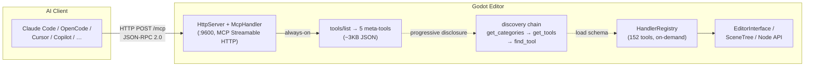

# Godot MCP

[](https://github.com/jessp/godot-mcp)
[](https://isocpp.org)
[](https://godotengine.org)
[](https://modelcontextprotocol.io)
[](License)

> Model Context Protocol bridge that lets AI assistants control the Godot Engine editor.

*[中文文档](README-zh.md)*



Godot MCP exposes the Godot 4.6+ editor to AI tools through **152 commands** — create nodes, modify properties, manage scenes, inspect the scene tree, edit GDScript/C# files, animate, debug, and more.

## Features

- **152 Editor Commands** — Scene/node manipulation, animation, filesystem, scripts, debugger, docs, settings, input map, signals, groups, runtime bridge, and more
- **Progressive Disclosure** — `tools/list` returns only 5 meta-tools (~3KB JSON); full 152 tools discovered on-demand via `get_categories` → `get_tools` → `find_tool`. Token cost comparable to an ~10-tool MCP server on first connect
- **MCP Resources Layer** — `godot://scene-tree`, `godot://project-settings`, `godot://editor-info` (read-only state queries), plus URI template `godot://scene-node/{path}`
- **11-Client Auto-Configuration** — Per-project config generation from the bottom panel or `generate_client_config` tool. No manual JSON editing
- **Streamable HTTP Transport** — Direct MCP Streamable HTTP (`:9600`) into the GDExtension, no external process, no session state
- **Single-Process Architecture** — C++ GDExtension plugin (godot-cpp 10.0.0-rc1) running inside the Godot editor
- **Pure Main-Thread C++** — No worker threads, no locks. Everything runs on Godot's main thread via `_process()`
- **AI Client Support** — Claude Code, OpenCode, Cursor, GitHub Copilot, Codex, Trae, and more
- **Cross-Platform** — Windows, macOS, and Linux

## How It Works

```
AI Assistant ──► godot_mcp_gdext.dll
   (HTTP POST /mcp, :9600)     (C++ GDExtension, JSON-RPC 2.0)
```

AI clients connect directly to the GDExtension's HTTP server on `localhost:9600` using the MCP Streamable HTTP protocol. The plugin dispatches each call on Godot's main thread via `McpEditorPlugin::_process()`, executes editor APIs safely, and returns results. Supports SSE for server-initiated events.

## Installation

### Prerequisites

- [Godot 4.6+](https://godotengine.org/download)
- [CMake 3.22+](https://cmake.org/download)
- [Visual Studio 2022](https://visualstudio.microsoft.com) (Windows) with C++ toolchain, or equivalent on macOS/Linux
- Python 3.14+ with [uv](https://docs.astral.sh/uv/)

### Build

```bash
git clone https://github.com/jessp/godot-mcp.git
cd godot-mcp
uv run python main.py build
```

This produces `build/addons.zip` — extract into any Godot project to install the editor plugin.

> **On Windows**, use `uv run python` to ensure the `.venv` environment — avoids Microsoft Store stubs that hang silently.

### Install the Plugin in Godot

1. Extract `build/addons.zip` into your Godot project root.
2. Open the project in Godot.
3. Go to **Project → Project Settings → Plugins** and enable **Godot MCP**.
4. You should see `[Godot MCP] Plugin loaded!` in the Output panel.

### Configure Your AI Client

Use the bottom panel in Godot or call `generate_client_config` to get a per-project config for any supported AI client — no manual JSON editing needed.

Or add the config manually:

```json
{
  "mcpServers": {
    "godot": {
      "type": "streamable-http",
      "url": "http://localhost:9600/mcp"
    }
  }
}
```

### Supported Clients & Config Paths

Config files are generated at **project-level paths** to avoid polluting global MCP settings:

| Client | Config Path | Format |
|--------|-------------|:------:|
| Claude Code | `.mcp.json` | JSON |
| OpenCode | `.opencode/opencode.json` | JSON |
| Cursor | `.cursor/mcp.json` | JSON |
| VS Code Copilot | `.vscode/mcp.json` | JSON |
| Cline | `.cline/mcp.json` | JSON |
| Codex | `.codex/config.toml` | TOML |
| Trae / Trae CN | `.trae/mcp.json` | JSON |
| Qoder | `.qoder/mcp.json` | JSON |
| CodeBuddy | `.codebuddy/mcp_settings.json` | JSON |
| Pi | `.pi/settings.json` | JSON |
| OpenClaw | `.openclaw/openclaw.json` | JSON |

## Usage

1. **Start the Godot editor** with the plugin enabled — the HTTP server automatically starts on port 9600.
2. **Connect your AI client** using the config above.
3. **Call any tool** from your AI assistant.

### Quick Examples

```
# Check the connection
"ping the godot editor"

# Create a scene and populate it
"create a new scene called Main"
"add a Node2D called Player under the root"
"set the Player's position to x=100, y=200"

# Inspect and modify
"get the scene tree"
"attach the script res://player.gd to the Player node"
"add an animation player to the Player node"

# Debug
"list all open scenes"
"get any errors from the console"
```

### Tool Categories (152 total)

| Category | Count | Description |
|----------|-------|-------------|
| Meta | 5 | Tool discovery, introspection, configuration |
| Scene Tree | 24 | Create/delete/rename/move/duplicate/reparent nodes |
| Workspace/Debugger | 13 | Viewport capture, console, debugger, breakpoints |
| Scripts | 12 | Read/write/patch/validate/list GDScript + C# |
| Filesystem | 12 | Create/delete/move/copy/open/search files |
| Animation | 10 | Create animation player/clip/track/keyframe/tree |
| Docs | 8 | Class/method/property/enum queries via ClassDB |
| Runtime (Bridge + Lifecycle) | 14 | Run/stop/pause game, inspect runtime scene tree |
| Resources | 6 | Save/load/new/duplicate/clear/get_info |
| Shaders | 5 | Create/read/apply preset/get/set uniforms |
| Control/UI | 4 | Create control, stylebox, layout, theme override |
| Settings | 4 | Get/set/reset/list project settings |
| Input Map | 4 | List/add/remove input actions and event bindings |
| Signals | 4 | Connect/disconnect/list signals and connections |
| Groups | 4 | Add/remove/get node groups |
| Export | 4 | List/validate/create export presets |
| 3D Scene | 3 | Mesh, light, environment |
| Audio | 3 | Audio player, stream, bus list |
| Navigation | 3 | Region, agent, navmesh bake |
| TileMap | 3 | Get info, set cells, erase cells |
| Plugin | 2 | List/enable/disable plugins |
| Collision | 1 | Create collision shape |
| Scaffold | 1 | Create project |
| Visualizer | 1 | Get project graph |

## Development

### Project Structure

```
extensions/                   C++ GDExtension plugin (godot-cpp 10.0.0-rc1)
  ├── src/
  │   ├── built_in/           Built-in tools (153 tools, 4-layer system)
  │   │   ├── tools/          ITool implementations by category
  │   │   ├── register/       X-macro registration files
  │   │   ├── cmd_utils/      Shared tool utilities (SchemaBuilder, undo_helpers, …)
  │   │   └── register_itools.cpp  X-macro registration entry
  │   ├── server/             MCP server
  │   │   ├── ipc/            HttpServer, SSE, HTTP parser
  │   │   ├── mcp/            McpHandler, ToolExecutor, PromptProvider
  │   │   └── registry/       HandlerRegistry (tool table, search, categories)
  │   ├── sdk/                McpToolDefinition, McpToolRegistry
  │   ├── runtime/            RuntimeBridge (editor↔game TCP :9601)
  │   ├── testing/            C++ TestEngine, YAML pipeline
  │   ├── ui/                 Bottom panel, confirm dialog, console, logger
  │   ├── editor_plugin.cpp   EditorPlugin — HTTP poll via _process()
  │   └── register_types.cpp  GDExtension entry (symbol: gdext_mcp_init)
  └── CMakeLists.txt
├── CMakeLists.txt             Root CMake (version, compatibility_minimum)
├── main.py                    Build/test/package orchestration
└── .repo_wiki/                Knowledge base for AI agents
```

### CI Gates

```bash
cmake -B build -S .
cmake --build build --config Debug
```

### Commands

```bash
uv run python main.py build                        # Debug + copy to example/
uv run python main.py build --release              # Release
uv run python main.py build --clean                # Clear build cache (keeps _deps/)
uv run python main.py build -j 8                   # Parallel build with 8 jobs
uv run python main.py test                         # Full test pipeline (auto start/stop Godot)
uv run python main.py test --file 03_*.yaml        # Run specific test files
uv run python main.py package                      # Package addons.zip
```

### DLL Hot-Reload

- `.gdextension` sets `reloadable = true` (Godot 4.2+ official mechanism — `GDExtensionManager::reload_extension()` auto-detects file changes and reloads the extension). `main.py build` overwrites the DLL directly; the editor reloads automatically on detecting a change. On Windows, the OS loader may lock the DLL and prevent overwriting (varies by system version / configuration); close the editor and retry if this happens. Known constraints: editor builds only; modifying a Godot base class requires restarting the editor.

### Key Constraints

- **Pinned deps**: `godot-cpp` at `10.0.0-rc1`, `ryml` at `v0.7.0` (both FetchContent). Don't bump without testing.
- **`godot_mcp.gdextension`**: entry symbol `gdext_mcp_init`, `compatibility_minimum = "4.6"`, `reloadable = true`.
- **Version** maintained in root `CMakeLists.txt` (`PROJECT_VERSION`). Only change there — `plugin.cfg` and `.gdextension` are auto-generated by `main.py build`.
- **Adding a tool**: create `.hpp` (implement `ITool`) → add `GODOT_MCP_TOOL(MyTool, false)` in `register/*.hpp` → `#include` in `register_itools.cpp`. No codegen.

## Documentation

| Doc | Content |
|-----|---------|
| [Getting Started](docs/en/guide/getting-started.md) | Install, configure, basic usage |
| [Architecture](docs/en/about/architecture.md) | Single-process C++ GDExtension architecture |
| [Building](docs/en/guide/building.md) | Build system, versioning |
| [Tools Overview](docs/en/guide/tools-overview.md) | All 152 tools by category |
| [Client Configuration](docs/en/guide/client-setup.md) | Config templates for all AI clients |
| [FAQ](docs/en/guide/faq.md) | Frequently asked questions |
| [Project Wiki](.repo_wiki/index.md) | Knowledge base for AI agents |

## Related

- [MCP Specification](https://modelcontextprotocol.io)
- [Godot Engine](https://godotengine.org)
- [godot-cpp](https://github.com/godotengine/godot-cpp)
