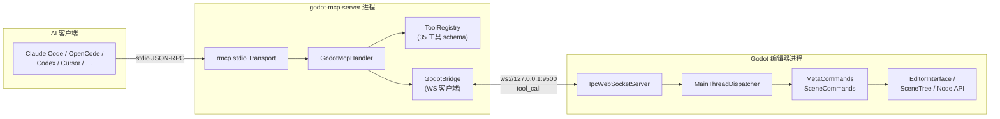

# Godot MCP

[](https://github.com/jessp/godot-mcp/actions/workflows/ci.yml)
[](https://www.rust-lang.org)
[](https://godotengine.org)

> Model Context Protocol bridge that lets AI assistants control the Godot Engine editor.

*[中文文档](README.zh-CN.md)*



Godot MCP exposes the Godot 4.6+ editor to AI tools through 35 commands — create nodes, modify properties, manage scenes, and inspect the scene tree — all from your AI assistant.

## Features

- **35 Editor Commands** — Full scene manipulation: create/delete/move nodes, set properties, manage scene files, attach scripts, and more
- **Two-Process Architecture** — stdio MCP server + in-editor GDExtension plugin, connected via local WebSocket
- **Thread-Safe Design** — Async tokio runtime paired with a main-thread dispatcher for safe Godot API access
- **12 AI Client Support** — Claude Code, Codex, Cursor, GitHub Copilot, OpenCode, Trae, and more (stdio transport)
- **Cross-Platform** — Windows, macOS, and Linux
- **47-Pass Test Suite** — Offline tests covering protocol round-trips and tool registry correctness

## How It Works

```
AI Assistant ──► godot-mcp-server ──► godot_mcp_gdext
   (stdio)       (Rust binary)    ws://127.0.0.1:9500   (GDExtension plugin)
                                                           │
                                                    Godot Editor API
```

1. Your AI client launches `godot-mcp-server` and speaks to it over stdio (MCP protocol).
2. The server forwards tool calls to the Godot editor plugin via WebSocket on `localhost:9500`.
3. The plugin dispatches each call to the Godot main thread, executes editor APIs safely, and returns results.
4. The server relays results back to the AI client as MCP responses.

## Installation

### Prerequisites

- [Godot 4.6+](https://godotengine.org/download)
- [Rust](https://rustup.rs) (stable toolchain)
- [Python 3](https://www.python.org) (for the build script)

### Build

```bash
git clone https://github.com/jessp/godot-mcp.git
cd godot-mcp
py -3 package_addons.py
```

This produces:
- `addons.zip` — extract into any Godot project to install the editor plugin
- `target/debug/godot-mcp-server` (or `.exe`) — the MCP server binary for your AI client

> **Note:** On Windows, always use `py -3` instead of `python` — the Microsoft Store stubs hang silently.

### Install the Plugin in Godot

1. Extract `addons.zip` into your Godot project root.
2. Open the project in Godot.
3. Go to **Project → Project Settings → Plugins** and enable **Godot MCP**.
4. You should see `[Godot MCP] Plugin loaded!` in the Output panel.

### Configure Your AI Client

Add this to your MCP client config (most clients use `mcpServers`):

```json
{
  "mcpServers": {
    "godot-mcp": {
      "command": "/path/to/godot-mcp-server",
      "args": ["--godot-port", "9500"]
    }
  }
}
```

| Client | Config Path |
|--------|-------------|
| Claude Code | `~/.claude/mcp.json` |
| OpenCode | `~/.config/opencode/config.json` |
| Cursor | `<project>/.cursor/mcp.json` |
| GitHub Copilot | `<project>/.vscode/mcp.json` |
| Trae / Trae CN | `<project>/.trae/mcp.json` |
| Codex | `~/.codex/config.toml` |

> **Important:** After rebuilding the server, restart your MCP client — it keeps the old binary handle alive.

## Usage

1. **Start the Godot editor** with the plugin enabled — the WebSocket server automatically starts on port 9500.
2. **Connect your AI client** using the config above.
3. **Call any of the 35 tools** from your AI assistant.

### Quick Examples

```
# Check the connection
"ping the godot editor"

# Create a scene and populate it
"open scene res://main.tscn"
"create a Node2D called Player under the root"

# Inspect and modify
"get the scene tree"
"set the Player's position to x=100, y=200"
"attach the script res://player.gd to the Player node"
```

### Available Tools

| Category | Count | Examples |
|----------|-------|----------|
| Meta | 4 | `ping`, `get_engine_version`, `get_plugin_version`, `get_server_version` |
| Scene Read | 4 | `get_scene_tree`, `get_node_path`, `get_property_list`, `get_property` |
| Node Write | 6 | `create_node`, `delete_node`, `rename_node`, `set_property`, `duplicate_node`, `move_node` |
| Script & Search | 3 | `attach_script`, `detach_script`, `find_nodes` |
| Scene Files | 6 | `open_scene`, `close_scene`, `save_scene`, `save_scene_as`, `reload_scene`, `create_scene`, `delete_scene`, `rename_scene` |
| Branching | 3 | `branch_to_scene`, `scene_to_branch`, `instantiate_scene` |
| Multi-Scene | 4 | `get_open_scenes`, `get_open_scene_roots`, `save_all_scenes`, `mark_scene_unsaved` |
| Advanced | 3 | `reset_parent`, `set_as_root`, `batch_set_property` |

See the [Tool Catalog](.repo_wiki/reference/tools-catalog.md) for detailed argument shapes and return values.

## Development

### Project Structure

```
crates/
├── core/          Shared protocol types (IpcRequest, IpcResponse, ToolCallParams)
├── server/        MCP server binary — rmcp stdio transport, tool registry, WS client
└── gdext/         GDExtension cdylib — editor plugin, WS server, 35 command handlers
```

### CI Gates

Run these in order before pushing:

```bash
cargo fmt --check --all                       # Formatting
cargo clippy --workspace -- -D warnings       # Linting (strict)
cargo build --workspace                       # Compilation
cargo test --workspace                        # Tests (47 tests, all offline)
```

### Build Flags

```bash
py -3 package_addons.py --release             # Release build
py -3 package_addons.py --no-zip              # Skip zip (fast iteration)
py -3 package_addons.py --no-server           # DLL only (editor-side changes)
py -3 package_addons.py --clean               # Clean rebuild
```

### File Lock Tips

- **Server binary locked by MCP client** → `package_addons.py` auto-kills it; if running `cargo build` directly, `taskkill /F /IM godot-mcp-server.exe` first.
- **DLL locked by Godot editor** → disable the plugin or close the editor before rebuilding.

## Documentation

- [Architecture Overview](.repo_wiki/overview/architecture.md) — Two-process, three-crate design
- [Threading Model](.repo_wiki/overview/threading-model.md) — tokio ↔ main-thread split and dispatcher pattern
- [Tool Catalog](.repo_wiki/reference/tools-catalog.md) — All 35 tools with args and return shapes
- [Client Configuration](.repo_wiki/reference/client-config.md) — 12 AI client config templates
- [Build & Package](.repo_wiki/reference/build-and-package.md) — Build flags, CI gates, gotchas
- [IPCS Protocol](.repo_wiki/specification/ipc-protocol.md) — Wire format specification
- [Design Decisions](.repo_wiki/design/decisions.md) — Recorded architectural choices