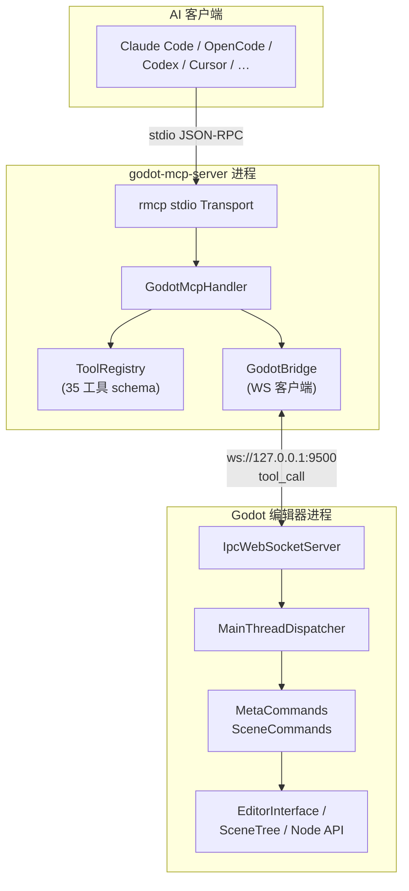

# Godot MCP

[](https://github.com/jessp/godot-mcp)
[](https://www.rust-lang.org)
[](https://godotengine.org)
[](https://modelcontextprotocol.io)
[](License)

> Model Context Protocol 桥接服务，让 AI 助手直接操控 Godot 引擎编辑器。

*[English](README.md)*



Godot MCP 通过 35 个编辑器命令，将 Godot 4.6+ 编辑器暴露给 AI 工具——创建节点、修改属性、管理场景、遍历场景树，全部通过 AI 助手完成。

## 特性

- **35 个编辑器命令** — 完整的场景操控能力：创建/删除/移动节点、设置属性、管理场景文件、挂载脚本等
- **双进程架构** — stdio MCP 服务器 + 编辑器内 GDExtension 插件，通过本地 WebSocket 通信
- **线程安全设计** — 异步 tokio 运行时配合主线程调度器，安全访问 Godot API
- **12 种 AI 客户端** — 支持 Claude Code、Codex、Cursor、GitHub Copilot、OpenCode、Trae 等（stdio 传输）
- **跨平台** — Windows、macOS、Linux
- **47 项测试** — 离线测试覆盖协议往返和工具注册表正确性

## 工作原理

```
AI 助手 ──► godot-mcp-server ──► godot_mcp_gdext
 (stdio)     (Rust 二进制)   ws://127.0.0.1:9500   (GDExtension 插件)
                                                       │
                                                Godot 编辑器 API
```

1. AI 客户端启动 `godot-mcp-server`，通过 stdio 以 MCP 协议与其通信。
2. 服务器通过 WebSocket（`localhost:9500`）将工具调用转发给 Godot 编辑器插件。
3. 插件将每次调用调度到 Godot 主线程，安全执行编辑器 API，并返回结果。
4. 服务器将结果以 MCP 响应的形式传回 AI 客户端。

## 安装

### 前置条件

- [Godot 4.6+](https://godotengine.org/download)
- [Rust](https://rustup.rs)（stable 工具链）
- [Python 3](https://www.python.org)（构建脚本依赖）

### 构建

```bash
git clone https://github.com/jessp/godot-mcp.git
cd godot-mcp
py -3 package_addons.py
```

构建产物：
- `addons.zip` — 解压到任意 Godot 项目根目录即可安装编辑器插件
- `target/debug/godot-mcp-server`（或 `.exe`）— 供 AI 客户端使用的 MCP 服务端二进制文件

> **注意：** Windows 下务必使用 `py -3` 而非 `python`——Microsoft Store 的路由桩会静默卡死。

### 在 Godot 中安装插件

1. 将 `addons.zip` 解压到你的 Godot 项目根目录。
2. 在 Godot 中打开该项目。
3. 前往 **项目 → 项目设置 → 插件**，启用 **Godot MCP**。
4. 输出面板中应出现 `[Godot MCP] Plugin loaded!`。

### 配置 AI 客户端

在 MCP 客户端配置中添加以下内容（多数客户端使用 `mcpServers` 键）：

```json
{
  "mcpServers": {
    "godot-mcp": {
      "command": "/path/to/godot-mcp-server",
      "args": ["--godot-port", "9500"]
    }
  }
}
```

| 客户端 | 配置文件路径 |
|--------|-------------|
| Claude Code | `~/.claude/mcp.json` |
| OpenCode | `~/.config/opencode/config.json` |
| Cursor | `<project>/.cursor/mcp.json` |
| GitHub Copilot | `<project>/.vscode/mcp.json` |
| Trae / Trae CN | `<project>/.trae/mcp.json` |
| Codex | `~/.codex/config.toml` |

> **重要：** 重新构建服务器后，务必重启 MCP 客户端——客户端会持有旧二进制文件的句柄。

## 使用

1. **启动 Godot 编辑器**（插件已启用）——WebSocket 服务器自动在 9500 端口启动。
2. **使用上述配置连接 AI 客户端。**
3. **从 AI 助手调用 35 种工具中的任意一种。**

### 快速示例

```
# 检查连接状态
"ping 一下 godot 编辑器"

# 创建场景并填充内容
"打开场景 res://main.tscn"
"在根节点下创建一个叫 Player 的 Node2D"

# 查看和修改
"获取场景树结构"
"把 Player 的位置设为 x=100, y=200"
"给 Player 节点挂载脚本 res://player.gd"
```

### 可用工具

| 分类 | 数量 | 示例 |
|------|------|------|
| 元命令 | 4 | `ping`、`get_engine_version`、`get_plugin_version`、`get_server_version` |
| 场景读取 | 4 | `get_scene_tree`、`get_node_path`、`get_property_list`、`get_property` |
| 节点写入 | 6 | `create_node`、`delete_node`、`rename_node`、`set_property`、`duplicate_node`、`move_node` |
| 脚本与搜索 | 3 | `attach_script`、`detach_script`、`find_nodes` |
| 场景文件 | 6 | `open_scene`、`close_scene`、`save_scene`、`save_scene_as`、`reload_scene`、`create_scene`、`delete_scene`、`rename_scene` |
| 场景分支 | 3 | `branch_to_scene`、`scene_to_branch`、`instantiate_scene` |
| 多场景标签 | 4 | `get_open_scenes`、`get_open_scene_roots`、`save_all_scenes`、`mark_scene_unsaved` |
| 高级操作 | 3 | `reset_parent`、`set_as_root`、`batch_set_property` |

详细的参数格式和返回值请参阅[工具目录](.repo_wiki/reference/tools-catalog.md)。

## 开发

### 项目结构

```
crates/
├── core/          共享协议类型（IpcRequest、IpcResponse、ToolCallParams）
├── server/        MCP 服务端二进制——rmcp stdio 传输、工具注册表、WS 客户端
└── gdext/         GDExtension 动态库——编辑器插件、WS 服务器、35 个命令处理器
```

### CI 检查

推送前按顺序运行：

```bash
cargo fmt --check --all                       # 格式化检查
cargo clippy --workspace -- -D warnings       # 代码检查（严格模式）
cargo build --workspace                       # 编译
cargo test --workspace                        # 测试（47 项，全部离线）
```

### 构建选项

```bash
py -3 package_addons.py --release             # Release 构建
py -3 package_addons.py --no-zip              # 跳过打包（快速迭代）
py -3 package_addons.py --no-server           # 只构建 DLL（仅编辑器侧修改）
py -3 package_addons.py --clean               # 完全重新构建
```

### 文件锁定问题

- **MCP 客户端锁定服务端二进制** → `package_addons.py` 会自动结束进程；如果直接运行 `cargo build`，先执行 `taskkill /F /IM godot-mcp-server.exe`。
- **Godot 编辑器锁定 DLL** → 先禁用插件或关闭编辑器再重新构建。

## 文档

- [架构概览](.repo_wiki/overview/architecture.md) — 双进程三 crate 设计
- [线程模型](.repo_wiki/overview/threading-model.md) — tokio ↔ 主线程分离与调度器模式
- [工具目录](.repo_wiki/reference/tools-catalog.md) — 全部 35 个工具的参数与返回值
- [客户端配置](.repo_wiki/reference/client-config.md) — 12 种 AI 客户端配置模板
- [构建与打包](.repo_wiki/reference/build-and-package.md) — 构建选项、CI 流程、常见问题
- [IPC 协议](.repo_wiki/specification/ipc-protocol.md) — 通信格式规范
- [设计决策](.repo_wiki/design/decisions.md) — 已记录的架构选择