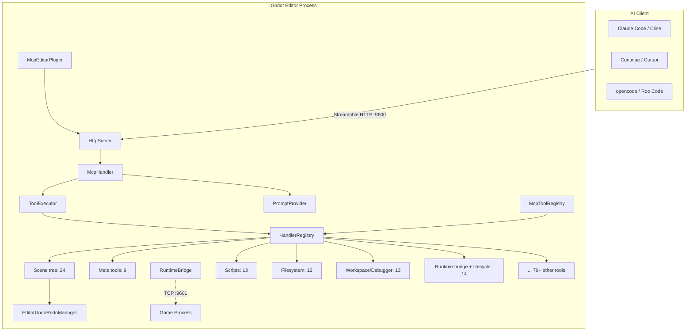
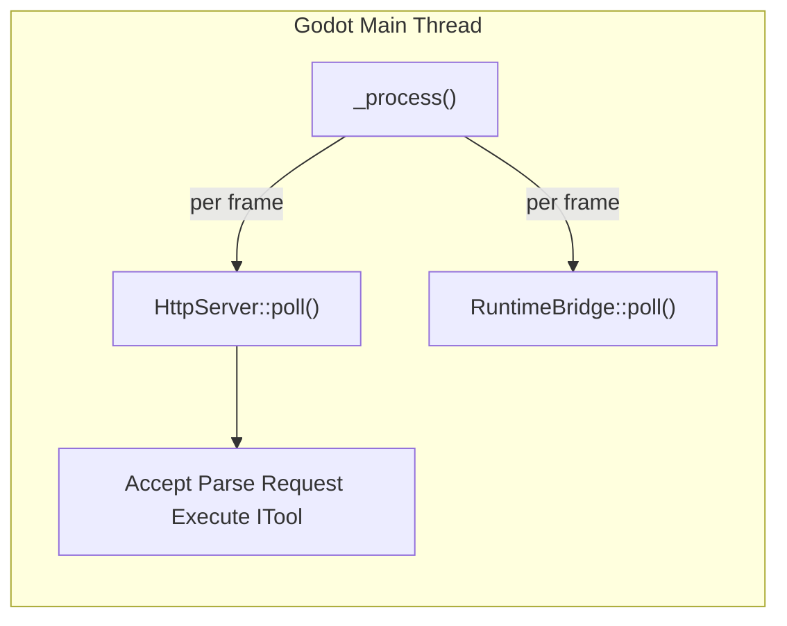
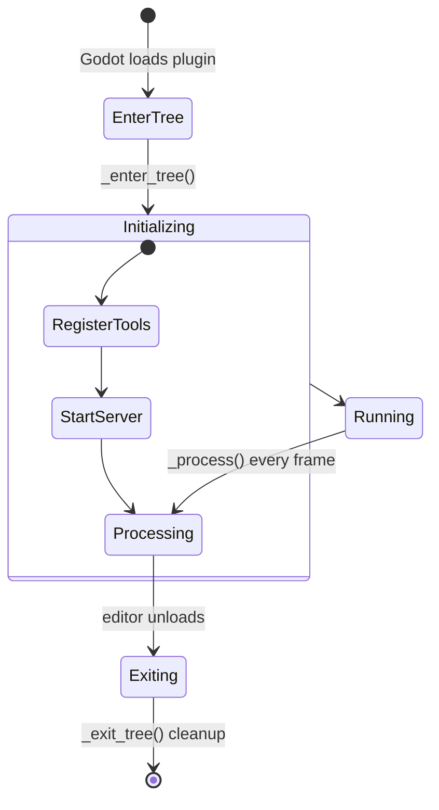
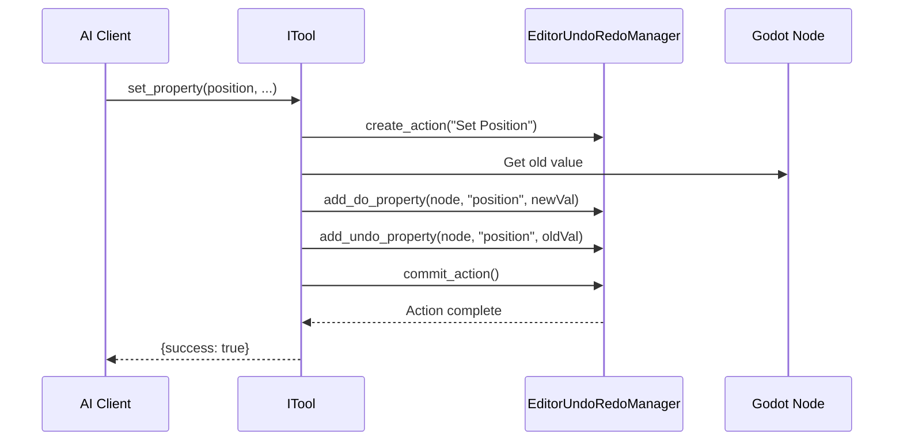

# Architecture

## System Architecture



## Core Design Principles

### Pure Main Thread

The entire GDExtension runs on the Godot editor's main thread -- **no worker threads, no locks**. `McpEditorPlugin::_process()` drives `HttpServer::poll()` + `RuntimeBridge::poll()` every frame.



This means:
- **No** `MainThreadDispatcher` required
- **No** cross-thread logging (direct `UtilityFunctions::print`)
- **No** tokio runtime
- No `bind_mut` deadlock risks
- All tools can call Godot API directly

### Streamable HTTP (MCP 2026-07-28)

Uses JSON-RPC 2.0 with `GET (SSE stream), POST, OPTIONS` communication. Session management has been removed in the MCP 2026-07-28 upgrade. SSE events are inlined in POST responses and also available via GET streaming. The server validates `Mcp-Method` and `Mcp-Name` HTTP headers against the request body.

### ITool Architecture + X-macro Registration

Each tool implements the `ITool` interface (`name()`, `category()`, `input_schema()`, `execute_impl()`), collected automatically via X-macro registration files (`register/*.hpp`). Registration macro: 2 parameters (`cls`, `is_destructive_val`). `HandlerRegistry` maintains an ITool primary table + SDK `CommandFn` sidetable.

### Four-Layer Tool System

| Layer | Name | Count | Description |
|-------|------|-------|-------------|
| 0 | Generic Fallback | 2 | `get_node_property` / `set_node_property` |
| 1 | Meta Tools | 9 | Tool introspection, search, discovery |
| 2 | Semantic Tools | 145 | Purpose-built tools for every domain |
| 3 | Doc Query Tools | 8 | ClassDB-powered documentation queries |

### Runtime Bridge

Editor connects to `GameBridgeNode` (TCP server in game process) via `RuntimeBridge` (TCP client, port 9601). Supports runtime scene tree queries, property read/write, method calls, screenshots, input simulation. All bridge tools support configurable `timeout_ms`.

### SDK Layer

`McpToolRegistry` is an Engine singleton accessible from GDScript and C#. Two registration modes: inheriting `McpToolDefinition` (GDVIRTUAL override) or using `register_tool()` with a `Callable`.

## Editor Plugin Lifecycle



## Command Routing Path

Complete tool call flow:

```
Client HTTP POST /mcp
  -> HttpServer::handle_post()
    -> Validate headers, parse JSON-RPC
  -> McpHandler::handle_message()
    -> ToolExecutor::execute()
      -> HandlerRegistry::find("add_node") -> ITool
      -> ITool::execute() (template method)
      -> Wrap response -> HTTP 200 + JSON-RPC Response
```

## Data Flow -- Undo Support

