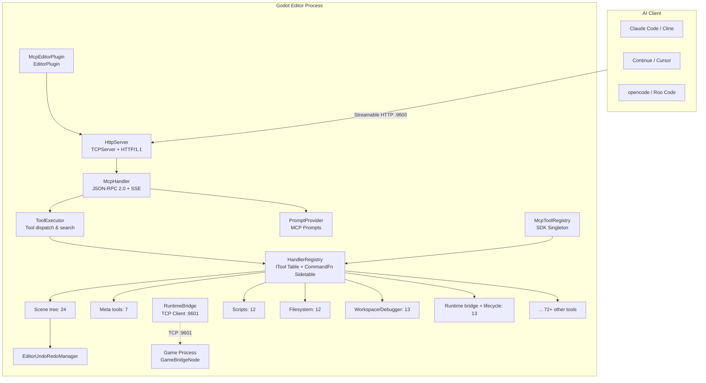
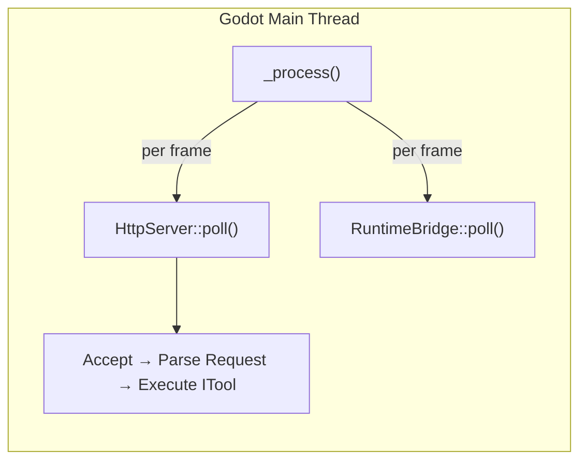
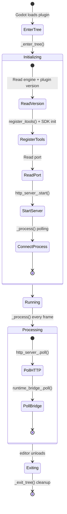
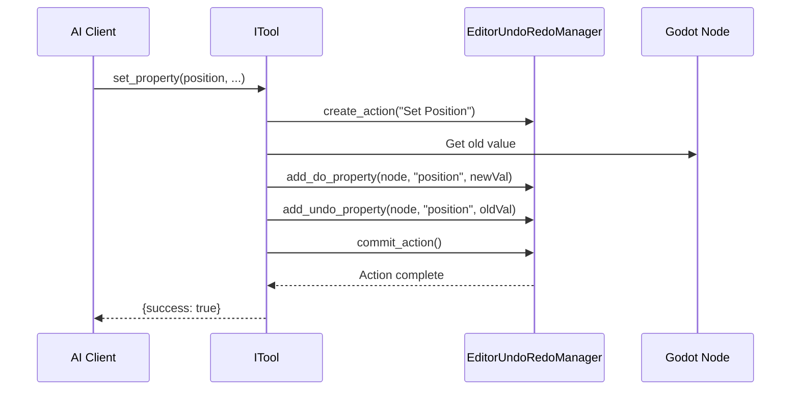

# Architecture

## Overall Architecture



## Core Design Principles

### Pure Main Thread

The entire GDExtension runs on the Godot editor's main thread, **no worker threads, no locks**. `McpEditorPlugin::_process()` drives `HttpServer::poll()` + `RuntimeBridge::poll()` every frame.



This means:
- **No** `MainThreadDispatcher` required
- **No** cross-thread logging (direct `UtilityFunctions::print`)
- **No** tokio runtime
- No `bind_mut` deadlock risks
- All tools can call Godot API directly

### Streamable HTTP (MCP 2026-07-28)

Uses JSON-RPC 2.0 as the protocol layer with pure `POST + OPTIONS` communication. Session management (previously `Mcp-Session-Id`, `GET /mcp`, `DELETE /mcp`, `initialize` handshake) has been removed in the MCP 2026-07-28 upgrade. SSE events are inlined in POST responses. The server validates `Mcp-Method` and `Mcp-Name` HTTP headers against the request body for consistency.

### ITool Architecture + X-macro Registration

Each tool implements the `ITool` interface (`name()`, `category()`, `input_schema()`, `execute_impl()`), collected automatically via X-macro registration files (`register/*.hpp`). The registration macro was simplified in v0.2.1 from 6 parameters to 2 (`cls`, `is_destructive_val`). `HandlerRegistry` maintains an ITool primary table + SDK `CommandFn` sidetable, supporting `find_tool` search engine and progressive tool discovery.

### Runtime Bridge

The editor process connects to `GameBridgeNode` (TCP server in the game process) via `RuntimeBridge` (TCP client, port 9601), supporting runtime scene tree queries, property read/write, method calls, screenshots, input simulation, and more. The editor automatically detects game start/stop via `is_playing_scene()`. All bridge tools support configurable `timeout_ms` parameter.

### SDK Layer

`McpToolRegistry` is registered as an Engine singleton, accessible from both GDScript and C#. It supports two registration modes: inheriting `McpToolDefinition` (with `execute()` GDVIRTUAL override) or using `register_tool()` with a `Callable` handler.

## Editor Plugin Lifecycle



## Command Routing Path

Complete tool call flow:

```
Client HTTP POST /mcp {"method":"tools/call","params":{"name":"add_node",...}}
  → HttpServer::handle_post()
    → Validate Content-Type / Accept / Origin / Mcp-Method
    → Parse JSON-RPC 2.0 message
  → McpHandler::handle_message()
    → ToolExecutor::execute()
      → HandlerRegistry::find("add_node") → ITool
      → ITool::execute() (template method: schema validation → context resolution → execute_impl())
      → Wrap response → HTTP 200 + JSON-RPC Response
```

## Directory Structure

```
extensions/src/
├── register_types.cpp       # GDExtension entry (symbol: gdext_mcp_init)
├── editor_plugin.cpp/.hpp   # EditorPlugin assembler
├── client_config_registry.hpp # MCP client config templates (11 providers)
├── sdk/
│   ├── mcp_tool_definition.cpp/.hpp  # SDK base class (GDScript-inheritable)
│   └── mcp_tool_registry.cpp/.hpp    # Tool registry singleton
├── server/
│   ├── ipc/http_server.cpp/.hpp      # HTTP server (CORS, SSE, header validation)
│   ├── http/http_parser.cpp/.hpp     # HTTP request parser
│   └── mcp/
│       ├── mcp_handler.cpp/.hpp      # MCP protocol handler (no sessions)
│       ├── tool_executor.cpp/.hpp    # Tool dispatch & search
│       └── prompt_provider.cpp/.hpp  # MCP Prompts support
├── registry/
│   └── handler_registry.cpp/.hpp    # Tool registry (ITool + CommandFn + search)
├── built_in/
│   ├── tool_base.cpp/.hpp           # ITool base class + type validation
│   ├── tool_adapter.cpp/.hpp        # IToolAdapter (SDK bridge)
│   ├── cmd_utils.cpp/.hpp           # Utilities (resolve_node, undoable_set, etc.)
│   ├── cmd_utils_json.cpp           # JSON ↔ Variant conversion
│   ├── cmd_utils/                   # Shared tool templates (7 .hpp files)
│   │   ├── dispatch_map.hpp         # DispatchMap for if/else chains
│   │   ├── undo_helpers.hpp         # Undo/Redo helper templates
│   │   ├── args_get_typed.hpp       # Type-safe argument extraction
│   │   ├── schema_builder.hpp       # Input schema fluent builder
│   │   ├── error_codes.hpp          # Standard error codes
│   │   ├── memdelete_guard.hpp      # Safe memdelete wrapper
│   │   └── tracked_settings.hpp     # Settings change tracker
│   ├── screenshot_utils.hpp         # Screenshot utilities
│   ├── register_itools.cpp          # #include collection + X-macro registration
│   └── tools/
│       ├── meta/                    # Meta tools (7)
│       ├── signal/                  # Signal management (4)
│       ├── group/                   # Node groups (4)
│       ├── node_tools/              # Resource operations (6) + fallback (2)
│       ├── editor_tools/            # Editor tool collection
│       │   ├── scene_tree/          # Scene tree operations (24)
│       │   ├── scripts/             # Script read/write (12, GD + C# variants)
│       │   ├── filesystem/          # Filesystem operations (12)
│       │   ├── workspace/           # Workspace + debugger (13, merged)
│       │   ├── animation/           # Animation (10, inc. AnimationTree)
│       │   ├── audio/               # Audio tools (3) — NEW
│       │   ├── navigation/          # Navigation tools (3) — NEW
│       │   ├── 3d_scene/            # 3D scene tools (3) — NEW
│       │   ├── control/             # UI controls (4)
│       │   ├── collision/           # Collision shapes (1)
│       │   ├── docs/                # ClassDB doc queries (8)
│       │   ├── export/              # Export (4)
│       │   ├── inputmap/            # Input mapping (4)
│       │   ├── plugin/              # Plugin management (2)
│       │   ├── scaffold/            # Project scaffolding (1)
│       │   ├── settings/            # Project settings (4)
│       │   ├── shader/              # Shaders (5)
│       │   ├── tilemap/             # TileMap (3)
│       │   └── visualizer/          # Project graph visualization (1)
│       ├── runtime_tools/           # Runtime tools
│       │   ├── bridge/              # Runtime bridge (7)
│       │   └── lifecycle/           # Lifecycle control (6)
│       └── register/                # X-macro registration files
├── runtime/
│   ├── bridge.cpp/.hpp             # Editor-side TCP client
│   └── game_bridge.cpp/.hpp        # Game process TCP server
├── ui/                              # UI components — NEW
│   ├── mcp_dock.cpp/.hpp           # Editor right panel dock
│   ├── mcp_console.cpp/.hpp        # Editor output console
│   └── mcp_logger.cpp/.hpp         # C++ structured logger
└── testing/                        # YAML test engine (pipeline architecture)
    ├── pipeline_parser.cpp/.hpp    # Pipeline YAML parser
    ├── pipeline_runner.cpp/.hpp    # Pipeline executor
    ├── pipeline_context.cpp/.hpp   # Pipeline context
    ├── pipeline_types.hpp          # Pipeline type definitions
    ├── test_engine.cpp/.hpp        # Core test engine
    ├── yaml_parser.hpp             # YAML parsing utilities
    └── test_assertions.hpp         # Test assertion helpers
```

## Data Flow

### Undo Support


