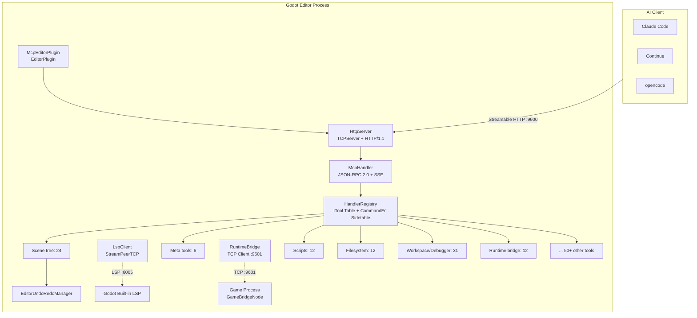
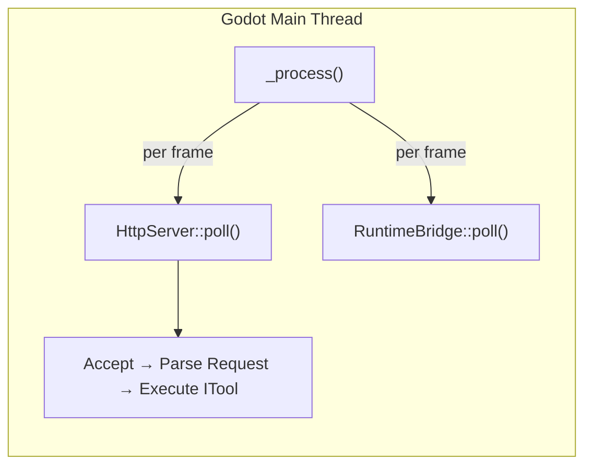
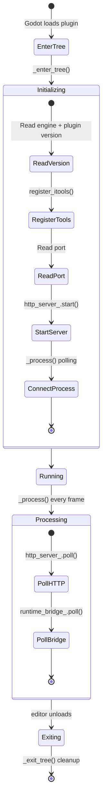
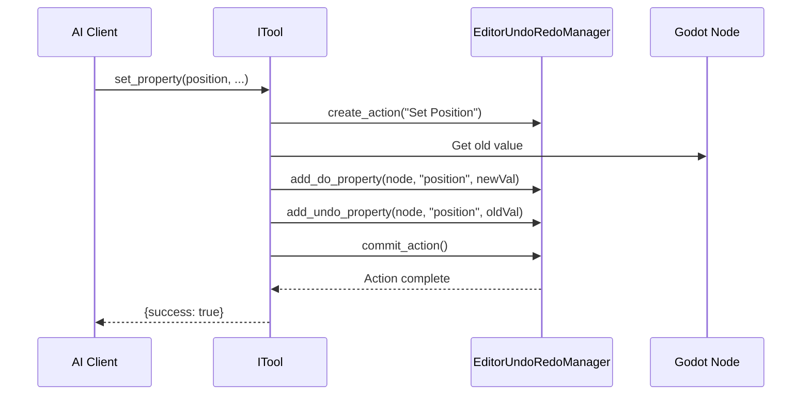

# Architecture

## Overall Architecture



## Core Design Principles

### Pure Main Thread

The entire GDExtension runs on the Godot editor's main thread, **no worker threads, no locks**. `McpEditorPlugin::_process()` drives `HttpServer::poll()` + `RuntimeBridge::poll()` every frame.



This means:
- **No** `MainThreadDispatcher` required
- **No** cross-thread logging (direct `UtilityFunctions::print`)
- **No** tokio runtime
- No `bind_mut` deadlock risks
- All tools can call Godot API directly

### Streamable HTTP

Uses JSON-RPC 2.0 as the protocol layer, with Server-Sent Events (SSE) for streaming results, compatible with the MCP Streamable HTTP transport specification.

### ITool Architecture + X-macro Registration

Each tool implements the `ITool` interface (`name()`, `category()`, `input_schema()`, `execute_impl()`), collected automatically via X-macro registration files (`register/*.hpp`). `HandlerRegistry` maintains an ITool primary table + SDK `CommandFn` sidetable, supporting `find_tool` search engine and progressive tool discovery.

### Runtime Bridge

The editor process connects to `GameBridgeNode` (TCP server in the game process) via `RuntimeBridge` (TCP client, port 9601), supporting runtime scene tree queries, property read/write, method calls, screenshots, input simulation, and more. The editor automatically detects game start/stop via `is_playing_scene()`.

## Editor Plugin Lifecycle



## Command Routing Path

Complete tool call flow:

```
Client HTTP POST /mcp {"method":"tools/call","params":{"name":"add_node",...}}
  → HttpServer::handle_post()
    → Validate protocol version / Content-Type / Accept / Origin
    → Parse JSON-RPC 2.0 message
  → McpHandler::handle_tools_call()
    → HandlerRegistry::find("add_node") → ITool
    → ITool::execute() type validation + execute_impl()
    → Wrap response → HTTP 200 + JSON-RPC Response
```

## Directory Structure

```
extensions/src/
├── register_types.cpp       # GDExtension entry (symbol: gdext_mcp_init)
├── editor_plugin.cpp/.hpp   # EditorPlugin assembler
├── logging.hpp              # Logging utilities
├── pch.hpp                  # Precompiled header
├── sdk/
│   ├── mcp_tool_definition.cpp/.hpp  # SDK base class (GDScript-inheritable)
│   └── mcp_tool_registry.cpp/.hpp    # Tool registry singleton
├── server/
│   ├── ipc/http_server.cpp/.hpp      # HTTP server
│   ├── mcp/mcp_handler.cpp/.hpp      # MCP session management
│   └── registry/handler_registry.cpp/.hpp  # Tool registry (ITool + CommandFn)
├── built_in/
│   ├── tool_base.cpp/.hpp           # ITool base class + type validation
│   ├── tool_adapter.cpp/.hpp        # IToolAdapter (SDK bridge)
│   ├── cmd_utils.cpp/.hpp           # Utilities (resolve_node, undoable_set, etc.)
│   ├── cmd_utils_json.cpp           # JSON ↔ Variant conversion
│   ├── screenshot_utils.hpp         # Screenshot utilities
│   ├── register_itools.cpp          # #include collection + X-macro registration
│   └── tools/
│       ├── meta/                    # Meta tools (6)
│       ├── signal/                  # Signal management (4)
│       ├── group/                   # Node groups (4)
│       ├── node_tools/              # Resource operations (7)
│       ├── node_properties/         # Property fallback tools
│       ├── node_props/              # Node property tools + YAML database
│       ├── node_resource/           # Resource property tools + YAML database
│       ├── editor_tools/            # Editor tool collection
│       │   ├── scene_tree/          # Scene tree operations (24)
│       │   ├── scripts/             # Script read/write (12)
│       │   ├── filesystem/          # Filesystem operations (12)
│       │   ├── workspace/           # Workspace + debugger (31)
│       │   ├── animation/           # Animation (5)
│       │   ├── control/             # UI controls (4)
│       │   ├── collision/           # Collision shapes (1)
│       │   ├── docs/                # ClassDB doc queries (8)
│       │   ├── export/              # Export (2)
│       │   ├── inputmap/            # Input mapping (1)
│       │   ├── plugin/              # Plugin management (3)
│       │   ├── scaffold/            # Project scaffolding (1)
│       │   ├── settings/            # Project settings (4)
│       │   ├── shader/              # Shaders (3)
│       │   ├── tilemap/             # TileMap (3)
│       │   └── visualizer/          # Project graph visualization (1)
│       ├── runtime_tools/           # Runtime tools
│       │   ├── bridge/              # Runtime bridge (6)
│       │   └── lifecycle/           # Lifecycle control (6)
│       └── register/                # X-macro registration files
├── runtime/
│   ├── bridge.cpp/.hpp             # Editor-side TCP client
│   └── game_bridge.cpp/.hpp        # Game process TCP server
├── testing/                        # YAML test engine
└── lsp/
    └── client.cpp/.hpp             # LSP validation client
```

## Data Flow

### Undo Support


